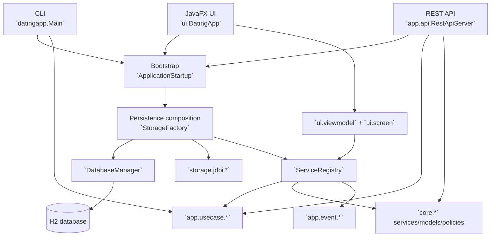

# 2026-03-30 CAST-Style Software Discovery Report

## Scope and method

This report covers the `Date_Program` workspace as a **source-driven CAST-style discovery pass**.

- **Workspace root:** `c:\Users\tom7s\Desktopp\Claude_Folder_2\Date_Program`
- **Primary source of truth used:** `pom.xml`, `src/main/java`, `src/test/java`, `config/app-config.json`, and `src/main/resources`
- **Important note:** a live CAST Imaging application inventory/API surface was **not exposed in this session**, so the application, architecture, dependency, database, and source-file mapping below is derived directly from the checked-out codebase rather than a remote CAST server model.

## Executive summary

The workspace contains **one Maven-packaged Java application** with **three intentional runtime surfaces** sharing the same domain and service graph:

1. **CLI** via `src/main/java/datingapp/Main.java`
2. **JavaFX desktop UI** via `src/main/java/datingapp/ui/DatingApp.java`
3. **REST API server** via `src/main/java/datingapp/app/api/RestApiServer.java`

All three converge on a shared bootstrap path through `src/main/java/datingapp/app/bootstrap/ApplicationStartup.java`, which loads configuration, initializes the database, and returns a shared `ServiceRegistry` assembled through `src/main/java/datingapp/storage/StorageFactory.java`.

The codebase is organized as a layered application:

- `app/` = adapters, bootstrap, events, use cases
- `core/` = domain logic, policies, models, storage contracts
- `storage/` = persistence infrastructure and JDBI implementations
- `ui/` = JavaFX shell, controllers, async infrastructure, and ViewModels

The persistence model is **H2 + HikariCP + JDBI**, with schema and migrations authored in Java rather than standalone SQL files. The codebase currently contains:

| Metric                  |  Value |
|-------------------------|-------:|
| Main Java files         |    147 |
| Test Java files         |    173 |
| Total Java files        |    320 |
| Java LOC (all lines)    | 94,544 |
| Java code lines         | 76,080 |
| Standalone `.sql` files |      0 |

## 1. Application discovery

### Application inventory

| Item                 | Evidence                                                  | Discovery result                                                                        |
|----------------------|-----------------------------------------------------------|-----------------------------------------------------------------------------------------|
| Repository/workspace | Root workspace                                            | `Date_Program`                                                                          |
| Maven artifact       | `pom.xml`                                                 | One packaged artifact: `com.datingapp:dating-app:1.0.0`                                 |
| Packaging            | `pom.xml`                                                 | `jar`                                                                                   |
| Runtime shape        | Source entrypoints                                        | Single application codebase with multiple delivery surfaces, not multiple separate apps |
| Shared bootstrap     | `ApplicationStartup`, `StorageFactory`, `ServiceRegistry` | One shared domain/service graph reused by CLI, JavaFX, and REST                         |

### Runtime surfaces and entrypoints

| Surface            | File                                                            | Key symbol(s)                                        | What it does                                                                                            |
|--------------------|-----------------------------------------------------------------|------------------------------------------------------|---------------------------------------------------------------------------------------------------------|
| CLI                | `src/main/java/datingapp/Main.java`                             | `main(String[] args)`                                | Starts the console app, initializes services, wires handlers, and runs the interactive menu loop        |
| JavaFX UI          | `src/main/java/datingapp/ui/DatingApp.java`                     | `init()`, `start(Stage)`, `stop()`                   | Initializes services, builds `ViewModelFactory`, wires `NavigationService`, and launches the desktop UI |
| REST API           | `src/main/java/datingapp/app/api/RestApiServer.java`            | `main(String[] args)`, `start()`, `registerRoutes()` | Starts a localhost-only Javalin server exposing the app’s HTTP interface                                |
| Bootstrap          | `src/main/java/datingapp/app/bootstrap/ApplicationStartup.java` | `initialize()`, `load()`, `shutdown()`               | Centralized config loading, DB bootstrap, seeding, and cleanup scheduler startup                        |
| Background cleanup | `src/main/java/datingapp/app/bootstrap/CleanupScheduler.java`   | `start()`, `stop()`                                  | Runs periodic cleanup work via the metrics service                                                      |

### Technology stack snapshot

| Area                  | Technologies                            |
|-----------------------|-----------------------------------------|
| Language/runtime      | Java 25 with preview enabled            |
| Build                 | Maven                                   |
| Desktop UI            | JavaFX 25.0.2, AtlantaFX, Ikonli        |
| REST                  | Javalin 6.7.0, Jackson 2.21.0           |
| Persistence           | H2 2.4.240, HikariCP 6.3.0, JDBI 3.51.0 |
| Logging               | SLF4J 2.0.17, Logback 1.5.28            |
| Security/sanitization | OWASP Java HTML Sanitizer               |
| Testing               | JUnit 5.14.2                            |
| Quality gates         | Spotless, Checkstyle, PMD, JaCoCo       |

## 2. Component and architecture analysis

### High-level architecture view



### Architectural layers and responsibilities

| Layer                      | Representative packages/files                                    | Responsibility                                                                        |
|----------------------------|------------------------------------------------------------------|---------------------------------------------------------------------------------------|
| Bootstrap                  | `app/bootstrap/ApplicationStartup.java`, `CleanupScheduler.java` | Startup, config loading, service graph initialization, lifecycle management           |
| Adapters: CLI              | `app/cli/*`                                                      | Console menus and command handling                                                    |
| Adapters: REST             | `app/api/RestApiServer.java`, `RestApiDtos.java`                 | HTTP transport, JSON DTOs, route-level validation and mapping                         |
| Application boundary       | `app/usecase/*`                                                  | Orchestration layer between delivery surfaces and domain services                     |
| Events                     | `app/event/*`, `app/event/handlers/*`                            | In-process event publication and cross-cutting reactions                              |
| Domain/core                | `core/*`                                                         | Business logic, domain models, policies, time/config/session abstractions             |
| Storage contracts          | `core/storage/*`                                                 | Persistence interfaces shared by production and tests                                 |
| Persistence infrastructure | `storage/*`, `storage/jdbi/*`, `storage/schema/*`                | DB lifecycle, concrete storage implementations, schema/migrations                     |
| Desktop UI                 | `ui/*`, `ui/async/*`, `ui/screen/*`, `ui/viewmodel/*`            | JavaFX application shell, controller/viewmodel composition, UI threading abstractions |
| Tests                      | `src/test/java/datingapp/*`                                      | REST, core, storage, and JavaFX validation surfaces                                   |

### Composition roots and high-fan-in components

| Component                    | File                                                            | Why it matters                                                                           |
|------------------------------|-----------------------------------------------------------------|------------------------------------------------------------------------------------------|
| Bootstrap root               | `src/main/java/datingapp/app/bootstrap/ApplicationStartup.java` | Shared startup path for all runtime surfaces                                             |
| Service container            | `src/main/java/datingapp/core/ServiceRegistry.java`             | Aggregates services, storage contracts, event bus, policies, and use-case bundles        |
| Persistence composition root | `src/main/java/datingapp/storage/StorageFactory.java`           | Wires JDBI/H2 storage and core services into a `ServiceRegistry`                         |
| DB lifecycle root            | `src/main/java/datingapp/storage/DatabaseManager.java`          | Owns connection pool creation, password/profile resolution, and migration initialization |
| REST transport root          | `src/main/java/datingapp/app/api/RestApiServer.java`            | Registers all API route modules, request guards, and exception mapping                   |
| UI composition root          | `src/main/java/datingapp/ui/viewmodel/ViewModelFactory.java`    | Bridges `ServiceRegistry` into controllers and ViewModels                                |

### Architectural characteristics

- **Single shared domain/service graph:** CLI, JavaFX, and REST all use the same core services.
- **Use-case boundary present:** `app/usecase/*` is the main application seam between adapters and core.
- **Framework-specific code is pushed outward:** JavaFX is in `ui/`, Javalin is in `app/api/`, and persistence implementations live in `storage/`.
- **Schema is code-defined:** database tables and migrations are authored in Java rather than SQL migration files.
- **Event-driven cross-cutting behavior exists:** event handlers are registered in `StorageFactory` on an in-process event bus.

## 3. Dependency mapping

### External dependency groups

| Group                 | Key dependencies                                         | Main usage                                    |
|-----------------------|----------------------------------------------------------|-----------------------------------------------|
| Persistence           | `h2`, `jdbi3-core`, `jdbi3-sqlobject`, `HikariCP`        | Database storage, pooling, SQL object access  |
| Web/API               | `javalin`, `jackson-databind`, `jackson-datatype-jsr310` | REST server and JSON serialization            |
| Desktop UI            | `javafx-*`, `atlantafx-base`, `ikonli-*`                 | JavaFX desktop application and theming/icons  |
| Logging               | `slf4j-api`, `logback-classic`                           | Runtime logging                               |
| Security/sanitization | `owasp-java-html-sanitizer`                              | Sanitizing untrusted text                     |
| Utilities             | `annotations`, `metadata-extractor`                      | Nullability hints and image metadata handling |
| Testing               | `junit-jupiter`, `junit-jupiter-params`                  | Unit and integration tests                    |

### Internal dependency direction map

| From            | Depends on                                                                             | Notes                                                                    |
|-----------------|----------------------------------------------------------------------------------------|--------------------------------------------------------------------------|
| `app/cli`       | `ApplicationStartup`, `ServiceRegistry`, `app/usecase/*`, `core/*`                     | CLI is a thin delivery surface over shared services/use cases            |
| `ui/*`          | `ApplicationStartup`, `ViewModelFactory`, `ServiceRegistry`, `app/usecase/*`, `core/*` | JavaFX UI depends on shared services plus UI-thread abstractions         |
| `app/api`       | `ServiceRegistry`, `app/usecase/*`, selected `core/*` services                         | REST is mostly thin, with one deliberate direct candidate-read exception |
| `app/usecase/*` | `core/*`, `app/event/*`, storage contracts                                             | Application orchestration layer                                          |
| `core/*`        | `core/model/*`, `core/storage/*`, policies/config/time/session abstractions            | Inward business logic layer                                              |
| `storage/*`     | `core/storage/*`, `core/*`, external persistence libraries                             | Concrete infrastructure implementations                                  |
| Tests           | Main code + shared test fixtures                                                       | Mirrors runtime layers; uses common fixtures/harnesses                   |

### Dependency hotspots

| File                                                            | Why it is a hotspot                                                                 |
|-----------------------------------------------------------------|-------------------------------------------------------------------------------------|
| `src/main/java/datingapp/core/ServiceRegistry.java`             | Central aggregator for services, storage, policies, event bus, and use-case bundles |
| `src/main/java/datingapp/storage/StorageFactory.java`           | Main wiring hub for persistence, event handlers, and domain service construction    |
| `src/main/java/datingapp/app/bootstrap/ApplicationStartup.java` | Connects config, DB, seed data, cleanup scheduling, and runtime initialization      |
| `src/main/java/datingapp/app/api/RestApiServer.java`            | Concentrates HTTP routes, guards, error mapping, and route-to-use-case binding      |
| `src/main/java/datingapp/ui/viewmodel/ViewModelFactory.java`    | Concentrates controller/ViewModel creation and UI dependency bridging               |
| `src/main/java/datingapp/storage/DatabaseManager.java`          | Couples DB connection setup, query timeout policy, and profile/password behavior    |

### Noteworthy dependency and architecture exceptions

| Observation                                                                                        | Evidence                                                                                                                                    |
|----------------------------------------------------------------------------------------------------|---------------------------------------------------------------------------------------------------------------------------------------------|
| REST is localhost-only by design                                                                   | `RestApiServer.start()` binds to loopback and `enforceLocalhostOnly(...)` rejects non-loopback callers                                      |
| One REST read route bypasses the use-case layer intentionally                                      | `RestApiServer.readCandidateSummaries(User)` calls `CandidateFinder` directly and comments that this is the “remaining direct-read adapter” |
| `ServiceRegistry` constructs `LocationService` internally instead of accepting it from the builder | `new LocationService(this.validationService)` in `ServiceRegistry`                                                                          |
| UI controller creation has a reflective fallback path                                              | `ViewModelFactory.createFallbackController(...)`                                                                                            |
| DB startup depends on explicit password/profile resolution                                         | `DatabaseManager.getConfiguredPassword()` requires password or explicit `test`/`dev` profile for local DB access                            |

## 4. Database and data structure discovery

### Persistence flow

```mermaid
flowchart LR
	APP[`ApplicationStartup.initialize()`]
	DBM[`DatabaseManager`]
	MIG[`MigrationRunner.runAllPending(...)`]
	SCHEMA[`SchemaInitializer.createAllTables(...)`]
	FACTORY[`StorageFactory.buildH2(...)`]
	JDBI[`Jdbi*Storage` implementations]
	H2[(H2 database)]
	TEST[`TestStorages` + `RestApiTestFixture`]

	APP --> DBM
	DBM --> MIG
	MIG --> SCHEMA
	APP --> FACTORY
	FACTORY --> JDBI
	JDBI --> H2
	TEST -. shared storage contracts .- JDBI
```

### Persistence architecture summary

| Area                               | Key files                                                 | Discovery result                                                                                                |
|------------------------------------|-----------------------------------------------------------|-----------------------------------------------------------------------------------------------------------------|
| DB lifecycle                       | `storage/DatabaseManager.java`                            | Hikari-backed H2 connection management, lazy schema init, session query timeout handling                        |
| Service/persistence composition    | `storage/StorageFactory.java`                             | Builds `Jdbi` instance, storage implementations, domain services, event handlers, and returns `ServiceRegistry` |
| Baseline schema                    | `storage/schema/SchemaInitializer.java`                   | Frozen V1 baseline schema for all tables and indexes                                                            |
| Versioned migrations               | `storage/schema/MigrationRunner.java`                     | Append-only migration list from V1 through V11                                                                  |
| Production storage implementations | `storage/jdbi/*`                                          | JDBI implementations of storage interfaces                                                                      |
| Test/in-memory storage             | `src/test/java/datingapp/core/testutil/TestStorages.java` | In-memory contract-compatible test storages                                                                     |

### Database tables grouped by capability

| Capability                 | Tables                                                                                                                                                         |
|----------------------------|----------------------------------------------------------------------------------------------------------------------------------------------------------------|
| User/profile core          | `users`, `profile_notes`, `profile_views`                                                                                                                      |
| Matching and interaction   | `likes`, `matches`, `swipe_sessions`, `daily_pick_views`, `daily_picks`, `standouts`, `undo_states`                                                            |
| Messaging and relationship | `conversations`, `messages`, `friend_requests`, `notifications`                                                                                                |
| Trust and safety           | `blocks`, `reports`                                                                                                                                            |
| Metrics and achievements   | `user_stats`, `platform_stats`, `user_achievements`                                                                                                            |
| Normalized profile detail  | `user_photos`, `user_interests`, `user_interested_in`, `user_db_smoking`, `user_db_drinking`, `user_db_wants_kids`, `user_db_looking_for`, `user_db_education` |
| Schema bookkeeping         | `schema_version`                                                                                                                                               |

### Migration history currently present in source

| Version | Summary                                                                      |
|--------:|------------------------------------------------------------------------------|
|      V1 | Baseline schema via `SchemaInitializer`                                      |
|      V2 | Adds `daily_picks`                                                           |
|      V3 | Drops legacy serialized profile columns from `users`                         |
|      V4 | Adds `deleted_at` soft-delete support to `conversations` and `profile_notes` |
|      V5 | Normalizes `profile_views` PK and conversation uniqueness constraint         |
|      V6 | Adds/backfills `matches.updated_at`                                          |
|      V7 | Adds `messages(conversation_id)` index                                       |
|      V8 | Adds hot-path optimization indexes                                           |
|      V9 | Repairs `matches.updated_at` for legacy DBs                                  |
|     V10 | Adds named FKs for `daily_pick_views` and `user_achievements`                |
|     V11 | Adds `friend_requests` pair-key/pending uniqueness helpers                   |

### Core data structures and domain records

| File                                                            | Main structures                                                                       | Purpose                                                 |
|-----------------------------------------------------------------|---------------------------------------------------------------------------------------|---------------------------------------------------------|
| `src/main/java/datingapp/core/model/User.java`                  | `User`, `User.Gender`, `User.UserState`, `User.VerificationMethod`                    | Primary user/profile aggregate                          |
| `src/main/java/datingapp/core/model/Match.java`                 | `Match`, `Match.MatchState`, `Match.MatchArchiveReason`, `generateId(...)`            | Match lifecycle and deterministic pair IDs              |
| `src/main/java/datingapp/core/model/ProfileNote.java`           | `ProfileNote`                                                                         | Standalone profile note record                          |
| `src/main/java/datingapp/core/connection/ConnectionModels.java` | `Conversation`, `Message`, `Like`, `Block`, `Report`, `FriendRequest`, `Notification` | Messaging, social, and moderation data structures       |
| `src/main/java/datingapp/core/metrics/EngagementDomain.java`    | `Achievement`, `UserStats`, `PlatformStats`                                           | Metrics and achievement snapshots                       |
| `src/main/java/datingapp/core/metrics/SwipeState.java`          | `Session`, `Undo`, `Undo.Storage`                                                     | Swipe session and undo state                            |
| `src/main/java/datingapp/core/profile/MatchPreferences.java`    | Lifestyle and dealbreaker records/enums                                               | Matching and preference configuration at the user level |
| `src/main/java/datingapp/core/model/LocationModels.java`        | `Country`, `City`, `ZipRange`, `ResolvedLocation`, `Precision`                        | Shared location lookup/value types                      |
| `src/main/java/datingapp/core/matching/Standout.java`           | `Standout`, `Standout.Storage`                                                        | Daily standout recommendation record                    |

### Storage-contract alignment between production and tests

| Contract               | Production path                                                         | Test/in-memory path                                  |
|------------------------|-------------------------------------------------------------------------|------------------------------------------------------|
| `UserStorage`          | `storage/jdbi/JdbiUserStorage.java`                                     | `core/testutil/TestStorages.java` (`Users`)          |
| `InteractionStorage`   | `storage/jdbi/JdbiMatchmakingStorage.java`                              | `core/testutil/TestStorages.java` (`Interactions`)   |
| `CommunicationStorage` | `storage/jdbi/JdbiConnectionStorage.java`                               | `core/testutil/TestStorages.java` (`Communications`) |
| `AnalyticsStorage`     | `storage/jdbi/JdbiMetricsStorage.java`                                  | `core/testutil/TestStorages.java` (`Analytics`)      |
| `TrustSafetyStorage`   | `storage/jdbi/JdbiTrustSafetyStorage.java`                              | `core/testutil/TestStorages.java` (`TrustSafety`)    |
| Undo/standouts extras  | `JdbiMatchmakingStorage.undoStorage()`, metrics-backed standout storage | In-memory support inside `RestApiTestFixture`        |

### Resource and schema asset notes

- `src/main/resources` contains `css/`, `fxml/`, `i18n/`, `images/`, and `logback.xml`.
- The repository contains **no standalone `.sql` files**.
- This means schema evolution is tracked in Java source, not in external SQL scripts.

## 5. Source file discovery

### Best starting files for a new engineer

Read these first for the fastest path to understanding the system:

1. `src/main/java/datingapp/Main.java`
2. `src/main/java/datingapp/app/bootstrap/ApplicationStartup.java`
3. `src/main/java/datingapp/core/ServiceRegistry.java`
4. `src/main/java/datingapp/app/api/RestApiServer.java`
5. `src/main/java/datingapp/ui/DatingApp.java`
6. `src/main/java/datingapp/app/usecase/matching/MatchingUseCases.java`
7. `src/main/java/datingapp/app/usecase/profile/ProfileUseCases.java`
8. `src/main/java/datingapp/storage/StorageFactory.java`
9. `src/main/java/datingapp/storage/schema/SchemaInitializer.java`
10. `src/test/java/datingapp/app/api/RestApiTestFixture.java`

### Grouped source-file map

| Concern                    | Key files                                                                                                                                                                                                                           | Why they matter                                                             |
|----------------------------|-------------------------------------------------------------------------------------------------------------------------------------------------------------------------------------------------------------------------------------|-----------------------------------------------------------------------------|
| Entry and bootstrap        | `Main.java`, `app/bootstrap/ApplicationStartup.java`, `app/bootstrap/CleanupScheduler.java`                                                                                                                                         | Show how the process starts, loads config, creates services, and shuts down |
| Service graph and policies | `core/ServiceRegistry.java`, `core/AppConfig.java`, `core/AppConfigValidator.java`, `core/AppSession.java`                                                                                                                          | Central runtime graph and shared operational abstractions                   |
| REST surface               | `app/api/RestApiServer.java`, `app/api/RestApiDtos.java`                                                                                                                                                                            | Best files for HTTP contract and route tracing                              |
| Use-case layer             | `app/usecase/matching/MatchingUseCases.java`, `app/usecase/profile/ProfileUseCases.java`, `app/usecase/profile/VerificationUseCases.java`, `app/usecase/messaging/MessagingUseCases.java`, `app/usecase/social/SocialUseCases.java` | Main business orchestration seam                                            |
| Matching domain            | `core/matching/CandidateFinder.java`, `MatchingService.java`, `RecommendationService.java`, `MatchQualityService.java`, `TrustSafetyService.java`                                                                                   | Matching, recommendation, and safety behavior                               |
| Profile domain             | `core/profile/ProfileService.java`, `LocationService.java`, `ValidationService.java`, `ProfileCompletionSupport.java`                                                                                                               | Profile logic, completeness, and location handling                          |
| Connection/social domain   | `core/connection/ConnectionService.java`, `ConnectionModels.java`                                                                                                                                                                   | Messaging, conversation, and relationship transitions                       |
| Persistence                | `storage/DatabaseManager.java`, `StorageFactory.java`, `storage/jdbi/*`, `storage/schema/*`                                                                                                                                         | Production database wiring and schema evolution                             |
| JavaFX UI                  | `ui/DatingApp.java`, `ui/NavigationService.java`, `ui/viewmodel/ViewModelFactory.java`, `ui/viewmodel/BaseViewModel.java`, `ui/screen/*`                                                                                            | JavaFX bootstrapping and screen/viewmodel wiring                            |
| Resources                  | `src/main/resources/fxml/*`, `css/*`, `i18n/*`                                                                                                                                                                                      | FXML layouts, styling, and localization assets                              |
| REST testing               | `src/test/java/datingapp/app/api/RestApiTestFixture.java`, `RestApiReadRoutesTest.java`, `RestApiRelationshipRoutesTest.java`                                                                                                       | Best API test entrypoints                                                   |
| UI testing                 | `src/test/java/datingapp/ui/JavaFxTestSupport.java`, `ui/async/UiAsyncTestSupport.java`                                                                                                                                             | Shared JavaFX and async harnesses                                           |
| Schema and DB tests        | `src/test/java/datingapp/storage/schema/SchemaInitializerTest.java`, `storage/DatabaseManagerConfigurationTest.java`                                                                                                                | Best files for understanding schema expectations and DB profile rules       |

### Strongest onboarding paths by interest area

| If you care about...        | Start here                                                                                                        |
|-----------------------------|-------------------------------------------------------------------------------------------------------------------|
| App startup and composition | `ApplicationStartup.java` → `StorageFactory.java` → `ServiceRegistry.java`                                        |
| REST/API behavior           | `RestApiServer.java` → `RestApiDtos.java` → `RestApiTestFixture.java` → `RestApiReadRoutesTest.java`              |
| Matching behavior           | `MatchingUseCases.java` → `CandidateFinder.java` → `MatchingService.java` → `RecommendationService.java`          |
| Profile behavior            | `ProfileUseCases.java` → `ProfileService.java` → `LocationService.java`                                           |
| Messaging behavior          | `MessagingUseCases.java` → `ConnectionService.java` → `ConnectionModels.java`                                     |
| Database internals          | `DatabaseManager.java` → `MigrationRunner.java` → `SchemaInitializer.java` → `Jdbi*Storage` classes               |
| Desktop UI                  | `DatingApp.java` → `NavigationService.java` → `ViewModelFactory.java` → relevant `ui/viewmodel/*` + `ui/screen/*` |

## 6. Discovery conclusions

### Overall assessment

This project is best understood as **one multi-surface dating application** rather than a collection of separate apps. Its strongest structural pattern is the reuse of a shared service graph across:

- CLI workflows
- JavaFX desktop flows
- REST endpoints

### Most important discovery findings

1. **There is one shared application core.** Delivery surfaces vary, but the domain and service graph are shared.
2. **`ApplicationStartup` + `StorageFactory` + `ServiceRegistry` are the core runtime spine.** Most architecture questions eventually route through those files.
3. **The persistence model is code-authored and migration-driven.** There are no standalone SQL migrations to inspect.
4. **REST is intentionally local-only and mostly thin.** It delegates to use cases except for the explicitly documented candidate direct-read route.
5. **UI composition is centralized.** `ViewModelFactory` is the main JavaFX composition root.
6. **Tests mirror architecture cleanly.** REST, UI, core, and storage each have recognizable support fixtures and focused test surfaces.

### Best next discovery artifacts, if needed

If a second-pass CAST-style artifact is useful, the next best reports would be:

1. **Change impact map** for a specific subsystem such as matching, REST, or UI.
2. **Route-to-use-case matrix** for `RestApiServer`.
3. **Use-case-to-storage dependency map** for the application boundary.
4. **Database table-to-domain-object traceability matrix**.
5. **New engineer onboarding map** with recommended reading order by feature area.
