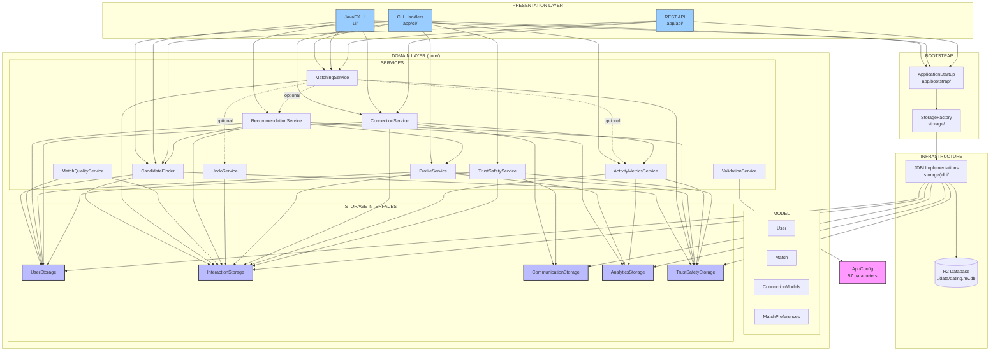
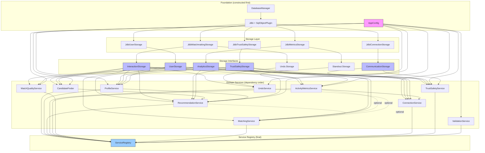
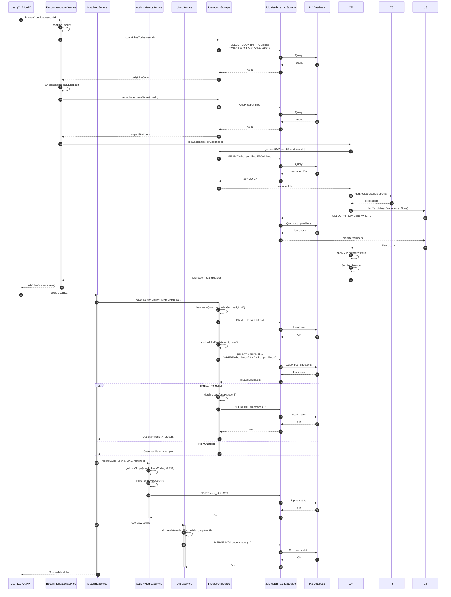
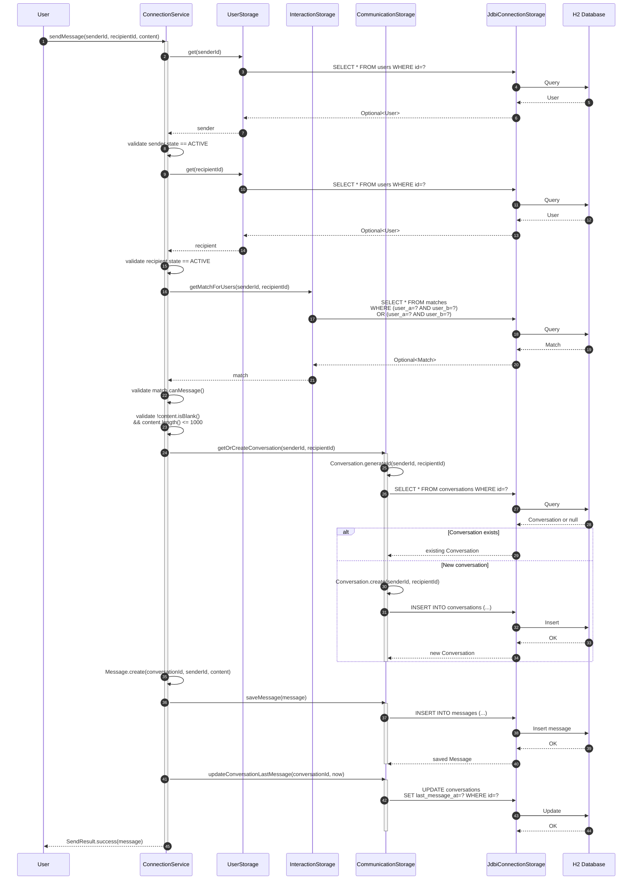
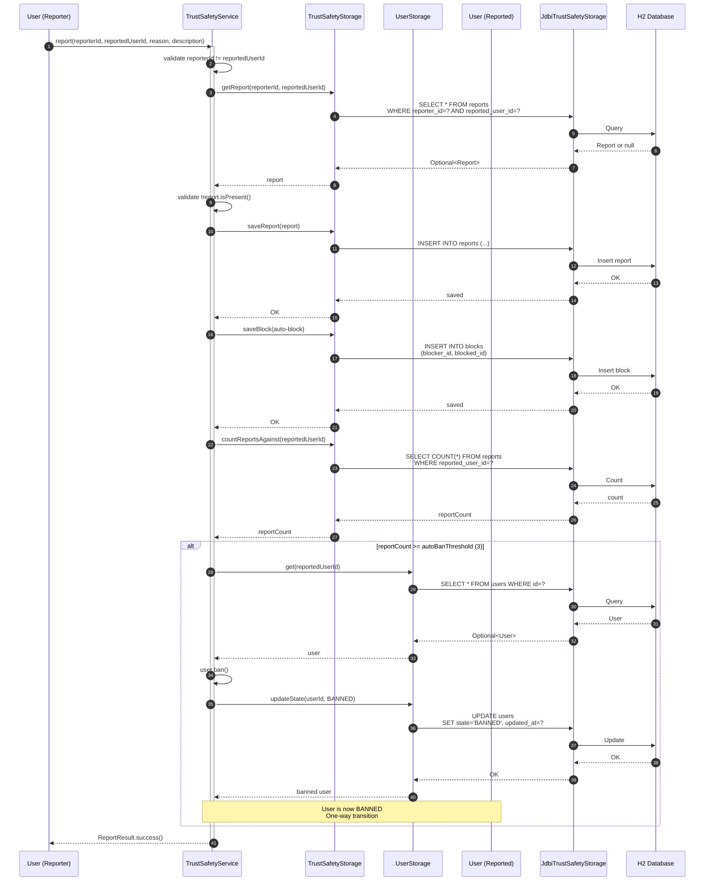
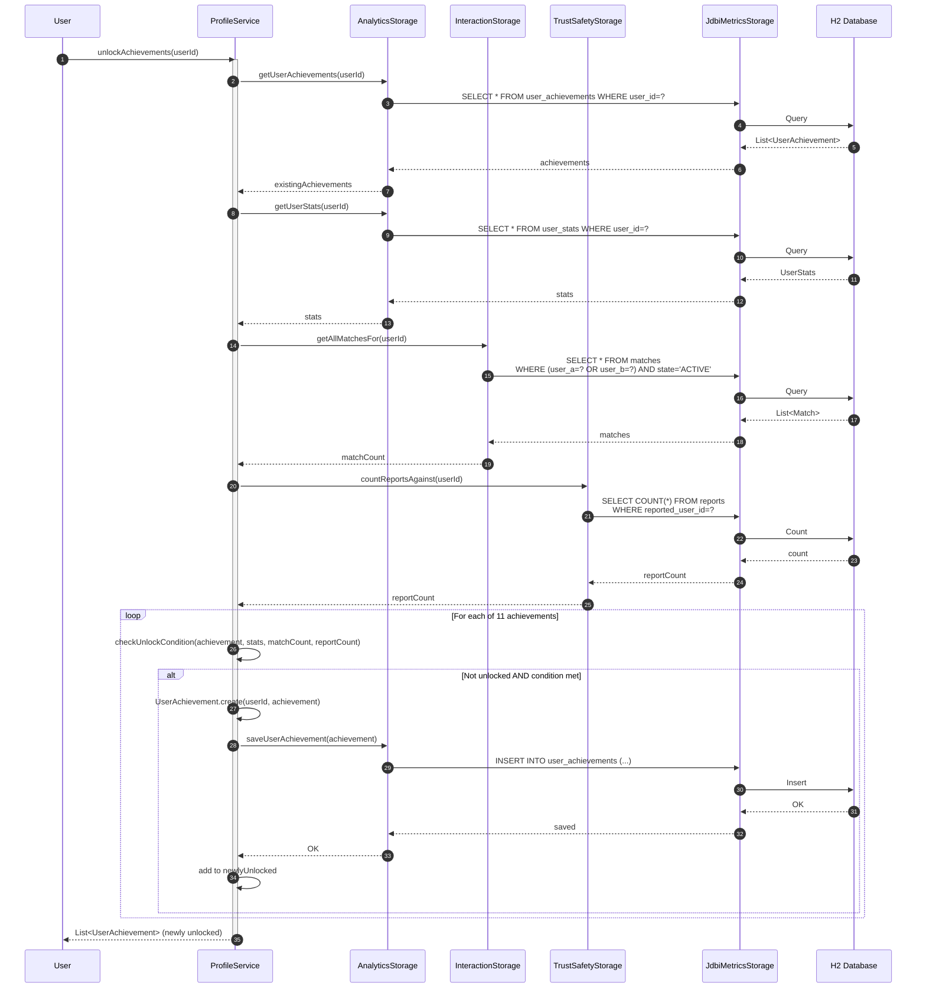
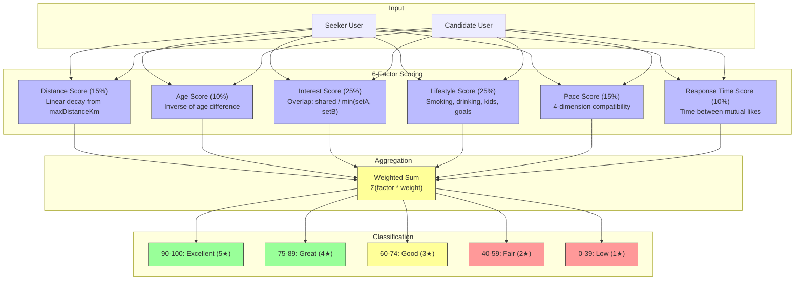

# Architecture Diagrams

**Purpose:** Visual documentation for AI agents and developers to understand system architecture, data flows, and relationships.

**Generated:** 2026-02-22
**ChangeStamp:** 3|2026-02-22 00:00:00|agent:qwen_code|docs|enhance-architecture-diagrams|ARCHITECTURE_DIAGRAMS.md

> **Source of Truth:** All diagrams are derived from the actual codebase. Code is the only source of truth.

---

## Quick Navigation

| Diagram Type                                                          | Section | Format              |
|-----------------------------------------------------------------------|---------|---------------------|
| [Module/Component Graph](#1-modulecomponent-graph)                    | 1       | Mermaid             |
| [Call Graph / Function Graph](#2-call-graph--function-graph)          | 2       | JSON                |
| [UML Class Diagrams](#3-uml-class-diagrams)                           | 3       | PlantUML            |
| [Sequence Diagrams](#4-sequence-diagrams)                             | 4       | Mermaid             |
| [Data Flow / Pipeline](#5-data-flow--pipeline)                        | 5       | Mermaid + Triples   |
| [Architecture Overview](#6-architecture-overview)                     | 6       | Structured Markdown |
| [Database ER / Schema](#7-database-er--schema)                        | 7       | SQL DDL + Mermaid   |
| [File Tree + Symbol Index](#8-file-tree--symbol-index)                | 8       | Markdown Table      |
| [Component Responsibility Matrix](#9-component-responsibility-matrix) | 9       | Markdown Table      |

---

## Legend

| Color                                           | Meaning                    |
|-------------------------------------------------|----------------------------|
| <span style="color:#9cf;">**Light Blue**</span> | Entry Points / Controllers |
| <span style="color:#bbf;">**Blue**</span>       | Storage Interfaces         |
| <span style="color:#f9f;">**Pink**</span>       | Configuration              |
| <span style="color:#9f9;">**Green**</span>      | Success / Valid States     |
| <span style="color:#ff9;">**Yellow**</span>     | Intermediate States        |
| <span style="color:#f99;">**Red**</span>        | Error / Terminal States    |

---

# 1. Module/Component Graph

## 1.1 High-Level Architecture



## 1.2 Package Dependency Graph

```mermaid
graph LR
    subgraph "datingapp.core"
        CORE[core.*<br/>AppClock, AppConfig,<br/>AppSession, ServiceRegistry]
    end

    subgraph "datingapp.core.model"
        MODEL[User, Match,<br/>ProfileNote]
    end

    subgraph "datingapp.core.connection"
        CONN[ConnectionModels,<br/>ConnectionService]
    end

    subgraph "datingapp.core.matching"
        MATCH_SVC[CandidateFinder,<br/>MatchingService,<br/>MatchQualityService,<br/>RecommendationService,<br/>UndoService,<br/>TrustSafetyService]
    end

    subgraph "datingapp.core.profile"
      PROFILE_PROVIDER[ProfileProvider<br/>(implemented by ProfileService)]
        PROFILE[ProfileService,<br/>ValidationService,<br/>MatchPreferences]
    end

    subgraph "datingapp.core.metrics"
        METRICS[ActivityMetricsService,<br/>EngagementDomain,<br/>SwipeState]
    end

    subgraph "datingapp.core.storage"
        STORAGE_IF[UserStorage,<br/>InteractionStorage,<br/>CommunicationStorage,<br/>AnalyticsStorage,<br/>TrustSafetyStorage]
    end

    subgraph "datingapp.storage"
        INFRA[DatabaseManager,<br/>StorageFactory,<br/>JDBI implementations,<br/>SchemaInitializer]
    end

    subgraph "datingapp.app"
        APP[ApplicationStartup,<br/>RestApiServer,<br/>CLI Handlers]
    end

    subgraph "datingapp.ui"
        UI[DatingApp,<br/>NavigationService,<br/>Controllers,<br/>ViewModels]
    end

    CORE --> MODEL
    MODEL --> STORAGE_IF
    CONN --> MODEL
    CONN --> STORAGE_IF
    MATCH_SVC --> MODEL
    MATCH_SVC --> CONN
    MATCH_SVC --> PROFILE_PROVIDER
    MATCH_SVC --> METRICS
    MATCH_SVC --> STORAGE_IF
    PROFILE --> MODEL
    PROFILE --> STORAGE_IF
    METRICS --> MODEL
    METRICS --> CONN
    METRICS --> STORAGE_IF
    STORAGE_IF --> MODEL
    STORAGE_IF --> CONN
    STORAGE_IF --> METRICS
    INFRA --> CORE
    INFRA --> MODEL
    INFRA --> CONN
    INFRA --> MATCH_SVC
    INFRA --> PROFILE
    INFRA --> METRICS
    INFRA --> STORAGE_IF
    APP --> CORE
    APP --> MODEL
    APP --> CONN
    APP --> MATCH_SVC
    APP --> PROFILE
    APP --> METRICS
    APP --> STORAGE_IF
    APP --> INFRA
    UI --> CORE
    UI --> MODEL
    UI --> CONN
    UI --> MATCH_SVC
    UI --> PROFILE
    UI --> METRICS
    UI --> STORAGE_IF
    UI --> APP

    style STORAGE_IF fill:#bbf,stroke:#333
    style INFRA fill:#9f9,stroke:#333
    style APP fill:#9cf,stroke:#333
    style UI fill:#9cf,stroke:#333
```

## 1.3 Service Construction Dependency Graph



---

# 2. Call Graph / Function Graph

## 2.1 Service Method Call Graph (JSON)

```json
{
  "callGraph": {
    "version": "1.0",
    "generatedFrom": "datingapp/ source code",
    "nodes": {
      "CandidateFinder": {
        "package": "datingapp.core.matching",
        "methods": {
          "findCandidatesForUser": {
            "returns": "List<User>",
            "calls": [
              "InteractionStorage.getLikedOrPassedUserIds",
              "TrustSafetyStorage.getBlockedUserIds",
              "UserStorage.findCandidates",
              "Dealbreakers.Evaluator.passes",
              "GeoUtils.calculateDistance"
            ]
          },
          "filterNoPriorInteraction": {
            "returns": "Predicate<User>",
            "calls": ["InteractionStorage.getLikedOrPassedUserIds"]
          },
          "filterMutualGender": {
            "returns": "Predicate<User>",
            "calls": []
          },
          "filterMutualAge": {
            "returns": "Predicate<User>",
            "calls": ["User.getAge"]
          },
          "filterDistance": {
            "returns": "Predicate<User>",
            "calls": ["GeoUtils.calculateDistance"]
          }
        }
      },
      "MatchingService": {
        "package": "datingapp.core.matching",
        "methods": {
          "recordLike": {
            "returns": "Optional<Match>",
            "calls": [
              "InteractionStorage.saveLikeAndMaybeCreateMatch",
              "ActivityMetricsService.recordSwipe",
              "UndoService.recordSwipe",
              "TrustSafetyStorage.getBlockedUserIds"
            ]
          },
          "processSwipe": {
            "returns": "SwipeResult",
            "calls": [
              "RecommendationService.canLike",
              "InteractionStorage.saveLike",
              "ActivityMetricsService.recordSwipe",
              "UndoService.recordSwipe"
            ]
          },
          "getMatchesForUser": {
            "returns": "List<Match>",
            "calls": ["InteractionStorage.getAllMatchesFor"]
          },
          "unmatch": {
            "returns": "UnmatchResult",
            "calls": [
              "InteractionStorage.getMatchForUsers",
              "Match.unmatch",
              "ConnectionService.gracefulExitTransition"
            ]
          },
          "block": {
            "returns": "BlockResult",
            "calls": [
              "InteractionStorage.getMatchForUsers",
              "Match.block",
              "TrustSafetyStorage.saveBlock"
            ]
          }
        }
      },
      "MatchQualityService": {
        "package": "datingapp.core.matching",
        "methods": {
          "computeQualityScore": {
            "returns": "int (0-100)",
            "calls": [
              "calculateDistanceScore",
              "calculateAgeScore",
              "calculateInterestScore",
              "calculateLifestyleScore",
              "calculatePaceScore",
              "calculateResponseTimeScore"
            ]
          },
          "calculateInterestScore": {
            "returns": "int",
            "calls": ["EnumSetUtil.intersectionSize"]
          },
          "calculateLifestyleScore": {
            "returns": "int",
            "calls": [
              "LifestyleMatcher.matchSmoking",
              "LifestyleMatcher.matchDrinking",
              "LifestyleMatcher.matchWantsKids",
              "LifestyleMatcher.matchLookingFor",
              "LifestyleMatcher.matchEducation"
            ]
          }
        }
      },
      "RecommendationService": {
        "package": "datingapp.core.matching",
        "methods": {
          "browseCandidates": {
            "returns": "List<User>",
            "calls": [
              "canLike",
              "CandidateFinder.findCandidatesForUser",
              "MatchQualityService.computeQualityScore"
            ]
          },
          "canLike": {
            "returns": "CanLikeResult",
            "calls": [
              "InteractionStorage.countLikesToday",
              "InteractionStorage.countSuperLikesToday"
            ]
          },
          "getDailyPick": {
            "returns": "Optional<DailyPick>",
            "calls": [
              "AnalyticsStorage.getDailyPickView",
              "getStandouts",
              "AnalyticsStorage.saveDailyPickView"
            ]
          },
          "getStandouts": {
            "returns": "List<Standout>",
            "calls": [
              "CandidateFinder.findCandidatesForUser",
              "MatchQualityService.computeQualityScore",
              "ProfileService.calculate",
              "AnalyticsStorage.getStandouts"
            ]
          }
        }
      },
      "UndoService": {
        "package": "datingapp.core.matching",
        "methods": {
          "recordSwipe": {
            "returns": "void",
            "calls": ["Undo.Storage.save"]
          },
          "undoSwipe": {
            "returns": "UndoResult",
            "calls": [
              "Undo.Storage.findByUserId",
              "Undo.isExpired",
              "InteractionStorage.deleteLike",
              "InteractionStorage.deleteMatch",
              "ActivityMetricsService.decrementSwipeCount",
              "Undo.Storage.delete"
            ]
          }
        }
      },
      "ProfileService": {
        "package": "datingapp.core.profile",
        "methods": {
          "calculate": {
            "returns": "CompletionResult",
            "calls": [
              "checkFieldCompletion",
              "AnalyticsStorage.saveUserStats",
              "AppConfig.getCompletionThresholds"
            ]
          },
          "getCompletionTips": {
            "returns": "List<String>",
            "calls": ["checkFieldCompletion"]
          },
          "unlockAchievements": {
            "returns": "List<UserAchievement>",
            "calls": [
              "AnalyticsStorage.getUserAchievements",
              "AnalyticsStorage.saveUserAchievement",
              "InteractionStorage.getAllMatchesFor",
              "TrustSafetyStorage.countReportsAgainst"
            ]
          },
          "analyzeBehavior": {
            "returns": "BehaviorAnalysis",
            "calls": [
              "InteractionStorage.getSwipeHistory",
              "TrustSafetyStorage.getBlocksByUser",
              "TrustSafetyStorage.getReportsAgainst"
            ]
          }
        }
      },
      "ValidationService": {
        "package": "datingapp.core.profile",
        "methods": {
          "validateName": {
            "returns": "ValidationResult",
            "calls": ["AppConfig.maxNameLength"]
          },
          "validateAge": {
            "returns": "ValidationResult",
            "calls": ["AppConfig.minAge", "AppConfig.maxAge"]
          },
          "validateBio": {
            "returns": "ValidationResult",
            "calls": ["AppConfig.maxBioLength"]
          },
          "validateInterests": {
            "returns": "ValidationResult",
            "calls": ["AppConfig.maxInterests"]
          },
          "validateDealbreakers": {
            "returns": "ValidationResult",
            "calls": [
              "AppConfig.minHeightCm",
              "AppConfig.maxHeightCm",
              "AppConfig.maxAgeRangeSpan"
            ]
          }
        }
      },
      "ConnectionService": {
        "package": "datingapp.core.connection",
        "methods": {
          "sendMessage": {
            "returns": "SendResult",
            "calls": [
              "UserStorage.get",
              "InteractionStorage.getMatchForUsers",
              "Match.canMessage",
              "CommunicationStorage.getOrCreateConversation",
              "CommunicationStorage.saveMessage",
              "CommunicationStorage.updateConversationLastMessage"
            ]
          },
          "getConversationsForUser": {
            "returns": "List<Conversation>",
            "calls": ["CommunicationStorage.getConversationsForUser"]
          },
          "acceptFriendZoneTransition": {
            "returns": "AcceptFriendZoneResult",
            "calls": [
              "CommunicationStorage.getFriendRequest",
              "FriendRequest.accept",
              "CommunicationStorage.saveFriendRequest",
              "InteractionStorage.acceptFriendZoneTransition"
            ]
          },
          "gracefulExitTransition": {
            "returns": "GracefulExitResult",
            "calls": [
              "InteractionStorage.getMatchForUsers",
              "Match.gracefulExit",
              "CommunicationStorage.saveNotification"
            ]
          }
        }
      },
      "ActivityMetricsService": {
        "package": "datingapp.core.metrics",
        "methods": {
          "recordSwipe": {
            "returns": "void",
            "calls": [
              "getLockStripe",
              "incrementSwipeCount",
              "updateSessionMetrics"
            ]
          },
          "getUserStats": {
            "returns": "UserStats",
            "calls": [
              "InteractionStorage.countLikesGiven",
              "InteractionStorage.countLikesReceived",
              "InteractionStorage.countMatches",
              "computeReciprocityScore",
              "computeSelectivenessScore",
              "computeAttractivenessScore"
            ]
          },
          "getPlatformStats": {
            "returns": "PlatformStats",
            "calls": [
              "UserStorage.countActiveUsers",
              "AnalyticsStorage.getAllUserStats",
              "aggregateMetrics"
            ]
          },
          "startSession": {
            "returns": "SwipeSession",
            "calls": ["SwipeState.Session.create"]
          },
          "endSession": {
            "returns": "void",
            "calls": [
              "SwipeSession.end",
              "AnalyticsStorage.saveSwipeSession"
            ]
          }
        }
      },
      "TrustSafetyService": {
        "package": "datingapp.core.matching",
        "methods": {
          "block": {
            "returns": "BlockResult",
            "calls": [
              "TrustSafetyStorage.saveBlock",
              "InteractionStorage.unmatchAll"
            ]
          },
          "report": {
            "returns": "ReportResult",
            "calls": [
              "TrustSafetyStorage.saveReport",
              "TrustSafetyStorage.saveBlock",
              "TrustSafetyStorage.countReportsAgainst",
              "User.ban"
            ]
          },
          "verifyProfile": {
            "returns": "VerifyResult",
            "calls": [
              "UserStorage.get",
              "User.setVerified",
              "UserStorage.save"
            ]
          }
        }
      }
    },
    "entryPoints": {
      "CLI": {
        "file": "datingapp/Main.java",
        "calls": [
          "MatchingHandler.browseCandidates",
          "MatchingHandler.viewMatches",
          "ProfileHandler.completeProfile",
          "SafetyHandler.blockUser",
          "SafetyHandler.reportUser",
          "MessagingHandler.showConversations"
        ]
      },
      "JavaFX": {
        "file": "datingapp/ui/DatingApp.java",
        "calls": [
          "ViewModelFactory.getMatchingViewModel",
          "ViewModelFactory.getProfileViewModel",
          "ViewModelFactory.getChatViewModel"
        ]
      },
      "REST": {
        "file": "datingapp/app/api/RestApiServer.java",
        "routes": {
          "GET /api/health": ["System.currentTimeMillis"],
          "GET /api/users": ["UserStorage.findActive"],
          "GET /api/users/{id}": ["UserStorage.get"],
          "GET /api/users/{id}/candidates": ["CandidateFinder.findCandidatesForUser"],
          "POST /api/users/{id}/like/{targetId}": ["MatchingService.recordLike"],
          "POST /api/users/{id}/pass/{targetId}": ["MatchingService.processSwipe"],
          "GET /api/users/{id}/matches": ["InteractionStorage.getAllMatchesFor"],
          "GET /api/users/{id}/conversations": ["CommunicationStorage.getConversationsForUser"],
          "POST /api/conversations/{id}/messages": ["ConnectionService.sendMessage"]
        }
      }
    }
  }
}
```

## 2.2 Critical Path Call Trees

### Like → Match Creation Call Tree

```
User.like(candidateId)
├── RecommendationService.canLike(userId)
│   ├── InteractionStorage.countLikesToday(userId)
│   └── InteractionStorage.countSuperLikesToday(userId)
├── MatchingService.recordLike(like)
│   ├── InteractionStorage.saveLikeAndMaybeCreateMatch(like)
│   │   ├── Like.create(whoLikes, whoGotLiked, LIKE)
│   │   ├── LikeStorage.save(like)
│   │   ├── InteractionStorage.mutualLikeExists(userA, userB)
│   │   │   ├── LikeStorage.getByPair(userA, userB)
│   │   │   └── LikeStorage.getByPair(userB, userA)
│   │   └── Match.create(userA, userB) [if mutual]
│   │       └── MatchStorage.save(match)
│   ├── ActivityMetricsService.recordSwipe(userId, LIKE, matched)
│   │   ├── getLockStripe(userId.hashCode() % 256)
│   │   └── incrementSwipeCount()
│   └── UndoService.recordSwipe(like)
│       └── Undo.Storage.save(undoState)
└── Optional<Match> (present if mutual, empty otherwise)
```

### Send Message Call Tree

```
User.sendMessage(senderId, recipientId, content)
├── ConnectionService.sendMessage(senderId, recipientId, content)
│   ├── UserStorage.get(senderId)
│   │   └── validate state == ACTIVE
│   ├── UserStorage.get(recipientId)
│   │   └── validate state == ACTIVE
│   ├── InteractionStorage.getMatchForUsers(senderId, recipientId)
│   │   └── validate match.canMessage() == true
│   ├── validateContent(content)
│   │   ├── !content.isBlank()
│   │   └── content.length() <= 1000
│   ├── CommunicationStorage.getOrCreateConversation(senderId, recipientId)
│   │   ├── Conversation.generateId(senderId, recipientId)
│   │   └── ConversationStorage.saveIfNew()
│   ├── Message.create(conversationId, senderId, content)
│   ├── CommunicationStorage.saveMessage(message)
│   └── CommunicationStorage.updateConversationLastMessage(conversationId)
└── SendResult.success(message)
```

### Report → Auto-Ban Call Tree

```
User.report(reporterId, reportedUserId, reason, description)
├── TrustSafetyService.report(reporterId, reportedUserId, reason, description)
│   ├── validate(reporterId != reportedUserId)
│   ├── TrustSafetyStorage.getReport(reporterId, reportedUserId)
│   │   └── validate !exists (no duplicate)
│   ├── TrustSafetyStorage.saveReport(report)
│   ├── TrustSafetyStorage.saveBlock(auto-block reporter ← reported)
│   ├── TrustSafetyStorage.countReportsAgainst(reportedUserId)
│   └── if count >= autoBanThreshold (3):
│       ├── UserStorage.get(reportedUserId)
│       └── User.ban()
└── ReportResult.success()
```

---

# 3. UML Class Diagrams

## 3.1 Domain Models (PlantUML)

```plantuml
@startuml
skinparam classAttributeIconSize 0
skinparam monochrome true

package "datingapp.core.model" {
  class User {
    -id: UUID
    -name: String
    -bio: String
    -birthDate: LocalDate
    -gender: Gender
    -interestedIn: Set<Gender>
    -lat: double
    -lon: double
    -hasLocationSet: boolean
    -maxDistanceKm: int
    -minAge: int
    -maxAge: int
    -photoUrls: List<String>
    -state: UserState
    -createdAt: Instant
    -updatedAt: Instant
    -smoking: Smoking
    -drinking: Drinking
    -wantsKids: WantsKids
    -lookingFor: LookingFor
    -education: Education
    -heightCm: Integer
    -dealbreakers: Dealbreakers
    -interests: Set<Interest>
    -email: String
    -phone: String
    -isVerified: boolean
    -verificationMethod: VerificationMethod
    -verificationCode: String
    -verificationSentAt: Instant
    -verifiedAt: Instant
    -pacePreferences: PacePreferences
    -deletedAt: Instant
    +create(id: UUID, name: String): User
    +activate(): void
    +pause(): void
    +ban(): void
    +isComplete(): boolean
    +getAge(zone: ZoneId): int
  }

  enum Gender {
    MALE
    FEMALE
    OTHER
  }

  enum UserState {
    INCOMPLETE
    ACTIVE
    PAUSED
    BANNED
  }

  enum VerificationMethod {
    EMAIL
    PHONE
  }

  class Match {
    -id: String
    -userA: UUID
    -userB: UUID
    -createdAt: Instant
    -state: MatchState
    -endedAt: Instant
    -endedBy: UUID
    -endReason: MatchArchiveReason
    -deletedAt: Instant
    +create(userA: UUID, userB: UUID): Match
    +generateId(a: UUID, b: UUID): String
    +unmatch(userId: UUID): void
    +block(userId: UUID): void
    +transitionToFriends(userId: UUID): void
    +revertToActive(): void
    +gracefulExit(userId: UUID): void
    +canMessage(): boolean
    +involves(userId: UUID): boolean
    +getOtherUser(userId: UUID): UUID
  }

  enum MatchState {
    ACTIVE
    FRIENDS
    UNMATCHED
    GRACEFUL_EXIT
    BLOCKED
  }

  enum MatchArchiveReason {
    FRIEND_ZONE
    GRACEFUL_EXIT
    UNMATCH
    BLOCK
  }

  class ProfileNote {
    -authorId: UUID
    -subjectId: UUID
    -content: String
    -createdAt: Instant
    -updatedAt: Instant
    +create(authorId: UUID, subjectId: UUID, content: String): ProfileNote
    +withContent(newContent: String): ProfileNote
  }
}

User "1" -- "0..*" ProfileNote : writes
User "1" -- "0..*" ProfileNote : receives
Match "2" -- "2" User : involves

note top of User::state
  State Machine:
  INCOMPLETE → ACTIVE (activate)
  ACTIVE → PAUSED (pause)
  PAUSED → ACTIVE (activate)
  ANY → BANNED (ban, one-way)
end note

note top of Match::state
  State Machine:
  ACTIVE → FRIENDS | UNMATCHED | GRACEFUL_EXIT | BLOCKED
  FRIENDS → UNMATCHED | GRACEFUL_EXIT | BLOCKED | ACTIVE
  Others: terminal
end note

@enduml
```

## 3.2 Connection Models (PlantUML)

```plantuml
@startuml
skinparam classAttributeIconSize 0
skinparam monochrome true

package "datingapp.core.connection" {
  class ConnectionModels {
    +Message: record
    +Conversation: class
    +Like: record
    +Block: record
    +Report: record
    +FriendRequest: record
    +Notification: record
  }

  class Message {
    -id: UUID
    -conversationId: String
    -senderId: UUID
    -content: String
    -createdAt: Instant
  }

  class Conversation {
    -id: String
    -userA: UUID
    -userB: UUID
    -createdAt: Instant
    -lastMessageAt: Instant
    -userAReadAt: Instant
    -userBReadAt: Instant
    -userAArchivedAt: Instant
    -userBArchivedAt: Instant
    -userAArchiveReason: MatchArchiveReason
    -userBArchiveReason: MatchArchiveReason
    -visibleToUserA: boolean
    -visibleToUserB: boolean
    +generateId(userA: UUID, userB: UUID): String
    +archiveByUser(userId: UUID): void
    +unarchiveByUser(userId: UUID): void
    +hideByUser(userId: UUID): void
    +unhideByUser(userId: UUID): void
  }

  class Like {
    -id: UUID
    -whoLikes: UUID
    -whoGotLiked: UUID
    -direction: Direction
    -createdAt: Instant
    +create(whoLikes: UUID, whoGotLiked: UUID, dir: Direction): Like
  }

  enum Direction {
    LIKE
    PASS
  }

  class Block {
    -id: UUID
    -blockerId: UUID
    -blockedId: UUID
    -createdAt: Instant
  }

  class Report {
    -id: UUID
    -reporterId: UUID
    -reportedUserId: UUID
    -reason: Reason
    -description: String
    -createdAt: Instant
  }

  enum Reason {
    SPAM
    INAPPROPRIATE_CONTENT
    HARASSMENT
    FAKE_PROFILE
    UNDERAGE
    OTHER
  }

  class FriendRequest {
    -id: UUID
    -fromUserId: UUID
    -toUserId: UUID
    -createdAt: Instant
    -status: Status
    -respondedAt: Instant
  }

  enum Status {
    PENDING
    ACCEPTED
    DECLINED
    EXPIRED
  }

  class Notification {
    -id: UUID
    -userId: UUID
    -type: Type
    -title: String
    -message: String
    -createdAt: Instant
    -isRead: boolean
    -data: Map<String,String>
  }

  enum Type {
    MATCH_FOUND
    NEW_MESSAGE
    FRIEND_REQUEST
    FRIEND_REQUEST_ACCEPTED
    GRACEFUL_EXIT
  }
}

Conversation "1" *-- "0..*" Message : contains
Conversation "2" -- "2" User : involves
Like "2" -- "2" User : involves
Block "2" -- "2" User : involves
Report "2" -- "2" User : involves
FriendRequest "2" -- "2" User : involves
Notification "1" -- "1" User : targets

note top of Conversation::id
  Deterministic ID:
  userA_userB (sorted)
end note

note top of Like::direction
  LIKE = positive interest
  PASS = negative interest
end note

@enduml
```

## 3.3 Match Preferences (PlantUML)

```plantuml
@startuml
skinparam classAttributeIconSize 0
skinparam monochrome true

package "datingapp.core.profile" {
  class MatchPreferences {
    +Interest: enum
    +Lifestyle: class
    +PacePreferences: record
    +Dealbreakers: record
  }

  enum Interest {
    HIKING
    CAMPING
    FISHING
    CYCLING
    RUNNING
    CLIMBING
    MOVIES
    MUSIC
    CONCERTS
    ART_GALLERIES
    THEATER
    PHOTOGRAPHY
    READING
    WRITING
    COOKING
    BAKING
    WINE
    CRAFT_BEER
    COFFEE
    FOODIE
    GYM
    YOGA
    BASKETBALL
    SOCCER
    TENNIS
    SWIMMING
    GOLF
    VIDEO_GAMES
    BOARD_GAMES
    CODING
    TECH
    PODCASTS
    TRAVEL
    DANCING
    VOLUNTEERING
    PETS
    DOGS
    CATS
    NIGHTLIFE
  }

  class Lifestyle {
    +Smoking: enum
    +Drinking: enum
    +WantsKids: enum
    +LookingFor: enum
    +Education: enum
  }

  enum Smoking {
    NEVER
    SOMETIMES
    REGULARLY
  }

  enum Drinking {
    NEVER
    SOCIALLY
    REGULARLY
  }

  enum WantsKids {
    NO
    OPEN
    SOMEDAY
    HAS_KIDS
  }

  enum LookingFor {
    CASUAL
    SHORT_TERM
    LONG_TERM
    MARRIAGE
    UNSURE
  }

  enum Education {
    HIGH_SCHOOL
    SOME_COLLEGE
    BACHELORS
    MASTERS
    PHD
    TRADE_SCHOOL
    OTHER
  }

  record PacePreferences {
    -messagingFrequency: MessagingFrequency
    -timeToFirstDate: TimeToFirstDate
    -communicationStyle: CommunicationStyle
    -depthPreference: DepthPreference
  }

  enum MessagingFrequency {
    RARELY
    OFTEN
    CONSTANTLY
    WILDCARD
  }

  enum TimeToFirstDate {
    QUICKLY
    FEW_DAYS
    WEEKS
    MONTHS
    WILDCARD
  }

  enum CommunicationStyle {
    TEXT_ONLY
    VOICE_NOTES
    VIDEO_CALLS
    IN_PERSON_ONLY
    MIX_OF_EVERYTHING
  }

  enum DepthPreference {
    SMALL_TALK
    DEEP_CHAT
    EXISTENTIAL
    DEPENDS_ON_VIBE
  }

  record Dealbreakers {
    -acceptableSmoking: Set<Smoking>
    -acceptableDrinking: Set<Drinking>
    -acceptableKidsStance: Set<WantsKids>
    -acceptableLookingFor: Set<LookingFor>
    -acceptableEducation: Set<Education>
    -minHeightCm: Integer
    -maxHeightCm: Integer
    -maxAgeDifference: Integer
    +none(): Dealbreakers
    +Builder: class
    +Evaluator: class
  }

  class Dealbreakers.Evaluator {
    +passes(seeker: User, candidate: User, zone: ZoneId): boolean
  }
}

Dealbreakers "1" *-- "1" Dealbreakers.Evaluator : uses
PacePreferences "1" *-- "4" Enum : composes
Dealbreakers "1" *-- "7" Field : composes

note top of Interest
  39 interests across 6 categories:
  - OUTDOORS (6)
  - ARTS (8)
  - FOOD (6)
  - SPORTS (7)
  - TECH (5)
  - SOCIAL (7)

  Max per user: 10
  Min for complete: 3
end note

@enduml
```

## 3.4 Metrics Domain (PlantUML)

```plantuml
@startuml
skinparam classAttributeIconSize 0
skinparam monochrome true

package "datingapp.core.metrics" {
  class SwipeState {
    +Session: class
    +Undo: record
  }

  class SwipeState.Session {
    -id: UUID
    -userId: UUID
    -startedAt: Instant
    -lastActivityAt: Instant
    -endedAt: Instant
    -swipeCount: int
    -likeCount: int
    -passCount: int
    -matchCount: int
    +create(userId: UUID): Session
    +recordSwipe(direction: Direction, matched: boolean): void
    +end(): void
    +isTimedOut(timeout: Duration): boolean
  }

  record SwipeState.Undo {
    -userId: UUID
    -like: Like
    -matchId: String
    -expiresAt: Instant
    +create(userId: UUID, like: Like, matchId: String, expiresAt: Instant): Undo
    +isExpired(now: Instant): boolean
  }

  interface "Undo.Storage" as UndoStorage {
    +save(state: Undo): void
    +findByUserId(userId: UUID): Optional<Undo>
    +delete(userId: UUID): void
    +deleteExpired(cutoff: Instant): int
  }

  class EngagementDomain {
    +Achievement: enum
    +UserAchievement: record
    +UserStats: record
    +PlatformStats: record
  }

  enum Achievement {
    FIRST_SPARK
    SOCIAL_BUTTERFLY
    POPULAR
    SUPERSTAR
    LEGEND
    SELECTIVE
    OPEN_MINDED
    COMPLETE_PACKAGE
    STORYTELLER
    LIFESTYLE_GURU
    GUARDIAN
  }

  record UserAchievement {
    -id: UUID
    -userId: UUID
    -achievement: Achievement
    -unlockedAt: Instant
  }

  record UserStats {
    -id: UUID
    -userId: UUID
    -computedAt: Instant
    -totalSwipesGiven: int
    -likesGiven: int
    -passesGiven: int
    -likeRatio: double
    -totalSwipesReceived: int
    -likesReceived: int
    -passesReceived: int
    -incomingLikeRatio: double
    -totalMatches: int
    -activeMatches: int
    -matchRate: double
    -blocksGiven: int
    -blocksReceived: int
    -reportsGiven: int
    -reportsReceived: int
    -reciprocityScore: double
    -selectivenessScore: double
    -attractivenessScore: double
  }

  record PlatformStats {
    -id: UUID
    -computedAt: Instant
    -totalActiveUsers: int
    -avgLikesReceived: double
    -avgLikesGiven: double
    -avgMatchRate: double
    -avgLikeRatio: double
  }
}

SwipeState.Session "1" *-- "0..*" Like : records
SwipeState.Undo "1" *-- "1" Like : contains
SwipeState.Undo ..> UndoStorage : persists to
EngagementDomain "1" *-- "11" Achievement : defines
EngagementDomain "1" *-- "1" UserAchievement : tracks
EngagementDomain "1" *-- "1" UserStats : computes
EngagementDomain "1" *-- "1" PlatformStats : computes

note top of Achievement
  Categories:
  - Matching Milestones (5): FIRST_SPARK, SOCIAL_BUTTERFLY, POPULAR, SUPERSTAR, LEGEND
  - Behavior (2): SELECTIVE, OPEN_MINDED
  - Profile Excellence (3): COMPLETE_PACKAGE, STORYTELLER, LIFESTYLE_GURU
  - Community (1): GUARDIAN
end note

note top of SwipeState.Session
  Timeout: 5 minutes of inactivity
  Tracked per browsing session
end note

note top of SwipeState.Undo
  Undo window: 30 seconds (configurable)
  One undo per user at a time
end note

@enduml
```

## 3.5 Storage Interfaces (PlantUML)

```plantuml
@startuml
skinparam classAttributeIconSize 0
skinparam monochrome true

package "datingapp.core.storage" {
  interface UserStorage {
    +save(user: User): void
    +get(id: UUID): Optional<User>
    +findByEmail(email: String): Optional<User>
    +findActive(): List<User>
    +findCandidates(...): List<User>
    +updateState(id: UUID, state: UserState): void
    +saveNote(note: ProfileNote): void
    +getNote(authorId: UUID, subjectId: UUID): Optional<ProfileNote>
    +getAllNotesBy(authorId: UUID): List<ProfileNote>
    +deleteNote(authorId: UUID, subjectId: UUID): void
    +countActive(): int
  }

  interface InteractionStorage {
    +saveLike(like: Like): void
    +getLike(id: UUID): Optional<Like>
    +getByPair(whoLikes: UUID, whoGotLiked: UUID): Optional<Like>
    +deleteLike(id: UUID): void
    +mutualLikeExists(userA: UUID, userB: UUID): boolean
    +saveMatch(match: Match): void
    +getMatch(id: String): Optional<Match>
    +getMatchForUsers(userA: UUID, userB: UUID): Optional<Match>
    +getAllMatchesFor(userId: UUID): List<Match>
    +updateMatchState(id: String, state: MatchState): void
    +getLikedOrPassedUserIds(userId: UUID): Set<UUID>
    +countLikesToday(userId: UUID): int
    +countSuperLikesToday(userId: UUID): int
    +saveLikeAndMaybeCreateMatch(like: Like): Optional<Match>
    +acceptFriendZoneTransition(matchId: String): void
    +gracefulExitTransition(matchId: String, userId: UUID): void
  }

  interface CommunicationStorage {
    +saveConversation(conv: Conversation): void
    +getConversation(id: String): Optional<Conversation>
    +getOrCreateConversation(userA: UUID, userB: UUID): Conversation
    +getConversationsForUser(userId: UUID): List<Conversation>
    +updateConversation(conv: Conversation): void
    +saveMessage(msg: Message): void
    +getMessagesForConversation(convId: String, limit: int, offset: int): List<Message>
    +updateConversationLastMessage(convId: String, timestamp: Instant): void
    +saveFriendRequest(request: FriendRequest): void
    +getFriendRequest(id: UUID): Optional<FriendRequest>
    +getPendingFriendRequestsFor(userId: UUID): List<FriendRequest>
    +updateFriendRequest(request: FriendRequest): void
    +saveNotification(notification: Notification): void
    +getNotificationsFor(userId: UUID, limit: int): List<Notification>
    +markNotificationRead(id: UUID): void
    +getUnreadNotificationCount(userId: UUID): int
  }

  interface AnalyticsStorage {
    +saveUserStats(stats: UserStats): void
    +getUserStats(userId: UUID): Optional<UserStats>
    +saveUserAchievement(achievement: UserAchievement): void
    +getUserAchievements(userId: UUID): List<UserAchievement>
    +saveSwipeSession(session: SwipeState.Session): void
    +getDailyPickView(userId: UUID, date: LocalDate): Optional<DailyPickView>
    +saveDailyPickView(userId: UUID, date: LocalDate): void
    +getStandouts(limit: int): List<Standout>
    +saveStandout(standout: Standout): void
    +getPlatformStats(): Optional<PlatformStats>
    +savePlatformStats(stats: PlatformStats): void
    +getAllUserStats(): List<UserStats>
  }

  interface TrustSafetyStorage {
    +saveBlock(block: Block): void
    +getBlock(blockerId: UUID, blockedId: UUID): Optional<Block>
    +getBlockedUserIds(userId: UUID): Set<UUID>
    +saveReport(report: Report): void
    +getReport(reporterId: UUID, reportedUserId: UUID): Optional<Report>
    +countReportsAgainst(userId: UUID): int
    +getReportsAgainst(userId: UUID): List<Report>
    +getBlocksByUser(userId: UUID): List<Block>
  }
}

note right of UserStorage
  Implemented by: JdbiUserStorage
  Tables: users, profile_notes
end note

note right of InteractionStorage
  Implemented by: JdbiMatchmakingStorage
  Tables: likes, matches, undo_states
end note

note right of CommunicationStorage
  Implemented by: JdbiConnectionStorage
  Tables: conversations, messages, friend_requests, notifications
end note

note right of AnalyticsStorage
  Implemented by: JdbiMetricsStorage
  Tables: user_stats, user_achievements, swipe_sessions, daily_pick_views, standouts, platform_stats
end note

note right of TrustSafetyStorage
  Implemented by: JdbiTrustSafetyStorage
  Tables: blocks, reports
end note

@enduml
```



## 3.6 Service Implementations (PlantUML)

```plantuml
@startuml
skinparam classAttributeIconSize 0
skinparam monochrome true

package "datingapp.core.matching" {
  class CandidateFinder {
    -userStorage: UserStorage
    -interactionStorage: InteractionStorage
    -trustSafetyStorage: TrustSafetyStorage
    -userTimeZone: ZoneId
    +findCandidatesForUser(userId: UUID): List<User>
    -filterNoPriorInteraction(userId: UUID): Predicate<User>
    -filterMutualGender: Predicate<User>
    -filterMutualAge(seeker: User): Predicate<User>
    -filterDistance(seeker: User): Predicate<User>
  }

  class MatchingService {
    -interactionStorage: InteractionStorage
    -trustSafetyStorage: TrustSafetyStorage
    -userStorage: UserStorage
    -activityMetricsService: ActivityMetricsService
    -undoService: UndoService
    -dailyService: RecommendationService
    +recordLike(like: Like): Optional<Match>
    +processSwipe(swipe: Swipe): SwipeResult
    +getMatchesForUser(userId: UUID): List<Match>
    +unmatch(matchId: String, userId: UUID): UnmatchResult
    +block(matchId: String, userId: UUID): BlockResult
  }

  class MatchQualityService {
    -userStorage: UserStorage
    -interactionStorage: InteractionStorage
    -config: AppConfig
    +computeQualityScore(seeker: User, candidate: User): int
    -calculateDistanceScore(seeker: User, candidate: User): int
    -calculateAgeScore(seeker: User, candidate: User): int
    -calculateInterestScore(seeker: User, candidate: User): int
    -calculateLifestyleScore(seeker: User, candidate: User): int
    -calculatePaceScore(seeker: User, candidate: User): int
    -calculateResponseTimeScore(seeker: User, candidate: User): int
  }

  class RecommendationService {
    -userStorage: UserStorage
    -interactionStorage: InteractionStorage
    -trustSafetyStorage: TrustSafetyStorage
    -analyticsStorage: AnalyticsStorage
    -candidateFinder: CandidateFinder
    -standoutStorage: Standout.Storage
    -profileService: ProfileService
    -config: AppConfig
    -clock: Clock
    +browseCandidates(userId: UUID): List<User>
    +canLike(userId: UUID): CanLikeResult
    +getDailyPick(userId: UUID): Optional<DailyPick>
    +getStandouts(userId: UUID, limit: int): List<Standout>
  }

  class UndoService {
    -interactionStorage: InteractionStorage
    -undoStorage: Undo.Storage
    -config: AppConfig
    +recordSwipe(like: Like): void
    +undoSwipe(userId: UUID): UndoResult
  }

  class TrustSafetyService {
    -trustSafetyStorage: TrustSafetyStorage
    -interactionStorage: InteractionStorage
    -userStorage: UserStorage
    -config: AppConfig
    -communicationStorage: CommunicationStorage
    +block(blockerId: UUID, blockedId: UUID): BlockResult
    +report(reporterId: UUID, reportedUserId: UUID, reason: Reason, desc: String): ReportResult
    +verifyProfile(userId: UUID, method: VerificationMethod): VerifyResult
  }
}

package "datingapp.core.profile" {
  class ProfileService {
    -config: AppConfig
    -analyticsStorage: AnalyticsStorage
    -interactionStorage: InteractionStorage
    -trustSafetyStorage: TrustSafetyStorage
    -userStorage: UserStorage
    +calculate(user: User): CompletionResult
    +getCompletionTips(user: User): List<String>
    +unlockAchievements(userId: UUID): List<UserAchievement>
    +analyzeBehavior(userId: UUID): BehaviorAnalysis
  }

  class ValidationService {
    -config: AppConfig
    +validateName(name: String): ValidationResult
    +validateAge(age: int): ValidationResult
    +validateBio(bio: String): ValidationResult
    +validateInterests(interests: Set<Interest>): ValidationResult
    +validateDealbreakers(dealbreakers: Dealbreakers): ValidationResult
  }
}

package "datingapp.core.connection" {
  class ConnectionService {
    -config: AppConfig
    -communicationStorage: CommunicationStorage
    -interactionStorage: InteractionStorage
    -userStorage: UserStorage
    -activityMetricsService: ActivityMetricsService
    +sendMessage(senderId: UUID, recipientId: UUID, content: String): SendResult
    +getConversationsForUser(userId: UUID): List<Conversation>
    +acceptFriendZoneTransition(requestId: UUID): AcceptFriendZoneResult
    +gracefulExitTransition(matchId: String, userId: UUID): GracefulExitResult
  }
}

package "datingapp.core.metrics" {
  class ActivityMetricsService {
    -interactionStorage: InteractionStorage
    -trustSafetyStorage: TrustSafetyStorage
    -analyticsStorage: AnalyticsStorage
    -config: AppConfig
    -lockStripes: Object[256]
    +recordSwipe(userId: UUID, direction: Direction, matched: boolean): void
    +getUserStats(userId: UUID): UserStats
    +getPlatformStats(): PlatformStats
    +startSession(userId: UUID): SwipeState.Session
    +endSession(session: SwipeState.Session): void
  }
}

CandidateFinder --> UserStorage
CandidateFinder --> InteractionStorage
CandidateFinder --> TrustSafetyStorage

MatchingService --> InteractionStorage
MatchingService --> TrustSafetyStorage
MatchingService --> UserStorage
MatchingService ..> ActivityMetricsService
MatchingService ..> UndoService
MatchingService ..> RecommendationService

MatchQualityService --> UserStorage
MatchQualityService --> InteractionStorage
MatchQualityService --> AppConfig

RecommendationService --> UserStorage
RecommendationService --> InteractionStorage
RecommendationService --> TrustSafetyStorage
RecommendationService --> AnalyticsStorage
RecommendationService --> CandidateFinder
RecommendationService --> ProfileService

UndoService --> InteractionStorage
UndoService --> Undo.Storage

TrustSafetyService --> TrustSafetyStorage
TrustSafetyService --> InteractionStorage
TrustSafetyService --> UserStorage
TrustSafetyService --> CommunicationStorage

ProfileService --> AnalyticsStorage
ProfileService --> InteractionStorage
ProfileService --> TrustSafetyStorage
ProfileService --> UserStorage

ValidationService --> AppConfig

ConnectionService --> CommunicationStorage
ConnectionService --> InteractionStorage
ConnectionService --> UserStorage
ConnectionService --> ActivityMetricsService

ActivityMetricsService --> InteractionStorage
ActivityMetricsService --> TrustSafetyStorage
ActivityMetricsService --> AnalyticsStorage

note right of ActivityMetricsService
  Uses lock striping (256 stripes)
  for concurrent stats updates
end note

note right of MatchingService
  Optional dependencies via Builder:
  - ActivityMetricsService
  - UndoService
  - RecommendationService
end note

@enduml
```



---

# 4. Sequence Diagrams

## 4.1 Complete Like → Match Flow



## 4.2 Send Message Flow



## 4.3 Report → Auto-Ban Flow



## 4.4 Undo Swipe Flow

```mermaid
sequenceDiagram
    autonumber
    participant U as User
    participant USV as UndoService
    participant IS as InteractionStorage
    participant AMS as ActivityMetricsService
    participant JDBI as JdbiMatchmakingStorage
    participant DB as H2 Database

    U->>USV: undoSwipe(userId)
    activate USV

    USV->>IS: getUndoState(userId)
    IS->>JDBI: SELECT * FROM undo_states WHERE user_id=?
    JDBI->>DB: Query
    DB-->>JDBI: UndoState or null
    JDBI-->>IS: Optional<UndoState>
    IS-->>USV: undoState

    alt No undo state found
        USV-->>U: UndoResult.failure("No swipe to undo")
        deactivate USV
    else Undo state found
        USV->>USV: undoState.isExpired(now)

        alt Expired (>30 seconds)
            USV-->>U: UndoResult.failure("Undo window expired")
            deactivate USV
        else Still valid
            USV->>USV: undoState.getLike()

            USV->>IS: deleteLike(like.id)
            IS->>JDBI: DELETE FROM likes WHERE id=?
            JDBI->>DB: Delete like
            DB-->>JDBI: OK
            JDBI-->>IS: deleted
            IS-->>USV: OK

            alt Match was created
                USV->>IS: deleteMatch(matchId)
                IS->>JDBI: DELETE FROM matches WHERE id=?
                JDBI->>DB: Delete match
                DB-->>JDBI: OK
                JDBI-->>IS: deleted
                IS-->>USV: OK
            end

            USV->>AMS: decrementSwipeCount(userId)
            activate AMS
            AMS->>AMS: getLockStripe(userId.hashCode() % 256)
            AMS->>AMS: decrementSwipeCount()
            AMS->>JDBI: UPDATE user_stats SET ...
            JDBI->>DB: Update stats
            DB-->>JDBI: OK
            deactivate AMS

            USV->>IS: deleteUndoState(userId)
            IS->>JDBI: DELETE FROM undo_states WHERE user_id=?
            JDBI->>DB: Delete undo state
            DB-->>JDBI: OK
            JDBI-->>IS: deleted
            IS-->>USV: OK

            USV-->>U: UndoResult.success()
        end
    end
    deactivate USV
```

## 4.5 Daily Picks Flow

```mermaid
sequenceDiagram
    autonumber
    participant U as User
    participant RS as RecommendationService
    participant AS as AnalyticsStorage
    participant CF as CandidateFinder
    participant MQS as MatchQualityService
    participant PS as ProfileService
    participant JDBI as JdbiMetricsStorage
    participant DB as H2 Database

    U->>RS: getDailyPick(userId)
    activate RS

    RS->>AS: getDailyPickView(userId, today)
    AS->>JDBI: SELECT * FROM daily_pick_views<br/>WHERE user_id=? AND viewed_date=?
    JDBI->>DB: Query
    DB-->>JDBI: DailyPickView or null
    JDBI-->>AS: Optional<DailyPickView>
    AS-->>RS: view

    alt Already viewed today
        RS-->>U: Optional<DailyPick> (existing or empty)
        deactivate RS
    else Not yet viewed
        RS->>AS: getStandouts(limit=5)
        AS->>JDBI: SELECT * FROM standouts<br/>ORDER BY featured_date DESC LIMIT 5
        JDBI->>DB: Query
        DB-->>JDBI: List<Standout>
        JDBI-->>AS: standouts
        AS-->>RS: List<Standout>

        alt No standouts available
            RS->>CF: findCandidatesForUser(userId)
            CF-->>RS: List<User> (candidates)

            loop For each candidate
                RS->>MQS: computeQualityScore(user, candidate)
                MQS-->>RS: score (0-100)

                RS->>PS: calculate(candidate)
                PS-->>RS: CompletionResult
            end

            RS->>RS: Score and rank candidates
            RS->>RS: Select top 5 as standouts

            loop For each standout
                RS->>AS: saveStandout(standout)
                AS->>JDBI: INSERT INTO standouts (...)
                JDBI->>DB: Insert
                DB-->>JDBI: OK
            end
        end

        RS->>RS: Pick random standout as daily pick

        RS->>AS: saveDailyPickView(userId, date)
        AS->>JDBI: MERGE INTO daily_pick_views (user_id, viewed_date, viewed_at)
        JDBI->>DB: Insert/Update
        DB-->>JDBI: OK
        JDBI-->>AS: saved
        AS-->>RS: OK

        RS-->>U: Optional<DailyPick> (present)
    end
    deactivate RS
```

## 4.6 Achievement Unlock Flow



---

# 5. Data Flow / Pipeline

## 5.1 Candidate Discovery Pipeline

```mermaid
flowchart LR
    subgraph "Input"
        USER[User seeking candidates]
    end

    subgraph "SQL Pre-Filter (UserStorage.findCandidates)"
        SQL1[ACTIVE state]
        SQL2[deleted_at IS NULL]
        SQL3[gender IN interestedIn]
        SQL4[age BETWEEN minAge AND maxAge]
        SQL5[Optional: lat/lon bounding box]
    end

    subgraph "7-Stage In-Memory Filter"
        S1["Stage 1: !self"]
        S2["Stage 2: ACTIVE state<br/>(double-check)"]
        S3["Stage 3: No prior interaction<br/>(liked/passed/blocked)"]
        S4["Stage 4: Mutual gender<br/>(bidirectional)"]
        S5["Stage 5: Mutual age<br/>(bidirectional)"]
        S6["Stage 6: Distance ≤ maxDistanceKm<br/>(Haversine)"]
        S7["Stage 7: Passes Dealbreakers<br/>(Evaluator)"]
    end

    subgraph "Sorting"
        SORT[Sort by distance ascending]
    end

    subgraph "Output"
        CAND[Candidates List]
    end

    USER --> SQL1
    SQL1 --> SQL2
    SQL2 --> SQL3
    SQL3 --> SQL4
    SQL4 --> SQL5
    SQL5 --> S1
    S1 --> S2
    S2 --> S3
    S3 --> S4
    S4 --> S5
    S5 --> S6
    S6 --> S7
    S7 --> SORT
    SORT --> CAND

    style S1 fill:#9f9,stroke:#333
    style S2 fill:#9f9,stroke:#333
    style S3 fill:#ff9,stroke:#333
    style S4 fill:#ff9,stroke:#333
    style S5 fill:#ff9,stroke:#333
    style S6 fill:#ff9,stroke:#333
    style S7 fill:#f99,stroke:#333
    style SORT fill:#9cf,stroke:#333
    style CAND fill:#9f9,stroke:#333

    note right of S3
        Excludes:
        - Previously liked
        - Previously passed
        - Blocked users
    end note

    note right of S4
        candidate.gender IN seeker.interestedIn
        AND
        seeker.gender IN candidate.interestedIn
    end note

    note right of S5
        candidate.age BETWEEN seeker.minAge AND maxAge
        AND
        seeker.age BETWEEN candidate.minAge AND maxAge
    end note

    note right of S7
        Dealbreakers checked:
        - Smoking
        - Drinking
        - Wants kids
        - Looking for
        - Education
        - Height range
        - Age difference
    end note
```

## 5.2 Match Quality Scoring Pipeline



## 5.3 Message Flow (Triples Format)

```yaml
# Data Flow: Send Message
# Format: source -> transform -> sink

flows:
  sendMessage:
    - User -> ConnectionService.sendMessage -> validate sender/recipient ACTIVE
    - ConnectionService -> UserStorage.get -> validate states
    - ConnectionService -> InteractionStorage.getMatchForUsers -> validate match.canMessage()
    - ConnectionService -> validateContent -> !blank && length <= 1000
    - ConnectionService -> CommunicationStorage.getOrCreateConversation -> deterministic ID
    - CommunicationStorage -> Conversation.generateId -> sorted UUIDs
    - CommunicationStorage -> JdbiConnectionStorage -> INSERT or SELECT conversation
    - ConnectionService -> Message.create -> conversationId, senderId, content
    - ConnectionService -> CommunicationStorage.saveMessage -> INSERT message
    - ConnectionService -> CommunicationStorage.updateConversationLastMessage -> UPDATE conversation
    - CommunicationStorage -> SendResult.success -> message

  getConversations:
    - User -> ConnectionService.getConversationsForUser -> userId
    - ConnectionService -> CommunicationStorage.getConversationsForUser -> SELECT
    - CommunicationStorage -> JdbiConnectionStorage -> query with ORDER BY last_message_at
    - JdbiConnectionStorage -> List<Conversation> -> sorted by activity

  getMessages:
    - User -> CommunicationStorage.getMessagesForConversation -> convId, limit, offset
    - CommunicationStorage -> JdbiConnectionStorage -> SELECT with LIMIT/OFFSET
    - JdbiConnectionStorage -> List<Message> -> ordered by created_at DESC
```

## 5.4 Like → Match Data Flow (Triples Format)

```yaml
# Data Flow: Like → Match Creation

flows:
  recordLike:
    - User -> MatchingService.recordLike -> Like object
    - MatchingService -> InteractionStorage.saveLikeAndMaybeCreateMatch -> Like
    - InteractionStorage -> Like.create -> whoLikes, whoGotLiked, LIKE
    - InteractionStorage -> JdbiMatchmakingStorage -> INSERT INTO likes
    - InteractionStorage -> mutualLikeExists -> check both directions
    - JdbiMatchmakingStorage -> SELECT FROM likes -> bidirectional query
    - InteractionStorage -> Match.create -> if mutual (deterministic ID)
    - InteractionStorage -> JdbiMatchmakingStorage -> INSERT INTO matches
    - InteractionStorage -> Optional<Match> -> present if mutual

  trackMetrics:
    - MatchingService -> ActivityMetricsService.recordSwipe -> userId, direction, matched
    - ActivityMetricsService -> getLockStripe -> userId.hashCode() % 256
    - ActivityMetricsService -> incrementSwipeCount -> atomic update
    - ActivityMetricsService -> JdbiMetricsStorage -> UPDATE user_stats

  recordUndo:
    - MatchingService -> UndoService.recordSwipe -> Like
    - UndoService -> Undo.create -> userId, like, matchId, expiresAt
    - UndoService -> JdbiMatchmakingStorage -> MERGE INTO undo_states
```

---

# 6. Architecture Overview

## 6.1 Layered Architecture

```
┌─────────────────────────────────────────────────────────────────────────────┐
│                           PRESENTATION LAYER                                 │
│  ┌─────────────────┐  ┌─────────────────┐  ┌─────────────────────────────┐  │
│  │ CLI Handlers    │  │ JavaFX UI       │  │ REST API (Javalin)          │  │
│  │ app/cli/        │  │ ui/             │  │ app/api/RestApiServer.java  │  │
│  │ - Matching      │  │ - 10 Controllers│  │ - Port 7070                 │  │
│  │ - Profile       │  │ - 10 ViewModels │  │ - /api/health               │  │
│  │ - Messaging     │  │ - MVVM Pattern  │  │ - /api/users/*              │  │
│  │ - Safety        │  │ - Navigation    │  │ - /api/conversations/*      │  │
│  │ - Stats         │  │ - Popups        │  │ - JSON responses            │  │
│  └─────────────────┘  └─────────────────┘  └─────────────────────────────┘  │
└─────────────────────────────────────────────────────────────────────────────┘
                                    ↓ calls
┌─────────────────────────────────────────────────────────────────────────────┐
│                           BOOTSTRAP LAYER                                    │
│  ┌─────────────────────────────────────────────────────────────────────┐    │
│  │ ApplicationStartup (app/bootstrap/)                                 │    │
│  │ - Load config from ./config/app-config.json + env vars              │    │
│  │ - Initialize DatabaseManager (HikariCP pool)                        │    │
│  │ - Build ServiceRegistry via StorageFactory                          │    │
│  │ - Graceful shutdown                                                 │    │
│  └─────────────────────────────────────────────────────────────────────┘    │
└─────────────────────────────────────────────────────────────────────────────┘
                                    ↓ uses
┌─────────────────────────────────────────────────────────────────────────────┐
│                           DOMAIN LAYER (core/)                               │
│  ┌─────────────────────────────────────────────────────────────────────┐    │
│  │ MODEL (core/model/)                                                 │    │
│  │ - User: Mutable entity, state machine (INCOMPLETE→ACTIVE→PAUSED)    │    │
│  │ - Match: Deterministic ID, state machine (ACTIVE→FRIENDS→...)       │    │
│  │ - ProfileNote: Private notes between users                          │    │
│  └─────────────────────────────────────────────────────────────────────┘    │
│  ┌─────────────────────────────────────────────────────────────────────┐    │
│  │ SERVICES (9 domain services)                                        │    │
│  │ - CandidateFinder: 7-stage filter pipeline                          │    │
│  │ - MatchingService: Like/pass/unmatch/block                          │    │
│  │ - MatchQualityService: 6-factor compatibility scoring               │    │
│  │ - RecommendationService: Daily picks, standouts, limits             │    │
│  │ - UndoService: 30-second undo window                                │    │
│  │ - ProfileService: Completion scoring, achievements                  │    │
│  │ - ValidationService: Field validation                               │    │
│  │ - ConnectionService: Messaging, friend requests                     │    │
│  │ - ActivityMetricsService: Session tracking, stats (256 lock stripes)│    │
│  │ - TrustSafetyService: Block/report, auto-ban                        │    │
│  └─────────────────────────────────────────────────────────────────────┘    │
│  ┌─────────────────────────────────────────────────────────────────────┐    │
│  │ STORAGE INTERFACES (core/storage/) - 5 consolidated interfaces      │    │
│  │ - UserStorage: User + ProfileNote (11 methods)                      │    │
│  │ - InteractionStorage: Like + Match + Undo (25 methods)              │    │
│  │ - CommunicationStorage: Conversation + Message + FriendRequest      │    │
│  │ - AnalyticsStorage: Stats + Achievements + Sessions (25 methods)    │    │
│  │ - TrustSafetyStorage: Block + Report (10 methods)                   │    │
│  └─────────────────────────────────────────────────────────────────────┘    │
│                                                                              │
│  ┌─────────────────────────────────────────────────────────────────────┐    │
│  │ SUPPORTING TYPES                                                    │    │
│  │ - AppConfig: 57-parameter configuration record                      │    │
│  │ - AppClock: Testable clock abstraction                              │    │
│  │ - AppSession: Singleton for current user                            │    │
│  │ - ServiceRegistry: Immutable container for all services             │    │
│  │ - MatchPreferences: Dealbreakers + PacePreferences + Interest enum  │    │
│  │ - ConnectionModels: Message, Conversation, Like, Block, Report...   │    │
│  │ - EngagementDomain: Achievement enum (11 values), UserStats         │    │
│  │ - SwipeState: Session + Undo records                                │    │
│  └─────────────────────────────────────────────────────────────────────┘    │
└─────────────────────────────────────────────────────────────────────────────┘
                                    ↓ implemented by
┌─────────────────────────────────────────────────────────────────────────────┐
│                         INFRASTRUCTURE LAYER                                 │
│  ┌─────────────────────────────────────────────────────────────────────┐    │
│  │ STORAGE IMPLEMENTATIONS (storage/jdbi/)                             │    │
│  │ - JdbiUserStorage → UserStorage                                     │    │
│  │ - JdbiMatchmakingStorage → InteractionStorage + Undo.Storage        │    │
│  │ - JdbiConnectionStorage → CommunicationStorage                      │    │
│  │ - JdbiMetricsStorage → AnalyticsStorage + Standout.Storage          │    │
│  │ - JdbiTrustSafetyStorage → TrustSafetyStorage                       │    │
│  │                                                                     │    │
│  │ Pattern: JDBI SqlObject interface + RowMapper + StorageBuilder      │    │
│  └─────────────────────────────────────────────────────────────────────┘    │
│  ┌─────────────────────────────────────────────────────────────────────┐    │
│  │ DATABASE (storage/schema/)                                          │    │
│  │ - SchemaInitializer: DDL for 18 tables + indexes + FKs              │    │
│  │ - MigrationRunner: Schema evolution                                 │    │
│  │ - DatabaseManager: H2 + HikariCP singleton                          │    │
│  └─────────────────────────────────────────────────────────────────────┘    │
└─────────────────────────────────────────────────────────────────────────────┘
                                    ↓ persists to
┌─────────────────────────────────────────────────────────────────────────────┐
│                           PLATFORM LAYER                                     │
│  ┌─────────────────────────────────────────────────────────────────────┐    │
│  │ H2 Database Engine                                                  │    │
│  │ - File: ./data/dating.mv.db                                         │    │
│  │ - URL: jdbc:h2:file:./data/dating                                   │    │
│  │ - User: sa / password: dev or DATING_APP_DB_PASSWORD                │    │
│  └─────────────────────────────────────────────────────────────────────┘    │
│  ┌─────────────────────────────────────────────────────────────────────┐    │
│  │ HikariCP Connection Pool                                            │    │
│  │ - Maximum pool size: 10                                             │    │
│  │ - Minimum idle: 2                                                   │    │
│  │ - Connection timeout: 30s                                           │    │
│  └─────────────────────────────────────────────────────────────────────┘    │
│  ┌─────────────────────────────────────────────────────────────────────┐    │
│  │ JDBI 3                                                              │    │
│  │ - SqlObject plugin for DAO pattern                                  │    │
│  │ - Custom type codecs (EnumSet, Instant, UUID)                       │    │
│  └─────────────────────────────────────────────────────────────────────┘    │
└─────────────────────────────────────────────────────────────────────────────┘
```

## 6.2 Service APIs

### Public Service Interfaces

| Service                    | Key Methods                                                                                                                                             | Returns                                                                                     | Used By                          |
|----------------------------|---------------------------------------------------------------------------------------------------------------------------------------------------------|---------------------------------------------------------------------------------------------|----------------------------------|
| **CandidateFinder**        | `findCandidatesForUser(UUID)`                                                                                                                           | `List<User>`                                                                                | CLI, REST, RecommendationService |
| **MatchingService**        | `recordLike(Like)`<br/>`processSwipe(Swipe)`<br/>`getMatchesForUser(UUID)`<br/>`unmatch(String, UUID)`<br/>`block(String, UUID)`                        | `Optional<Match>`<br/>`SwipeResult`<br/>`List<Match>`<br/>`UnmatchResult`<br/>`BlockResult` | CLI, REST, UI                    |
| **MatchQualityService**    | `computeQualityScore(User, User)`                                                                                                                       | `int (0-100)`                                                                               | RecommendationService            |
| **RecommendationService**  | `browseCandidates(UUID)`<br/>`canLike(UUID)`<br/>`getDailyPick(UUID)`<br/>`getStandouts(UUID, int)`                                                     | `List<User>`<br/>`CanLikeResult`<br/>`Optional<DailyPick>`<br/>`List<Standout>`             | CLI, UI, MatchingService         |
| **UndoService**            | `recordSwipe(Like)`<br/>`undoSwipe(UUID)`                                                                                                               | `void`<br/>`UndoResult`                                                                     | MatchingService                  |
| **ProfileService**         | `calculate(User)`<br/>`getCompletionTips(User)`<br/>`unlockAchievements(UUID)`<br/>`analyzeBehavior(UUID)`                                              | `CompletionResult`<br/>`List<String>`<br/>`List<UserAchievement>`<br/>`BehaviorAnalysis`    | CLI, UI, RecommendationService   |
| **ValidationService**      | `validateName(String)`<br/>`validateAge(int)`<br/>`validateBio(String)`<br/>`validateInterests(Set)`                                                    | `ValidationResult` (all)                                                                    | CLI, UI                          |
| **ConnectionService**      | `sendMessage(UUID, UUID, String)`<br/>`getConversationsForUser(UUID)`<br/>`acceptFriendZoneTransition(UUID)`<br/>`gracefulExitTransition(String, UUID)` | `SendResult`<br/>`List<Conversation>`<br/>`AcceptFriendZoneResult`<br/>`GracefulExitResult` | CLI, REST, UI                    |
| **ActivityMetricsService** | `recordSwipe(UUID, Direction, boolean)`<br/>`getUserStats(UUID)`<br/>`getPlatformStats()`<br/>`startSession(UUID)`<br/>`endSession(Session)`            | `void`<br/>`UserStats`<br/>`PlatformStats`<br/>`SwipeState.Session`<br/>`void`              | MatchingService, CLI, UI         |
| **TrustSafetyService**     | `block(UUID, UUID)`<br/>`report(UUID, UUID, Reason, String)`<br/>`verifyProfile(UUID, VerificationMethod)`                                              | `BlockResult`<br/>`ReportResult`<br/>`VerifyResult`                                         | CLI, UI, MatchingService         |

### REST API Endpoints

| Method | Path                               | Handler                | Description           |
|--------|------------------------------------|------------------------|-----------------------|
| GET    | `/api/health`                      | `RestApiServer`        | Health check          |
| GET    | `/api/users`                       | `RestApiServer`        | List all users        |
| GET    | `/api/users/{id}`                  | `RestApiServer`        | Get user details      |
| GET    | `/api/users/{id}/candidates`       | `CandidateFinder`      | Get candidate matches |
| GET    | `/api/users/{id}/matches`          | `InteractionStorage`   | Get user's matches    |
| POST   | `/api/users/{id}/like/{targetId}`  | `MatchingService`      | Like a user           |
| POST   | `/api/users/{id}/pass/{targetId}`  | `MatchingService`      | Pass on a user        |
| GET    | `/api/users/{id}/conversations`    | `CommunicationStorage` | Get conversations     |
| GET    | `/api/conversations/{id}/messages` | `CommunicationStorage` | Get messages          |
| POST   | `/api/conversations/{id}/messages` | `ConnectionService`    | Send message          |

### Security & API Contracts

**Auth model:** none. `RestApiServer` is localhost-only local IPC; it does not use auth tokens or sessions. Identity checks are route-scoped and only apply when a caller supplies an acting-user identity.

| Topic               | Contract                                                                                                                                                                                                             |
|---------------------|----------------------------------------------------------------------------------------------------------------------------------------------------------------------------------------------------------------------|
| Identity            | `/api/users/{id}/...` and `/api/users/{authorId}/...` accept `X-User-Id` or `userId` for scoped identity. When present, the acting user must match the path user ID.                                                 |
| Conversation access | `/api/conversations/{conversationId}/...` requires an acting user; that user must be one of the two participants.                                                                                                    |
| Authorization       | `403 FORBIDDEN` is used for localhost violations, path/acting-user mismatches, and conversation membership failures. `401 UNAUTHORIZED` is not emitted in the current build because no auth middleware is installed. |
| Missing resources   | `404 NOT_FOUND` is used when a user, conversation, or message lookup fails.                                                                                                                                          |
| Throttling          | `429 TOO_MANY_REQUESTS` is used when the local per-IP+method limiter is exceeded.                                                                                                                                    |
| Failures            | `500 INTERNAL_ERROR` is used for unexpected exceptions or dependency failures.                                                                                                                                       |

**Rate limits**

- HTTP throttle: 240 requests/minute per IP + HTTP method; `/api/health` is exempt.
- Like: 100 likes/day from `AppConfig.matching.dailyLikeLimit()`.
- Super-like: 1/day from `AppConfig.matching.dailySuperLikeLimit()`.
- Pass: unlimited by business rule (`dailyPassLimit = -1`), but still subject to the HTTP throttle.

**Representative payloads**

| Endpoint                               | Request                                                                                 | Success response                                                                                                                                                                                                                                                                               |
|----------------------------------------|-----------------------------------------------------------------------------------------|------------------------------------------------------------------------------------------------------------------------------------------------------------------------------------------------------------------------------------------------------------------------------------------------|
| `POST /api/users/{id}/like/{targetId}` | Path params only; no body. Optional `X-User-Id`/`userId` must match `{id}` if supplied. | `201` with `LikeResponse` when a match is created, otherwise `200`. Example: `{"isMatch":false,"message":"Like recorded","match":null}` or `{"isMatch":true,"message":"It's a match!","match":{"matchId":"...","otherUserId":"...","otherUserName":"...","state":"ACTIVE","createdAt":"..."}}` |
| `POST /api/users/{id}/pass/{targetId}` | Path params only; no body. Same scoped-identity rule as like.                           | `200` with `PassResponse`. Example: `{"message":"Passed"}`                                                                                                                                                                                                                                     |

**Shared error envelope**

- `ErrorResponse { code, message }`
- Common codes: `BAD_REQUEST` ($400$), `FORBIDDEN` ($403$), `NOT_FOUND` ($404$), `TOO_MANY_REQUESTS` ($429$), `INTERNAL_ERROR` ($500$)
- `CONFLICT` ($409$) is also used for domain conflicts even though it is outside the requested error set.

## 6.3 Data Stores

| Store               | Type               | Location                   | Purpose                |
|---------------------|--------------------|----------------------------|------------------------|
| **dating.mv.db**    | H2 File Database   | `./data/dating.mv.db`      | Primary data store     |
| **HikariCP Pool**   | Connection Pool    | In-memory                  | Database connections   |
| **app-config.json** | JSON Configuration | `./config/app-config.json` | Application settings   |
| **AppSession**      | Singleton          | In-memory                  | Current logged-in user |

## 6.4 External Dependencies

| Dependency      | Version | Purpose               |
|-----------------|---------|-----------------------|
| **H2 Database** | 2.3.232 | Embedded SQL database |
| **HikariCP**    | 5.1.0   | Connection pooling    |
| **JDBI 3**      | 3.47.0  | SQL object mapping    |
| **Javalin**     | 6.3.0   | REST API framework    |
| **Jackson**     | 2.18.2  | JSON serialization    |
| **JavaFX 25**   | 25      | Desktop UI framework  |
| **JUnit 5**     | 5.11.4  | Testing framework     |
| **AssertJ**     | 3.27.3  | Fluent assertions     |

---

# 7. Database ER / Schema

## 7.1 Complete Entity Relationship Diagram

```mermaid
erDiagram
    USERS {
        UUID id PK
        VARCHAR name
        VARCHAR bio
        DATE birth_date
        VARCHAR gender
        VARCHAR interested_in
        DOUBLE lat
        DOUBLE lon
        BOOLEAN has_location_set
        INT max_distance_km
        INT min_age
        INT max_age
        VARCHAR photo_urls
        VARCHAR state
        TIMESTAMP created_at
        TIMESTAMP updated_at
        VARCHAR smoking
        VARCHAR drinking
        VARCHAR wants_kids
        VARCHAR looking_for
        VARCHAR education
        INT height_cm
        VARCHAR db_smoking
        VARCHAR db_drinking
        VARCHAR db_wants_kids
        VARCHAR db_looking_for
        VARCHAR db_education
        INT db_min_height_cm
        INT db_max_height_cm
        INT db_max_age_diff
        VARCHAR interests
        VARCHAR email
        VARCHAR phone
        BOOLEAN is_verified
        VARCHAR verification_method
        VARCHAR verification_code
        TIMESTAMP verification_sent_at
        TIMESTAMP verified_at
        VARCHAR pace_messaging_frequency
        VARCHAR pace_time_to_first_date
        VARCHAR pace_communication_style
        VARCHAR pace_depth_preference
        TIMESTAMP deleted_at
    }

    LIKES {
        UUID id PK
        UUID who_likes FK
        UUID who_got_liked FK
        VARCHAR direction
        TIMESTAMP created_at
        TIMESTAMP deleted_at
    }

    MATCHES {
        VARCHAR id PK
        UUID user_a FK
        UUID user_b FK
        TIMESTAMP created_at
        VARCHAR state
        TIMESTAMP ended_at
        UUID ended_by
        VARCHAR end_reason
        TIMESTAMP deleted_at
    }

    CONVERSATIONS {
        VARCHAR id PK
        UUID user_a FK
        UUID user_b FK
        TIMESTAMP created_at
        TIMESTAMP last_message_at
        TIMESTAMP user_a_last_read_at
        TIMESTAMP user_b_last_read_at
        TIMESTAMP archived_at_a
        VARCHAR archive_reason_a
        TIMESTAMP archived_at_b
        VARCHAR archive_reason_b
        BOOLEAN visible_to_user_a
        BOOLEAN visible_to_user_b
        TIMESTAMP deleted_at
    }

    MESSAGES {
        UUID id PK
        VARCHAR conversation_id FK
        UUID sender_id FK
        VARCHAR content
        TIMESTAMP created_at
        TIMESTAMP deleted_at
    }

    FRIEND_REQUESTS {
        UUID id PK
        UUID from_user_id FK
        UUID to_user_id FK
        TIMESTAMP created_at
        VARCHAR status
        TIMESTAMP responded_at
    }

    NOTIFICATIONS {
        UUID id PK
        UUID user_id FK
        VARCHAR type
        VARCHAR title
        VARCHAR message
        TIMESTAMP created_at
        BOOLEAN is_read
        TEXT data_json
    }

    BLOCKS {
        UUID id PK
        UUID blocker_id FK
        UUID blocked_id FK
        TIMESTAMP created_at
        TIMESTAMP deleted_at
    }

    REPORTS {
        UUID id PK
        UUID reporter_id FK
        UUID reported_user_id FK
        VARCHAR reason
        VARCHAR description
        TIMESTAMP created_at
        TIMESTAMP deleted_at
    }

    SWIPE_SESSIONS {
        UUID id PK
        UUID user_id FK
        TIMESTAMP started_at
        TIMESTAMP last_activity_at
        TIMESTAMP ended_at
        VARCHAR state
        INT swipe_count
        INT like_count
        INT pass_count
        INT match_count
    }

    USER_STATS {
        UUID id PK
        UUID user_id FK
        TIMESTAMP computed_at
        INT total_swipes_given
        INT likes_given
        INT passes_given
        DOUBLE like_ratio
        INT total_swipes_received
        INT likes_received
        INT passes_received
        DOUBLE incoming_like_ratio
        INT total_matches
        INT active_matches
        DOUBLE match_rate
        INT blocks_given
        INT blocks_received
        INT reports_given
        INT reports_received
        DOUBLE reciprocity_score
        DOUBLE selectiveness_score
        DOUBLE attractiveness_score
    }

    USER_ACHIEVEMENTS {
        UUID id PK
        UUID user_id FK
        VARCHAR achievement
        TIMESTAMP unlocked_at
    }

    DAILY_PICK_VIEWS {
        UUID user_id PK,FK
        DATE viewed_date PK
        TIMESTAMP viewed_at
    }

    STANDOUTS {
        UUID id PK
        UUID seeker_id FK
        UUID standout_user_id FK
        DATE featured_date
        INT rank
        INT score
        VARCHAR reason
        TIMESTAMP created_at
        TIMESTAMP interacted_at
    }

    UNDO_STATES {
        UUID user_id PK
        UUID like_id
        UUID who_likes
        UUID who_got_liked
        VARCHAR direction
        TIMESTAMP like_created_at
        VARCHAR match_id
        TIMESTAMP expires_at
    }

    PROFILE_NOTES {
        UUID author_id PK,FK
        UUID subject_id PK,FK
        VARCHAR content
        TIMESTAMP created_at
        TIMESTAMP updated_at
    }

    PROFILE_VIEWS {
        UUID viewer_id PK,FK
        UUID viewed_id PK,FK
        TIMESTAMP viewed_at PK
    }

    PLATFORM_STATS {
        UUID id PK
        TIMESTAMP computed_at
        INT total_active_users
        DOUBLE avg_likes_received
        DOUBLE avg_likes_given
        DOUBLE avg_match_rate
        DOUBLE avg_like_ratio
    }

    %% Relationships
    USERS ||--o{ LIKES : "gives"
    USERS ||--o{ MATCHES : "creates"
    USERS ||--o{ CONVERSATIONS : "has"
    USERS ||--o{ MESSAGES : "sends"
    USERS ||--o{ FRIEND_REQUESTS : "sends/receives"
    USERS ||--o{ NOTIFICATIONS : "receives"
    USERS ||--o{ BLOCKS : "creates"
    USERS ||--o{ REPORTS : "creates/receives"
    USERS ||--o{ SWIPE_SESSIONS : "has"
    USERS ||--o{ USER_STATS : "has"
    USERS ||--o{ USER_ACHIEVEMENTS : "unlocks"
    USERS ||--o{ STANDOUTS : "featured_in"
    USERS ||--o{ UNDO_STATES : "has"
    USERS ||--o{ PROFILE_NOTES : "writes/receives"
    USERS ||--o{ PROFILE_VIEWS : "creates/views"

    LIKES }|--|| USERS : "who_likes"
    LIKES }|--|| USERS : "who_got_liked"

    MATCHES }|--|| USERS : "user_a"
    MATCHES }|--|| USERS : "user_b"

    CONVERSATIONS }|--|| USERS : "user_a"
    CONVERSATIONS }|--|| USERS : "user_b"
    CONVERSATIONS ||--o{ MESSAGES : "contains"

    FRIEND_REQUESTS }|--|| USERS : "from_user_id"
    FRIEND_REQUESTS }|--|| USERS : "to_user_id"

    NOTIFICATIONS }|--|| USERS : "user_id"

    BLOCKS }|--|| USERS : "blocker_id"
    BLOCKS }|--|| USERS : "blocked_id"

    REPORTS }|--|| USERS : "reporter_id"
    REPORTS }|--|| USERS : "reported_user_id"

    SWIPE_SESSIONS }|--|| USERS : "user_id"

    USER_STATS }|--|| USERS : "user_id"

    USER_ACHIEVEMENTS }|--|| USERS : "user_id"

    STANDOUTS }|--|| USERS : "seeker_id"
    STANDOUTS }|--|| USERS : "standout_user_id"

    UNDO_STATES }|--|| USERS : "user_id"

    PROFILE_NOTES }|--|| USERS : "author_id"
    PROFILE_NOTES }|--|| USERS : "subject_id"

    PROFILE_VIEWS }|--|| USERS : "viewer_id"
    PROFILE_VIEWS }|--|| USERS : "viewed_id"
```



## 7.2 SQL DDL (from SchemaInitializer.java)

### Core Tables

```sql
-- Users table (47 columns)
CREATE TABLE IF NOT EXISTS users (
    id UUID PRIMARY KEY,
    name VARCHAR(100) NOT NULL,
    bio VARCHAR(500),
    birth_date DATE,
    gender VARCHAR(20),
    interested_in VARCHAR(100),
    lat DOUBLE,
    lon DOUBLE,
    has_location_set BOOLEAN DEFAULT FALSE,
    max_distance_km INT DEFAULT 50,
    min_age INT DEFAULT 18,
    max_age INT DEFAULT 99,
    photo_urls VARCHAR(1000),
    state VARCHAR(20) NOT NULL DEFAULT 'INCOMPLETE',
    created_at TIMESTAMP NOT NULL,
    updated_at TIMESTAMP NOT NULL,
    smoking VARCHAR(20),
    drinking VARCHAR(20),
    wants_kids VARCHAR(20),
    looking_for VARCHAR(20),
    education VARCHAR(20),
    height_cm INT,
    db_smoking VARCHAR(100),
    db_drinking VARCHAR(100),
    db_wants_kids VARCHAR(100),
    db_looking_for VARCHAR(100),
    db_education VARCHAR(200),
    db_min_height_cm INT,
    db_max_height_cm INT,
    db_max_age_diff INT,
    interests VARCHAR(500),
    email VARCHAR(200),
    phone VARCHAR(50),
    is_verified BOOLEAN,
    verification_method VARCHAR(10),
    verification_code VARCHAR(10),
    verification_sent_at TIMESTAMP,
    verified_at TIMESTAMP,
    pace_messaging_frequency VARCHAR(30),
    pace_time_to_first_date VARCHAR(30),
    pace_communication_style VARCHAR(30),
    pace_depth_preference VARCHAR(30),
    deleted_at TIMESTAMP
);

-- Likes table
CREATE TABLE IF NOT EXISTS likes (
    id UUID PRIMARY KEY,
    who_likes UUID NOT NULL,
    who_got_liked UUID NOT NULL,
    direction VARCHAR(10) NOT NULL,
    created_at TIMESTAMP NOT NULL,
    deleted_at TIMESTAMP,
    CONSTRAINT fk_likes_who_likes FOREIGN KEY (who_likes) REFERENCES users(id) ON DELETE CASCADE,
    CONSTRAINT fk_likes_who_got_liked FOREIGN KEY (who_got_liked) REFERENCES users(id) ON DELETE CASCADE,
    CONSTRAINT uk_likes UNIQUE (who_likes, who_got_liked)
);

-- Matches table
CREATE TABLE IF NOT EXISTS matches (
    id VARCHAR(100) PRIMARY KEY,
    user_a UUID NOT NULL,
    user_b UUID NOT NULL,
    created_at TIMESTAMP NOT NULL,
    state VARCHAR(20) NOT NULL DEFAULT 'ACTIVE',
    ended_at TIMESTAMP,
    ended_by UUID,
    end_reason VARCHAR(30),
    deleted_at TIMESTAMP,
    CONSTRAINT fk_matches_user_a FOREIGN KEY (user_a) REFERENCES users(id) ON DELETE CASCADE,
    CONSTRAINT fk_matches_user_b FOREIGN KEY (user_b) REFERENCES users(id) ON DELETE CASCADE,
    CONSTRAINT uk_matches UNIQUE (user_a, user_b)
);

-- Swipe sessions table
CREATE TABLE IF NOT EXISTS swipe_sessions (
    id UUID PRIMARY KEY,
    user_id UUID NOT NULL,
    started_at TIMESTAMP NOT NULL,
    last_activity_at TIMESTAMP NOT NULL,
    ended_at TIMESTAMP,
    state VARCHAR(20) NOT NULL DEFAULT 'ACTIVE',
    swipe_count INT NOT NULL DEFAULT 0,
    like_count INT NOT NULL DEFAULT 0,
    pass_count INT NOT NULL DEFAULT 0,
    match_count INT NOT NULL DEFAULT 0,
    CONSTRAINT fk_sessions_user FOREIGN KEY (user_id) REFERENCES users(id) ON DELETE CASCADE
);
```

### Stats Tables

```sql
-- User stats (20 columns)
CREATE TABLE IF NOT EXISTS user_stats (
    id UUID PRIMARY KEY,
    user_id UUID NOT NULL,
    computed_at TIMESTAMP NOT NULL,
    total_swipes_given INT NOT NULL DEFAULT 0,
    likes_given INT NOT NULL DEFAULT 0,
    passes_given INT NOT NULL DEFAULT 0,
    like_ratio DOUBLE NOT NULL DEFAULT 0.0,
    total_swipes_received INT NOT NULL DEFAULT 0,
    likes_received INT NOT NULL DEFAULT 0,
    passes_received INT NOT NULL DEFAULT 0,
    incoming_like_ratio DOUBLE NOT NULL DEFAULT 0.0,
    total_matches INT NOT NULL DEFAULT 0,
    active_matches INT NOT NULL DEFAULT 0,
    match_rate DOUBLE NOT NULL DEFAULT 0.0,
    blocks_given INT NOT NULL DEFAULT 0,
    blocks_received INT NOT NULL DEFAULT 0,
    reports_given INT NOT NULL DEFAULT 0,
    reports_received INT NOT NULL DEFAULT 0,
    reciprocity_score DOUBLE NOT NULL DEFAULT 0.0,
    selectiveness_score DOUBLE NOT NULL DEFAULT 0.5,
    attractiveness_score DOUBLE NOT NULL DEFAULT 0.5,
    CONSTRAINT fk_user_stats_user FOREIGN KEY (user_id) REFERENCES users(id) ON DELETE CASCADE
);

-- Platform stats
CREATE TABLE IF NOT EXISTS platform_stats (
    id UUID PRIMARY KEY,
    computed_at TIMESTAMP NOT NULL,
    total_active_users INT NOT NULL DEFAULT 0,
    avg_likes_received DOUBLE NOT NULL DEFAULT 0.0,
    avg_likes_given DOUBLE NOT NULL DEFAULT 0.0,
    avg_match_rate DOUBLE NOT NULL DEFAULT 0.0,
    avg_like_ratio DOUBLE NOT NULL DEFAULT 0.5
);
```

### Feature Tables

```sql
-- Daily pick views
CREATE TABLE IF NOT EXISTS daily_pick_views (
    user_id UUID NOT NULL,
    viewed_date DATE NOT NULL,
    viewed_at TIMESTAMP NOT NULL,
    PRIMARY KEY (user_id, viewed_date),
  FOREIGN KEY (user_id) REFERENCES users(id) ON DELETE CASCADE
);

-- User achievements
CREATE TABLE IF NOT EXISTS user_achievements (
    id UUID PRIMARY KEY,
    user_id UUID NOT NULL,
    achievement VARCHAR(50) NOT NULL,
    unlocked_at TIMESTAMP NOT NULL,
    UNIQUE (user_id, achievement),
    FOREIGN KEY (user_id) REFERENCES users(id) ON DELETE CASCADE
);

-- Messaging: Conversations (14 columns)
CREATE TABLE IF NOT EXISTS conversations (
    id VARCHAR(100) PRIMARY KEY,
    user_a UUID NOT NULL,
    user_b UUID NOT NULL,
    created_at TIMESTAMP NOT NULL,
    last_message_at TIMESTAMP,
    user_a_last_read_at TIMESTAMP,
    user_b_last_read_at TIMESTAMP,
    archived_at_a TIMESTAMP,
    archive_reason_a VARCHAR(20),
    archived_at_b TIMESTAMP,
    archive_reason_b VARCHAR(20),
    visible_to_user_a BOOLEAN DEFAULT TRUE,
    visible_to_user_b BOOLEAN DEFAULT TRUE,
    deleted_at TIMESTAMP,
    CONSTRAINT unq_conversation_users UNIQUE (user_a, user_b),
    FOREIGN KEY (user_a) REFERENCES users(id) ON DELETE CASCADE,
    FOREIGN KEY (user_b) REFERENCES users(id) ON DELETE CASCADE
);

-- Messaging: Messages
CREATE TABLE IF NOT EXISTS messages (
    id UUID PRIMARY KEY,
    conversation_id VARCHAR(100) NOT NULL,
    sender_id UUID NOT NULL,
    content VARCHAR(1000) NOT NULL,
    created_at TIMESTAMP NOT NULL,
    deleted_at TIMESTAMP,
    FOREIGN KEY (sender_id) REFERENCES users(id) ON DELETE CASCADE,
    FOREIGN KEY (conversation_id) REFERENCES conversations(id) ON DELETE CASCADE
);

-- Social: Friend requests
CREATE TABLE IF NOT EXISTS friend_requests (
    id UUID PRIMARY KEY,
    from_user_id UUID NOT NULL,
    to_user_id UUID NOT NULL,
    created_at TIMESTAMP NOT NULL,
    status VARCHAR(20) NOT NULL,
    responded_at TIMESTAMP,
    FOREIGN KEY (from_user_id) REFERENCES users(id) ON DELETE CASCADE,
    FOREIGN KEY (to_user_id) REFERENCES users(id) ON DELETE CASCADE
);

-- Social: Notifications
CREATE TABLE IF NOT EXISTS notifications (
    id UUID PRIMARY KEY,
    user_id UUID NOT NULL,
    type VARCHAR(30) NOT NULL,
    title VARCHAR(200) NOT NULL,
    message TEXT NOT NULL,
    created_at TIMESTAMP NOT NULL,
    is_read BOOLEAN DEFAULT FALSE,
    data_json TEXT,
    FOREIGN KEY (user_id) REFERENCES users(id) ON DELETE CASCADE
);

-- Moderation: Blocks
CREATE TABLE IF NOT EXISTS blocks (
    id UUID PRIMARY KEY,
    blocker_id UUID NOT NULL,
    blocked_id UUID NOT NULL,
    created_at TIMESTAMP NOT NULL,
    deleted_at TIMESTAMP,
    UNIQUE (blocker_id, blocked_id),
    FOREIGN KEY (blocker_id) REFERENCES users(id) ON DELETE CASCADE,
    FOREIGN KEY (blocked_id) REFERENCES users(id) ON DELETE CASCADE
);

-- Moderation: Reports
CREATE TABLE IF NOT EXISTS reports (
    id UUID PRIMARY KEY,
    reporter_id UUID NOT NULL,
    reported_user_id UUID NOT NULL,
    reason VARCHAR(50) NOT NULL,
    description VARCHAR(500),
    created_at TIMESTAMP NOT NULL,
    deleted_at TIMESTAMP,
    UNIQUE (reporter_id, reported_user_id),
    FOREIGN KEY (reporter_id) REFERENCES users(id) ON DELETE CASCADE,
    FOREIGN KEY (reported_user_id) REFERENCES users(id) ON DELETE CASCADE
);

-- Profile: Profile notes
CREATE TABLE IF NOT EXISTS profile_notes (
    author_id UUID NOT NULL,
    subject_id UUID NOT NULL,
    content VARCHAR(500) NOT NULL,
    created_at TIMESTAMP NOT NULL,
    updated_at TIMESTAMP NOT NULL,
    PRIMARY KEY (author_id, subject_id),
    FOREIGN KEY (author_id) REFERENCES users(id) ON DELETE CASCADE,
    FOREIGN KEY (subject_id) REFERENCES users(id) ON DELETE CASCADE
);

-- Profile: Profile views
CREATE TABLE IF NOT EXISTS profile_views (
    viewer_id UUID NOT NULL,
    viewed_id UUID NOT NULL,
    viewed_at TIMESTAMP NOT NULL,
    PRIMARY KEY (viewer_id, viewed_id, viewed_at),
    FOREIGN KEY (viewer_id) REFERENCES users(id) ON DELETE CASCADE,
    FOREIGN KEY (viewed_id) REFERENCES users(id) ON DELETE CASCADE
);

-- Standouts
CREATE TABLE IF NOT EXISTS standouts (
    id UUID PRIMARY KEY,
    seeker_id UUID NOT NULL,
    standout_user_id UUID NOT NULL,
    featured_date DATE NOT NULL,
    rank INT NOT NULL,
    score INT NOT NULL,
    reason VARCHAR(200) NOT NULL,
    created_at TIMESTAMP NOT NULL,
    interacted_at TIMESTAMP,
    FOREIGN KEY (seeker_id) REFERENCES users(id) ON DELETE CASCADE,
    FOREIGN KEY (standout_user_id) REFERENCES users(id) ON DELETE CASCADE,
    CONSTRAINT uk_standouts_daily UNIQUE (seeker_id, standout_user_id, featured_date)
);

-- Undo states
CREATE TABLE IF NOT EXISTS undo_states (
    user_id UUID PRIMARY KEY,
    like_id UUID NOT NULL,
    who_likes UUID NOT NULL,
    who_got_liked UUID NOT NULL,
    direction VARCHAR(10) NOT NULL,
    like_created_at TIMESTAMP NOT NULL,
    match_id VARCHAR(100),
    expires_at TIMESTAMP NOT NULL
);
```

### Indexes

```sql
-- Core indexes
CREATE INDEX IF NOT EXISTS idx_likes_who_likes ON likes(who_likes);
CREATE INDEX IF NOT EXISTS idx_likes_who_got_liked ON likes(who_got_liked);
CREATE INDEX IF NOT EXISTS idx_matches_user_a ON matches(user_a);
CREATE INDEX IF NOT EXISTS idx_matches_user_b ON matches(user_b);
CREATE INDEX IF NOT EXISTS idx_matches_state ON matches(state);
CREATE INDEX IF NOT EXISTS idx_sessions_user_id ON swipe_sessions(user_id);
CREATE INDEX IF NOT EXISTS idx_sessions_user_active ON swipe_sessions(user_id, state);
CREATE INDEX IF NOT EXISTS idx_sessions_started_at ON swipe_sessions(user_id, started_at);
CREATE INDEX IF NOT EXISTS idx_users_state ON users(state);
CREATE INDEX IF NOT EXISTS idx_users_gender_state ON users(gender, state);

-- Stats indexes
CREATE INDEX IF NOT EXISTS idx_user_stats_user_id ON user_stats(user_id);
CREATE INDEX IF NOT EXISTS idx_user_stats_computed ON user_stats(user_id, computed_at DESC);
CREATE INDEX IF NOT EXISTS idx_platform_stats_computed_at ON platform_stats(computed_at DESC);

-- Additional indexes
CREATE INDEX IF NOT EXISTS idx_daily_pick_views_date ON daily_pick_views(viewed_date);
CREATE INDEX IF NOT EXISTS idx_achievements_user_id ON user_achievements(user_id);
CREATE INDEX IF NOT EXISTS idx_conversations_last_msg ON conversations(last_message_at DESC);
CREATE INDEX IF NOT EXISTS idx_friend_req_to_user ON friend_requests(to_user_id);
CREATE INDEX IF NOT EXISTS idx_notifications_created ON notifications(created_at DESC);
CREATE INDEX IF NOT EXISTS idx_daily_picks_user ON daily_pick_views(user_id);
CREATE INDEX IF NOT EXISTS idx_profile_views_viewer ON profile_views(viewer_id);
CREATE INDEX IF NOT EXISTS idx_messages_sender_id ON messages(sender_id);
CREATE INDEX IF NOT EXISTS idx_friend_req_to_status ON friend_requests(to_user_id, status);
CREATE INDEX IF NOT EXISTS idx_blocks_blocker ON blocks(blocker_id);
CREATE INDEX IF NOT EXISTS idx_blocks_blocked ON blocks(blocked_id);
CREATE INDEX IF NOT EXISTS idx_reports_reported ON reports(reported_user_id);
CREATE INDEX IF NOT EXISTS idx_profile_notes_author ON profile_notes(author_id);
CREATE INDEX IF NOT EXISTS idx_profile_views_viewed_id ON profile_views(viewed_id);
CREATE INDEX IF NOT EXISTS idx_profile_views_viewed_at ON profile_views(viewed_at DESC);
CREATE INDEX IF NOT EXISTS idx_standouts_seeker_date ON standouts(seeker_id, featured_date DESC);
CREATE INDEX IF NOT EXISTS idx_undo_states_expires ON undo_states(expires_at);
CREATE INDEX IF NOT EXISTS idx_conversations_user_a ON conversations(user_a);
CREATE INDEX IF NOT EXISTS idx_conversations_user_b ON conversations(user_b);
CREATE INDEX IF NOT EXISTS idx_messages_conversation_created ON messages(conversation_id, created_at);
CREATE INDEX IF NOT EXISTS idx_notifications_user ON notifications(user_id, is_read);
```

## 7.3 Table Summary

| Table                 | Columns | Primary Key                       | Foreign Keys                  | Soft Delete | Purpose                 |
|-----------------------|---------|-----------------------------------|-------------------------------|-------------|-------------------------|
| **users**             | 47      | id                                | -                             | deleted_at  | User profiles           |
| **likes**             | 6       | id                                | who_likes, who_got_liked      | deleted_at  | Like/pass records       |
| **matches**           | 9       | id (deterministic)                | user_a, user_b                | deleted_at  | Matched pairs           |
| **conversations**     | 14      | id (deterministic)                | user_a, user_b                | deleted_at  | Message threads         |
| **messages**          | 6       | id                                | conversation_id, sender_id    | deleted_at  | Individual messages     |
| **friend_requests**   | 6       | id                                | from_user_id, to_user_id      | -           | Friend zone transitions |
| **notifications**     | 8       | id                                | user_id                       | -           | In-app notifications    |
| **blocks**            | 5       | id                                | blocker_id, blocked_id        | deleted_at  | User blocking           |
| **reports**           | 6       | id                                | reporter_id, reported_user_id | deleted_at  | User reporting          |
| **swipe_sessions**    | 10      | id                                | user_id                       | -           | Session tracking        |
| **user_stats**        | 20      | id                                | user_id                       | -           | User analytics          |
| **user_achievements** | 4       | id                                | user_id                       | -           | Achievement tracking    |
| **daily_pick_views**  | 3       | user_id + viewed_date             | user_id                       | -           | Daily picks feature     |
| **standouts**         | 9       | id                                | seeker_id, standout_user_id   | -           | Standout candidates     |
| **undo_states**       | 8       | user_id                           | -                             | -           | Undo functionality      |
| **profile_notes**     | 5       | author_id + subject_id            | author_id, subject_id         | -           | Private notes           |
| **profile_views**     | 3       | viewer_id + viewed_id + viewed_at | viewer_id, viewed_id          | -           | Profile view tracking   |
| **platform_stats**    | 6       | id                                | -                             | -           | Global statistics       |

**Total Tables:** 18
**Total Indexes:** ~30

---

# 8. File Tree + Symbol Index

## 8.1 Complete File Tree with Exported Symbols

```
datingapp/
├── Main.java
│   ├── class: Main
│   └── method: main(String[])
│
├── app/
│   ├── api/
│   │   └── RestApiServer.java
│   │       ├── class: RestApiServer
│   │       ├── constructor: RestApiServer(ServiceRegistry, int)
│   │       ├── method: start()
│   │       ├── method: registerRoutes()
│   │       └── method: stop()
│   │
│   ├── bootstrap/
│   │   └── ApplicationStartup.java
│   │       ├── class: ApplicationStartup
│   │       ├── method: initialize() → ServiceRegistry
│   │       ├── method: initialize(AppConfig) → ServiceRegistry
│   │       └── method: shutdown()
│   │
│   └── cli/
│       ├── CliTextAndInput.java
│       │   ├── class: CliTextAndInput
│       │   ├── class: InputReader (nested)
│       │   └── constants: ~40 display strings
│       │
│       ├── MatchingHandler.java
│       │   ├── class: MatchingHandler
│       │   ├── record: Dependencies
│       │   ├── method: browseCandidates()
│       │   ├── method: viewMatches()
│       │   ├── method: browseWhoLikedMe()
│       │   ├── method: viewNotifications()
│       │   ├── method: viewPendingRequests()
│       │   └── method: viewStandouts()
│       │
│       ├── ProfileHandler.java
│       │   ├── class: ProfileHandler
│       │   ├── record: Dependencies
│       │   ├── method: createUser()
│       │   ├── method: selectUser()
│       │   ├── method: completeProfile()
│       │   ├── method: setDealbreakers()
│       │   ├── method: previewProfile()
│       │   ├── method: viewAllNotes()
│       │   └── method: viewProfileScore()
│       │
│       ├── MessagingHandler.java
│       │   ├── class: MessagingHandler
│       │   ├── record: Dependencies
│       │   ├── method: showConversations()
│       │   └── method: getTotalUnreadCount()
│       │
│       ├── SafetyHandler.java
│       │   ├── class: SafetyHandler
│       │   ├── record: Dependencies
│       │   ├── method: blockUser()
│       │   ├── method: reportUser()
│       │   ├── method: manageBlockedUsers()
│       │   └── method: verifyProfile()
│       │
│       └── StatsHandler.java
│           ├── class: StatsHandler
│           ├── record: Dependencies
│           ├── method: viewStatistics()
│           └── method: viewAchievements()
│
├── core/
│   ├── AppConfig.java
│   │   ├── record: AppConfig
│   │   ├── record: MatchingConfig (nested)
│   │   ├── record: ValidationConfig (nested)
│   │   ├── record: AlgorithmConfig (nested)
│   │   ├── record: SafetyConfig (nested)
│   │   └── class: Builder (nested)
│   │
│   ├── AppClock.java
│   │   ├── class: AppClock
│   │   ├── method: now() → Instant
│   │   └── method: setTestClock(TestClock)
│   │
│   ├── AppSession.java
│   │   ├── class: AppSession (Singleton)
│   │   ├── field: currentUser (Property<User>)
│   │   └── method: getInstance()
│   │
│   ├── EnumSetUtil.java
│   │   ├── class: EnumSetUtil
│   │   └── method: intersectionSize(Set, Set) → int
│   │
│   ├── LoggingSupport.java
│   │   ├── interface: LoggingSupport
│   │   └── default: log(String)
│   │
│   ├── PerformanceMonitor.java
│   │   ├── class: PerformanceMonitor
│   │   └── method: record(String, Duration)
│   │
│   ├── ServiceRegistry.java
│   │   ├── record: ServiceRegistry
│   │   └── fields: 10 service references
│   │
│   ├── TextUtil.java
│   │   ├── class: TextUtil
│   │   └── method: normalize(String) → String
│   │
│   ├── connection/
│   │   ├── ConnectionModels.java
│   │   │   ├── class: ConnectionModels (utility)
│   │   │   ├── record: Message
│   │   │   ├── class: Conversation
│   │   │   ├── record: Like
│   │   │   ├── enum: Direction (nested in Like)
│   │   │   ├── record: Block
│   │   │   ├── record: Report
│   │   │   ├── enum: Reason (nested in Report)
│   │   │   ├── record: FriendRequest
│   │   │   ├── enum: Status (nested in FriendRequest)
│   │   │   ├── record: Notification
│   │   │   └── enum: Type (nested in Notification)
│   │   │
│   │   └── ConnectionService.java
│   │       ├── class: ConnectionService
│   │       ├── constructor: ConnectionService(AppConfig, CommunicationStorage, ...)
│   │       ├── method: sendMessage(UUID, UUID, String) → SendResult
│   │       ├── method: getConversationsForUser(UUID) → List<Conversation>
│   │       ├── method: acceptFriendZoneTransition(UUID) → AcceptFriendZoneResult
│   │       └── method: gracefulExitTransition(String, UUID) → GracefulExitResult
│   │
│   ├── matching/
│   │   ├── CandidateFinder.java
│   │   │   ├── class: CandidateFinder
│   │   │   ├── constructor: CandidateFinder(UserStorage, InteractionStorage, ...)
│   │   │   ├── method: findCandidatesForUser(UUID) → List<User>
│   │   │   └── class: GeoUtils (nested)
│   │   │
│   │   ├── CompatibilityScoring.java
│   │   │   └── class: CompatibilityScoring (utility)
│   │   │
│   │   ├── LifestyleMatcher.java
│   │   │   └── class: LifestyleMatcher (utility)
│   │   │
│   │   ├── MatchQualityService.java
│   │   │   ├── class: MatchQualityService
│   │   │   ├── method: computeQualityScore(User, User) → int
│   │   │   └── method: getStarRating(int) → int
│   │   │
│   │   ├── MatchingService.java
│   │   │   ├── class: MatchingService
│   │   │   ├── class: Builder (nested)
│   │   │   ├── method: recordLike(Like) → Optional<Match>
│   │   │   ├── method: processSwipe(Swipe) → SwipeResult
│   │   │   ├── method: getMatchesForUser(UUID) → List<Match>
│   │   │   ├── method: unmatch(String, UUID) → UnmatchResult
│   │   │   └── method: block(String, UUID) → BlockResult
│   │   │
│   │   ├── RecommendationService.java
│   │   │   ├── class: RecommendationService
│   │   │   ├── class: Builder (nested)
│   │   │   ├── method: browseCandidates(UUID) → List<User>
│   │   │   ├── method: canLike(UUID) → CanLikeResult
│   │   │   ├── method: getDailyPick(UUID) → Optional<DailyPick>
│   │   │   └── method: getStandouts(UUID, int) → List<Standout>
│   │   │
│   │   ├── Standout.java
│   │   │   ├── record: Standout
│   │   │   └── interface: Storage (nested)
│   │   │
│   │   ├── TrustSafetyService.java
│   │   │   ├── class: TrustSafetyService
│   │   │   ├── method: block(UUID, UUID) → BlockResult
│   │   │   ├── method: report(UUID, UUID, Reason, String) → ReportResult
│   │   │   └── method: verifyProfile(UUID, VerificationMethod) → VerifyResult
│   │   │
│   │   └── UndoService.java
│   │       ├── class: UndoService
│   │       ├── method: recordSwipe(Like) → void
│   │       └── method: undoSwipe(UUID) → UndoResult
│   │
│   ├── metrics/
│   │   ├── ActivityMetricsService.java
│   │   │   ├── class: ActivityMetricsService
│   │   │   ├── field: lockStripes[256]
│   │   │   ├── method: recordSwipe(UUID, Direction, boolean) → void
│   │   │   ├── method: getUserStats(UUID) → UserStats
│   │   │   ├── method: getPlatformStats() → PlatformStats
│   │   │   ├── method: startSession(UUID) → Session
│   │   │   └── method: endSession(Session) → void
│   │   │
│   │   ├── EngagementDomain.java
│   │   │   ├── class: EngagementDomain (utility)
│   │   │   ├── enum: Achievement
│   │   │   ├── record: UserAchievement
│   │   │   ├── record: UserStats
│   │   │   └── record: PlatformStats
│   │   │
│   │   └── SwipeState.java
│   │       ├── class: SwipeState (utility)
│   │       ├── class: Session (nested)
│   │       └── record: Undo (nested)
│   │           └── interface: Storage (nested in Undo)
│   │
│   ├── model/
│   │   ├── Match.java
│   │   │   ├── class: Match
│   │   │   ├── enum: MatchState
│   │   │   └── enum: MatchArchiveReason
│   │   │
│   │   ├── ProfileNote.java
│   │   │   └── record: ProfileNote
│   │   │
│   │   └── User.java
│   │       ├── class: User
│   │       ├── enum: Gender
│   │       ├── enum: UserState
│   │       ├── enum: VerificationMethod
│   │       └── class: StorageBuilder (nested)
│   │
│   ├── profile/
│   │   ├── MatchPreferences.java
│   │   │   ├── class: MatchPreferences (utility)
│   │   │   ├── enum: Interest (39 values)
│   │   │   ├── class: Lifestyle (nested)
│   │   │   │   ├── enum: Smoking
│   │   │   │   ├── enum: Drinking
│   │   │   │   ├── enum: WantsKids
│   │   │   │   ├── enum: LookingFor
│   │   │   │   └── enum: Education
│   │   │   ├── record: PacePreferences
│   │   │   └── record: Dealbreakers
│   │   │       ├── class: Builder (nested)
│   │   │       └── class: Evaluator (nested)
│   │   │
│   │   ├── ProfileService.java
│   │   │   ├── class: ProfileService
│   │   │   ├── method: calculate(User) → CompletionResult
│   │   │   ├── method: getCompletionTips(User) → List<String>
│   │   │   ├── method: unlockAchievements(UUID) → List<UserAchievement>
│   │   │   └── method: analyzeBehavior(UUID) → BehaviorAnalysis
│   │   │
│   │   └── ValidationService.java
│   │       ├── class: ValidationService
│   │       ├── method: validateName(String) → ValidationResult
│   │       ├── method: validateAge(int) → ValidationResult
│   │       ├── method: validateBio(String) → ValidationResult
│   │       └── method: validateInterests(Set<Interest>) → ValidationResult
│   │
│   └── storage/
│       ├── AnalyticsStorage.java
│       │   └── interface: AnalyticsStorage
│       │
│       ├── CommunicationStorage.java
│       │   └── interface: CommunicationStorage
│       │
│       ├── InteractionStorage.java
│       │   └── interface: InteractionStorage
│       │
│       ├── TrustSafetyStorage.java
│       │   └── interface: TrustSafetyStorage
│       │
│       └── UserStorage.java
│           └── interface: UserStorage
│
├── storage/
│   ├── DatabaseManager.java
│   │   ├── class: DatabaseManager (Singleton)
│   │   ├── method: getInstance() → DatabaseManager
│   │   ├── method: getJdbi() → Jdbi
│   │   └── method: shutdown()
│   │
│   ├── StorageFactory.java
│   │   └── class: StorageFactory
│   │       └── method: buildH2(DatabaseManager, AppConfig) → ServiceRegistry
│   │
│   ├── jdbi/
│   │   ├── JdbiConnectionStorage.java
│   │   │   └── class: JdbiConnectionStorage implements CommunicationStorage
│   │   │
│   │   ├── JdbiMatchmakingStorage.java
│   │   │   └── class: JdbiMatchmakingStorage implements InteractionStorage
│   │   │
│   │   ├── JdbiMetricsStorage.java
│   │   │   └── class: JdbiMetricsStorage implements AnalyticsStorage
│   │   │
│   │   ├── JdbiTrustSafetyStorage.java
│   │   │   └── class: JdbiTrustSafetyStorage implements TrustSafetyStorage
│   │   │
│   │   ├── JdbiTypeCodecs.java
│   │   │   ├── class: JdbiTypeCodecs
│   │   │   ├── class: EnumSetSqlCodec (nested)
│   │   │   └── class: SqlRowReaders (nested)
│   │   │
│   │   └── JdbiUserStorage.java
│   │       └── class: JdbiUserStorage implements UserStorage
│   │
│   └── schema/
│       ├── MigrationRunner.java
│       │   └── class: MigrationRunner
│       │       └── method: migrateV1(Connection)
│       │
│       └── SchemaInitializer.java
│           └── class: SchemaInitializer
│               └── method: createAllTables(Connection)
│
└── ui/
    ├── DatingApp.java
    │   └── class: DatingApp extends Application
    │
    ├── ImageCache.java
    │   └── class: ImageCache
    │
    ├── NavigationService.java
    │   ├── class: NavigationService (Singleton)
    │   ├── enum: ViewType (nested)
    │   └── method: navigateTo(ViewType)
    │
    ├── UiAnimations.java
    │   └── class: UiAnimations
    │
    ├── UiComponents.java
    │   └── class: UiComponents
    │
    ├── UiConstants.java
    │   └── class: UiConstants (constants)
    │
    ├── UiFeedbackService.java
    │   └── class: UiFeedbackService
    │
    ├── UiUtils.java
    │   └── class: UiUtils
    │
    ├── popup/
    │   ├── MatchPopupController.java
    │   │   └── class: MatchPopupController extends BaseController
    │   │
    │   └── MilestonePopupController.java
    │       └── class: MilestonePopupController extends BaseController
    │
    ├── screen/
    │   ├── BaseController.java
    │   │   └── abstract class: BaseController<T>
    │   │
    │   ├── ChatController.java
    │   │   └── class: ChatController extends BaseController
    │   │
    │   ├── DashboardController.java
    │   │   └── class: DashboardController extends BaseController
    │   │
    │   ├── LoginController.java
    │   │   └── class: LoginController extends BaseController
    │   │
    │   ├── MatchesController.java
    │   │   └── class: MatchesController extends BaseController
    │   │
    │   ├── MatchingController.java
    │   │   └── class: MatchingController extends BaseController
    │   │
    │   ├── MilestonePopupController.java
    │   │   └── class: MilestonePopupController
    │   │
    │   ├── PreferencesController.java
    │   │   └── class: PreferencesController extends BaseController
    │   │
    │   ├── ProfileController.java
    │   │   └── class: ProfileController extends BaseController
    │   │
    │   ├── SocialController.java
    │   │   └── class: SocialController extends BaseController
    │   │
    │   ├── StandoutsController.java
    │   │   └── class: StandoutsController extends BaseController
    │   │
    │   └── StatsController.java
    │       └── class: StatsController extends BaseController
    │
    └── viewmodel/
        ├── ChatViewModel.java
        │   └── class: ChatViewModel
        │
        ├── DashboardViewModel.java
        │   └── class: DashboardViewModel
        │
        ├── LoginViewModel.java
        │   └── class: LoginViewModel
        │
        ├── MatchingViewModel.java
        │   └── class: MatchingViewModel
        │
        ├── MatchesViewModel.java
        │   └── class: MatchesViewModel
        │
        ├── PreferencesViewModel.java
        │   └── class: PreferencesViewModel
        │
        ├── ProfileViewModel.java
        │   └── class: ProfileViewModel
        │
        ├── SocialViewModel.java
        │   └── class: SocialViewModel
        │
        ├── StandoutsViewModel.java
        │   └── class: StandoutsViewModel
        │
        ├── StatsViewModel.java
        │   └── class: StatsViewModel
        │
        ├── UiDataAdapters.java
        │   ├── interface: UiUserStore
        │   └── interface: UiMatchDataAccess
        │
        ├── ViewModelErrorSink.java
        │   └── interface: ViewModelErrorSink
        │
        └── ViewModelFactory.java
            └── class: ViewModelFactory
```

## 8.2 Symbol Count Summary

| Category              | Count |
|-----------------------|-------|
| **Top-level Classes** | ~85   |
| **Enums**             | ~25   |
| **Records**           | ~20   |
| **Interfaces**        | ~15   |
| **Nested Types**      | ~30   |
| **Public Methods**    | ~300  |
| **Database Tables**   | 18    |
| **Database Indexes**  | ~30   |

---

# 9. Component Responsibility Matrix

## 9.1 Service Responsibility Matrix

| Component                  | User Mgmt | Matching | Messaging | Analytics | Safety | Profile | Config |
|----------------------------|-----------|----------|-----------|-----------|--------|---------|--------|
| **CandidateFinder**        | ❌         | ✅        | ❌         | ❌         | ✅      | ❌       | ✅      |
| **MatchingService**        | ❌         | ✅        | ❌         | ⚠️         | ✅      | ❌       | ✅      |
| **MatchQualityService**    | ❌         | ✅        | ❌         | ❌         | ❌      | ❌       | ✅      |
| **RecommendationService**  | ❌         | ✅        | ❌         | ✅         | ✅      | ✅       | ✅      |
| **UndoService**            | ❌         | ✅        | ❌         | ❌         | ❌      | ❌       | ✅      |
| **ProfileService**         | ❌         | ❌        | ❌         | ✅         | ✅      | ✅       | ✅      |
| **ValidationService**      | ✅         | ❌        | ❌         | ❌         | ❌      | ✅       | ✅      |
| **ConnectionService**      | ❌         | ⚠️        | ✅         | ❌         | ❌      | ❌       | ✅      |
| **ActivityMetricsService** | ❌         | ❌        | ❌         | ✅         | ✅      | ❌       | ✅      |
| **TrustSafetyService**     | ✅         | ❌        | ❌         | ❌         | ✅      | ❌       | ✅      |

**Legend:**
- ✅ = Primary responsibility
- ⚠️ = Secondary/partial responsibility
- ❌ = Not responsible

## 9.2 Storage Responsibility Matrix

| Storage Interface        | Users | Likes | Matches | Conversations | Messages | FriendRequests | Notifications | Blocks | Reports | Stats | Achievements | Sessions |
|--------------------------|-------|-------|---------|---------------|----------|----------------|---------------|--------|---------|-------|--------------|----------|
| **UserStorage**          | ✅     | ❌     | ❌       | ❌             | ❌        | ❌              | ❌             | ❌      | ❌       | ❌     | ❌            | ❌        |
| **InteractionStorage**   | ❌     | ✅     | ✅       | ❌             | ❌        | ❌              | ❌             | ❌      | ❌       | ❌     | ❌            | ⚠️        |
| **CommunicationStorage** | ❌     | ❌     | ❌       | ✅             | ✅        | ✅              | ✅             | ❌      | ❌       | ❌     | ❌            | ❌        |
| **AnalyticsStorage**     | ❌     | ❌     | ❌       | ❌             | ❌        | ❌              | ❌             | ❌      | ❌       | ✅     | ✅            | ✅        |
| **TrustSafetyStorage**   | ❌     | ❌     | ❌       | ❌             | ❌        | ❌              | ❌             | ✅      | ✅       | ❌     | ❌            | ❌        |

## 9.3 Layer Responsibility Matrix

| Layer                             | Entry Points | Business Logic | Data Access    | Persistence | Configuration |
|-----------------------------------|--------------|----------------|----------------|-------------|---------------|
| **Presentation (app/, ui/)**      | ✅            | ❌              | ❌              | ❌           | ⚠️             |
| **Domain (core/)**                | ❌            | ✅              | ⚠️ (interfaces) | ❌           | ✅             |
| **Infrastructure (storage/)**     | ❌            | ❌              | ✅ (impl)       | ✅           | ❌             |
| **Platform (H2, HikariCP, JDBI)** | ❌            | ❌              | ❌              | ✅           | ❌             |

## 9.4 Feature Coverage Matrix

| Feature                  | CLI | JavaFX | REST API | Domain Service         | Storage              |
|--------------------------|-----|--------|----------|------------------------|----------------------|
| **User Creation**        | ✅   | ✅      | ❌        | User.create()          | UserStorage          |
| **Profile Completion**   | ✅   | ✅      | ❌        | ProfileService         | UserStorage          |
| **Browse Candidates**    | ✅   | ✅      | ✅        | CandidateFinder        | UserStorage          |
| **Like/Pass**            | ✅   | ✅      | ✅        | MatchingService        | InteractionStorage   |
| **View Matches**         | ✅   | ✅      | ✅        | MatchingService        | InteractionStorage   |
| **Undo Swipe**           | ✅   | ✅      | ❌        | UndoService            | InteractionStorage   |
| **Daily Picks**          | ✅   | ✅      | ❌        | RecommendationService  | AnalyticsStorage     |
| **Standouts**            | ✅   | ✅      | ❌        | RecommendationService  | AnalyticsStorage     |
| **Send Message**         | ✅   | ✅      | ✅        | ConnectionService      | CommunicationStorage |
| **View Conversations**   | ✅   | ✅      | ✅        | ConnectionService      | CommunicationStorage |
| **Block User**           | ✅   | ✅      | ❌        | TrustSafetyService     | TrustSafetyStorage   |
| **Report User**          | ✅   | ✅      | ❌        | TrustSafetyService     | TrustSafetyStorage   |
| **View Statistics**      | ✅   | ✅      | ❌        | ActivityMetricsService | AnalyticsStorage     |
| **Achievements**         | ✅   | ✅      | ❌        | ProfileService         | AnalyticsStorage     |
| **Profile Verification** | ✅   | ❌      | ❌        | TrustSafetyService     | UserStorage          |

---

## 10. Appendix: Critical Design Patterns

### 10.1 Result Pattern (No Exceptions in Services)

```java
public static record SendResult(
    boolean success,
    Message message,
    String errorMessage,
    ErrorCode errorCode
) {
    public static SendResult success(Message m) {
        return new SendResult(true, m, null, null);
    }

    public static SendResult failure(String err, ErrorCode code) {
        return new SendResult(false, null, err, code);
    }
}
```

### 10.2 Builder Pattern (Optional Dependencies)

```java
MatchingService service = MatchingService.builder()
    .interactionStorage(storage)
    .trustSafetyStorage(trustSafety)
    .userStorage(userStorage)
    .activityMetricsService(metrics)  // optional
    .undoService(undo)                // optional
    .dailyService(recommendation)     // optional
    .build();
```

### 10.3 StorageBuilder (DB Reconstitution)

```java
User user = User.StorageBuilder.create(id, name, createdAt)
    .bio(rs.getString("bio"))
    .gender(Gender.valueOf(rs.getString("gender")))
    .interestedIn(interestedIn)
    .state(UserState.valueOf(rs.getString("state")))
    .build();
```

### 10.4 Deterministic ID Generation

```java
// Match ID
public static String generateMatchId(UUID userA, UUID userB) {
    return userA.compareTo(userB) < 0
        ? userA + "_" + userB
        : userB + "_" + userA;
}

// Conversation ID (same pattern)
public static String generateConversationId(UUID userA, UUID userB) {
    return userA.compareTo(userB) < 0
        ? userA + "_" + userB
        : userB + "_" + userA;
}
```

### 10.5 Lock Striping (Concurrent Stats)

```java
private static final int LOCK_STRIPE_COUNT = 256;
private final Object[] lockStripes = new Object[LOCK_STRIPE_COUNT];

public void recordSwipe(UUID userId, Direction direction, boolean matched) {
    int stripeIndex = Math.floorMod(userId.hashCode(), LOCK_STRIPE_COUNT);
    synchronized (lockStripes[stripeIndex]) {
        // Atomic update
    }
}
```

---

**Document Status:** Complete
**Last Updated:** 2026-02-22
**Total Diagrams:** 30+ (Mermaid, PlantUML, JSON, YAML, Tables)
**Source:** Actual codebase (code is the source of truth)

**ChangeStamp:** 3|2026-02-22 00:00:00|agent:qwen_code|docs|enhance-architecture-diagrams|ARCHITECTURE_DIAGRAMS.md
