# Project Architecture Diagrams

> Auto-generated from source code analysis (2026-03-01).
> All diagrams use [Mermaid](https://mermaid.js.org/) syntax — renderable in GitHub, VS Code, IntelliJ, and most markdown viewers.

---

## Table of Contents

1. [Layered Architecture Overview](#1-layered-architecture-overview)
2. [Package Structure](#2-package-structure)
3. [Bootstrap & Initialization Flow](#3-bootstrap--initialization-flow)
4. [ServiceRegistry Composition](#4-serviceregistry-composition)
5. [Storage Layer](#5-storage-layer)
6. [Domain Services (core/)](#6-domain-services)
7. [Use-Case Layer (app/usecase/)](#7-use-case-layer)
8. [Event System](#8-event-system)
9. [CLI Adapter Layer](#9-cli-adapter-layer)
10. [JavaFX UI Layer (MVVM)](#10-javafx-ui-layer-mvvm)
11. [Async ViewModel Pattern](#11-async-viewmodel-pattern)
12. [Key Data Flows](#12-key-data-flows)

---

## 1. Layered Architecture Overview

The project follows a clean architecture with strict inward-only dependencies.

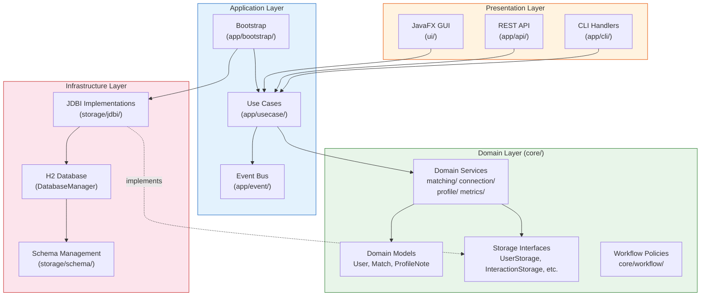

**Dependency rule:** Arrows point inward. `core/` never imports from `storage/`, `app/`, or `ui/`.

---

## 2. Package Structure

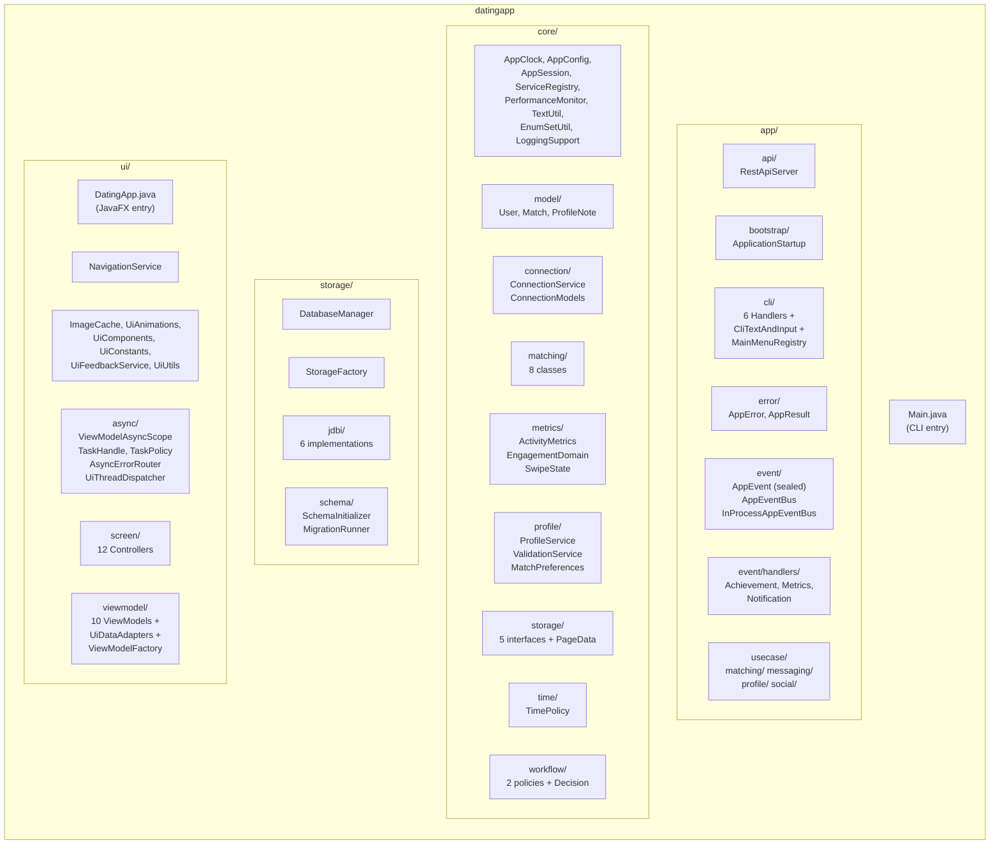

---

## 3. Bootstrap & Initialization Flow

Three entry points share a single bootstrap path.

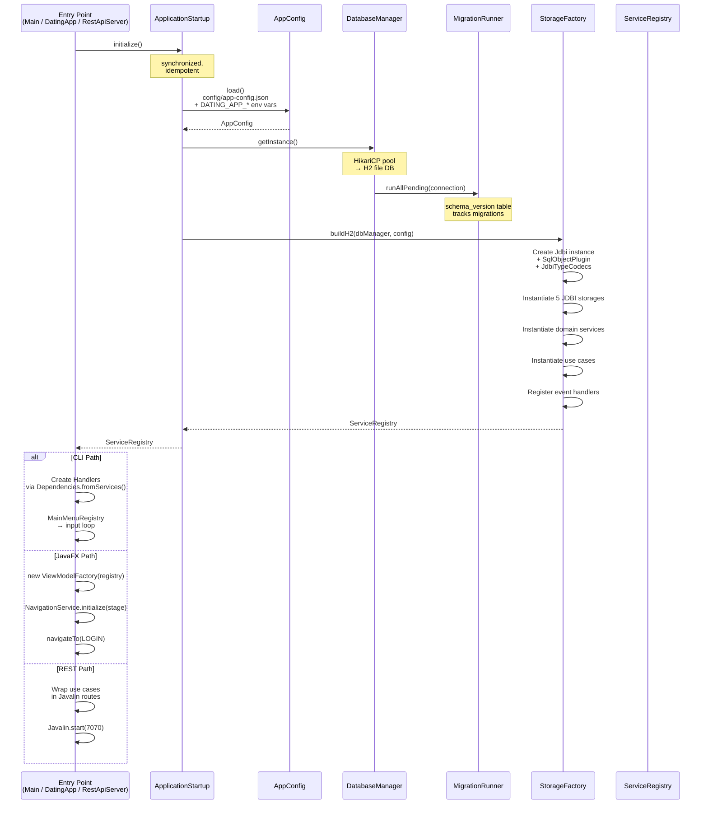

---

## 4. ServiceRegistry Composition

What the registry holds — a pure dependency container with no logic.

```mermaid
graph TB
    SR["ServiceRegistry"]

    subgraph Storage Interfaces
        US[UserStorage]
        IS[InteractionStorage]
        CS[CommunicationStorage]
        AS[AnalyticsStorage]
        TS[TrustSafetyStorage]
    end

    subgraph Domain Services
        CF[CandidateFinder]
        MS[MatchingService]
        RS[RecommendationService]
        MQS[MatchQualityService]
        UDS[UndoService]
        TSS[TrustSafetyService]
        PS[ProfileService]
        VS[ValidationService]
        AMS[ActivityMetricsService]
        CNS[ConnectionService]
    end

    subgraph Use Cases ["Use Cases (built in constructor)"]
        MUC[MatchingUseCases]
        MSUC[MessagingUseCases]
        PUC[ProfileUseCases]
        SUC[SocialUseCases]
    end

    subgraph Infrastructure
        AC[AppConfig]
        TP[TimePolicy]
        EB[AppEventBus]
        PAP[ProfileActivationPolicy]
        RWP[RelationshipWorkflowPolicy]
    end

    SR --- US & IS & CS & AS & TS
    SR --- CF & MS & RS & MQS & UDS
    SR --- TSS & PS & VS & AMS & CNS
    SR --- MUC & MSUC & PUC & SUC
    SR --- AC & TP & EB & PAP & RWP

    style SR fill:#1565c0,color:#fff
    style MUC fill:#e3f2fd
    style MSUC fill:#e3f2fd
    style PUC fill:#e3f2fd
    style SUC fill:#e3f2fd
```

---

## 5. Storage Layer

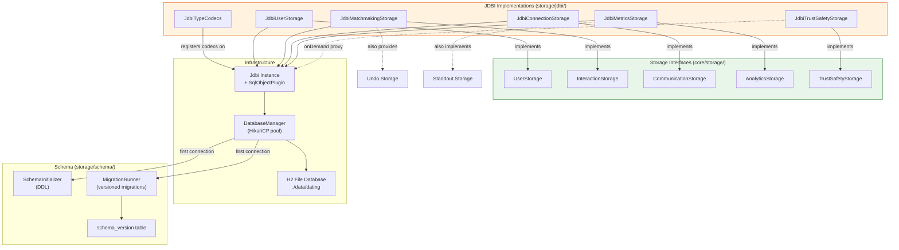

**Key detail:** `JdbiMatchmakingStorage` and `JdbiMetricsStorage` are dual-role — each implements multiple storage interfaces. `StorageFactory` casts them appropriately.

---

## 6. Domain Services

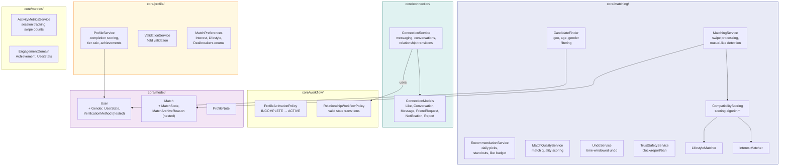

---

## 7. Use-Case Layer

All use cases follow a consistent pattern: typed input records → `UseCaseResult<T>` output → events published on success.

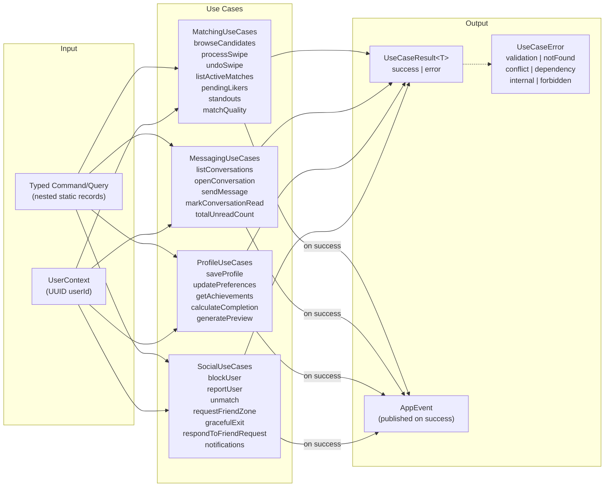

---

## 8. Event System

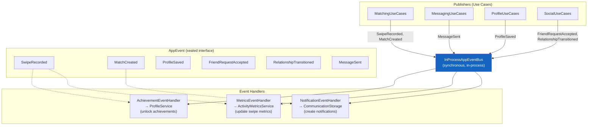

**Design choice:** The event bus is synchronous and in-process. Events are a sealed interface, enabling exhaustive `switch` in Java 25 with pattern matching.

---

## 9. CLI Adapter Layer

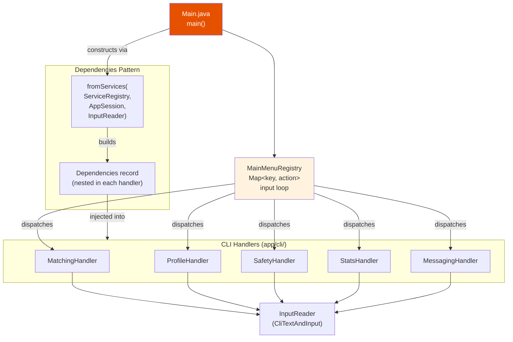

**Key detail:** CLI handlers construct their own local use-case instances from extracted services rather than using `ServiceRegistry.getMatchingUseCases()`. This means CLI and registry hold separate use-case instances.

---

## 10. JavaFX UI Layer (MVVM)

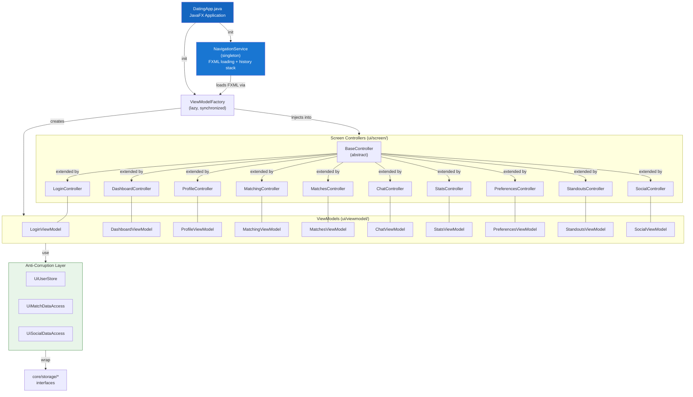

**Navigation mapping:**

| ViewType | FXML | Controller | ViewModel |
|----------|------|------------|-----------|
| LOGIN | login.fxml | LoginController | LoginViewModel |
| DASHBOARD | dashboard.fxml | DashboardController | DashboardViewModel |
| PROFILE | profile.fxml | ProfileController | ProfileViewModel |
| MATCHING | matching.fxml | MatchingController | MatchingViewModel |
| MATCHES | matches.fxml | MatchesController | MatchesViewModel |
| CHAT | chat.fxml | ChatController | ChatViewModel |
| STATS | stats.fxml | StatsController | StatsViewModel |
| PREFERENCES | MatchPreferences.fxml | PreferencesController | PreferencesViewModel |
| STANDOUTS | standouts.fxml | StandoutsController | StandoutsViewModel |
| SOCIAL | social.fxml | SocialController | SocialViewModel |

---

## 11. Async ViewModel Pattern

The `ui/async/` package provides a shared async abstraction for all ViewModels.

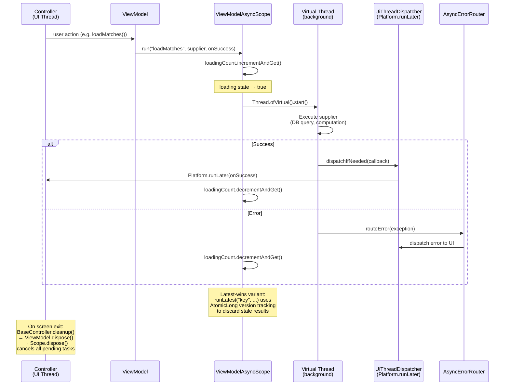

**Key primitives:**

| Method | Purpose |
|--------|---------|
| `run(name, supplier, onSuccess)` | Standard async: background work → UI callback |
| `runLatest(key, name, supplier, onSuccess)` | Latest-wins: cancels stale results for same key |
| `runFireAndForget(name, runnable)` | Side-effect only, no result callback |
| `dispose()` | Cancel all tasks (called from ViewModel.dispose()) |

---

## 12. Key Data Flows

### A. User Swipes Right (Like)

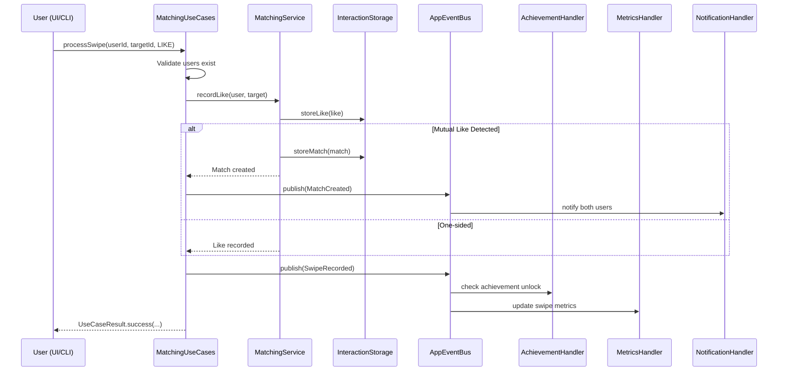

### B. User Opens a Conversation

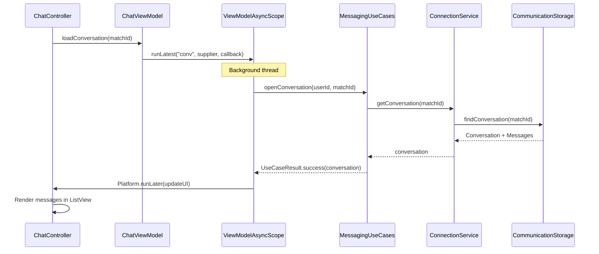

### C. Profile Completion & Activation

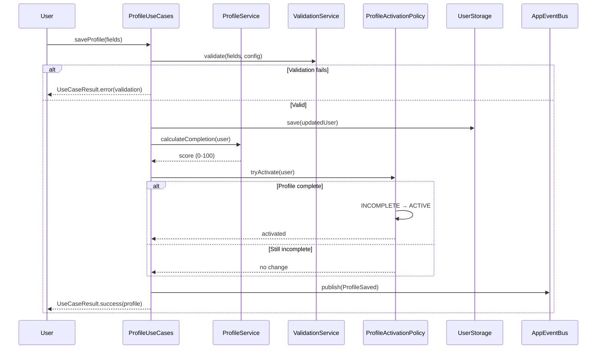

---

## Appendix: Three Entry Points Summary

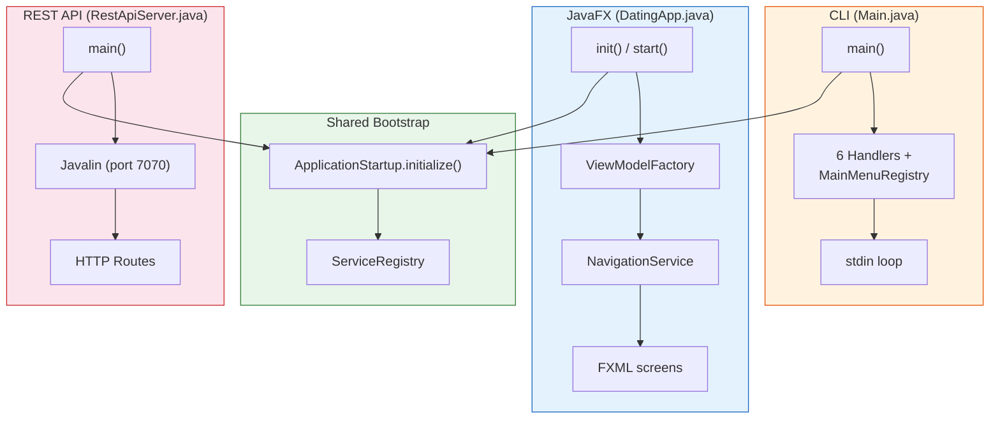
