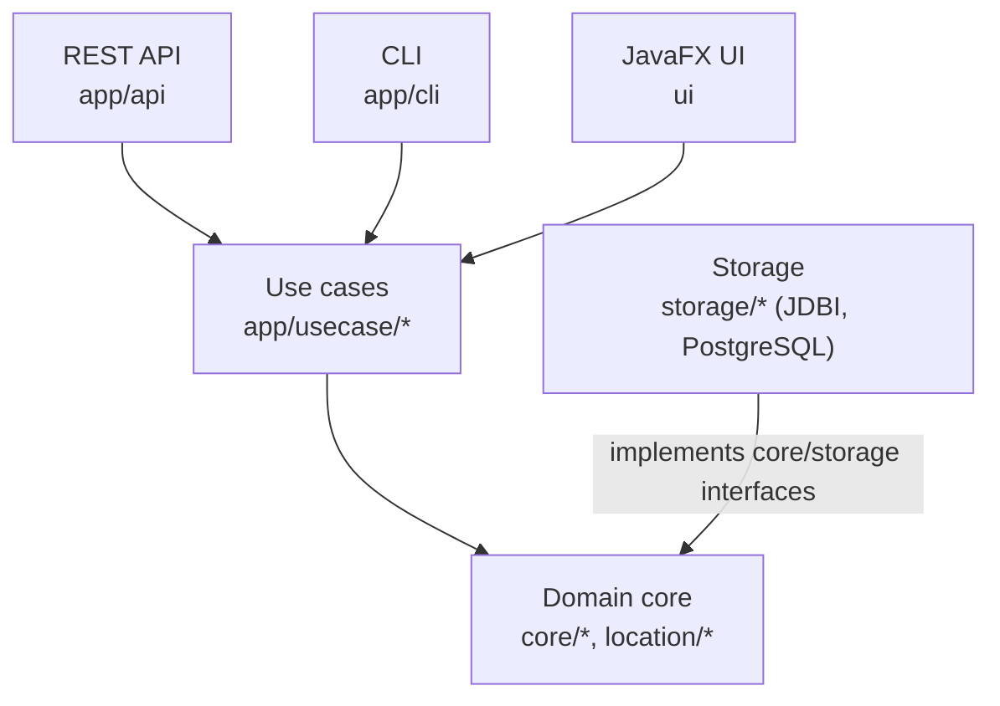

# Dating App

A dating backend in Java 25. One framework-free domain core serves three front
ends: a Javalin REST API, a JavaFX desktop app, and a CLI. The REST API is the
main one. It backs a separate Flutter client that lives outside this repository.

Profiles, browsing and ranking, likes and matches, messaging, friend requests,
notes, blocking and reporting, achievements and notifications all run through
the same use cases, whichever front end calls them.

## What to look at first

- **Layering that the build enforces.** `core/` imports no framework and no
  storage code. Architecture tests in `src/test/java/datingapp/architecture/`
  fail `mvn test` if `core/` imports a framework, if a ViewModel imports
  `core.storage` outside the `UiDataAdapters` types, or if feature code calls
  `ZoneId.systemDefault()` or `AppConfig.defaults()`.
- **One use-case layer, three adapters.** REST, CLI and JavaFX call the same
  `app/usecase/*` classes. Wiring happens in `ApplicationStartup.initialize()`.
- **Clerk auth, verified offline.** Clerk handles sign-in. The REST server checks
  each Clerk session token (RS256) against Clerk's public keys and maps the Clerk
  user to a local profile through `POST /api/auth/session`. It stores no
  passwords and holds no Clerk secret key. Requests under `/api/` are rate
  limited per IP and method.
- **Domain rules in plain classes.** Compatibility scoring, daily limits, undo,
  match quality and trust and safety live in `core/matching`. Relationship
  state changes go through `RelationshipWorkflowPolicy` in `core/workflow`.
- **Controllable time.** Domain code reads time through `AppClock`, and tests
  can fix or replace its clock instead of sleeping.
- **JavaFX threading in one place.** ViewModels run async work through
  `ViewModelAsyncScope` with latest-wins task semantics.
- **A real quality gate.** `mvn verify` runs Spotless, Checkstyle, PMD, SpotBugs
  and a JaCoCo line-coverage check at 0.60. The coverage check excludes the
  JavaFX UI, the CLI and `Main`.

## Architecture



`ServiceRegistry` holds the services. `StorageFactory.buildSqlDatabase(...)`
builds the PostgreSQL-backed storage that the app uses at runtime. H2 and
in-memory storage exist for tests. More detail is in
[docs/architecture/architecture.md](docs/architecture/architecture.md).

## Tech stack

- Java 25 with preview features, Maven
- Javalin 6.7.0 and Jackson 2.21.0 for REST
- JavaFX 25.0.2 with AtlantaFX and Ikonli for the desktop UI
- PostgreSQL, JDBI 3.51.0 and HikariCP for storage
- SLF4J and Logback for logging

## Run it

You need a JDK 25 and Maven. The runtime database is PostgreSQL. The scripts
below start a local instance on port 55432. They are PowerShell scripts.

```powershell
Copy-Item .env.example .env
.\scripts/check_postgresql_runtime_env.ps1
.\scripts/start_local_postgres.ps1

mvn compile
mvn exec:exec          # CLI
mvn javafx:run         # desktop UI
```

The CLI starts with `exec:exec` because `exec:java` cannot pass
`--enable-preview`.

To start only the REST server on `http://localhost:7070`, run
`datingapp.app.api.RestApiServer` with the runtime classpath and
`--enable-preview`. `GET /api/health` answers without auth. The manual
command is in [docs/guides/lan-backend-startup.md](docs/guides/lan-backend-startup.md).
Binding to a non-loopback address throws unless you supply
`DATING_APP_REST_SHARED_SECRET`.

Set `DATING_APP_SEED_DATA=true` to seed sample users at startup
(`ApplicationStartup` calls `DevDataSeeder`).

### Tests and checks

```powershell
mvn test                      # unit and architecture tests
mvn spotless:apply verify     # formatting plus the full quality gate
.\scripts/run_verify.ps1      # quality gate plus a PostgreSQL smoke run
```

CI definitions are in `.github/workflows/` and `.circleci/`. The
[CI and PostgreSQL guide](docs/guides/ci-and-postgresql.md) describes both.

## API

Routes cover auth, users and profiles, photos, location, browsing and
candidates, likes and matches, conversations and messages, friend requests,
notes, notifications, blocking and reporting. The route table is in
`RestApiServer`. The auth and photo contract is written up in
[docs/api/API-SPECIFICATION.md](docs/api/API-SPECIFICATION.md). That document
covers only auth and photos, so read the server source for the rest.

## Known limitations

This started as a phone-alpha backend, and it shows in a few places. Photo files
are served without auth, only Israel is a selectable location, and the dev
config ships placeholder secrets that the production guard rejects. The full
list is in [docs/known-limitations.md](docs/known-limitations.md).

## Docs

Start at the [documentation index](docs/README.md).

## How this was built

I used AI coding assistants on this project. The instruction files they read are
in the repo, so you can see how they were steered: `CLAUDE.md`, `AGENTS.md`,
`.claude/rules/` and `.github/copilot-instructions.md`. The source code is the
reference for what the system does. Where a document disagrees with the code, the
document is wrong.

<!-- TODO(Tom): add your own sentence or two here about what you designed and
decided yourself versus what the assistants drafted. -->

## License

MIT. See [LICENSE](LICENSE).
