# CI/CD Integration Research for Dating App

> **Research Date:** January 20, 2026
> **Project:** Java 25 + JavaFX 25 Dating Application
> **Build Tool:** Maven (with Spotless, Checkstyle, PMD, JaCoCo)

---

## Executive Summary

This document presents research findings on integrating Continuous Integration (CI) into this Java 25/JavaFX 25 Maven project. Given your prior experience with **CircleCI**, this analysis focuses on three leading options: **GitHub Actions**, **CircleCI**, and **Jenkins**—with a primary recommendation for **GitHub Actions** due to its native GitHub integration, superior free tier for private repos, and ease of setup.

---

## Current Project Profile

| Aspect                 | Details                                                       |
|------------------------|---------------------------------------------------------------|
| **Java Version**       | 25 (with `--enable-preview` flag)                             |
| **JavaFX Version**     | 25.0.1                                                        |
| **Build Tool**         | Maven 3.x                                                     |
| **Quality Plugins**    | Spotless (Palantir), Checkstyle, PMD, JaCoCo                  |
| **Testing Framework**  | JUnit Jupiter 5.14.2                                          |
| **Coverage Threshold** | 60% line coverage                                             |
| **Existing CI**        | `.github/` folder exists (contains `copilot-instructions.md`) |
| **Repository Hosting** | GitHub (based on `.github` folder presence)                   |

### Key CI Requirements

1. **Build & Compile** with Java 25 + `--enable-preview`
2. **Run Tests** via `mvn verify` (includes Surefire with preview flag)
3. **Execute Quality Checks** (Spotless, Checkstyle, PMD, JaCoCo)
4. **Handle JavaFX dependencies** (headless testing consideration)
5. **Run on Push/PR** events

---

## CI Platform Comparison

### 1. GitHub Actions ⭐ **RECOMMENDED**

| ✅ Pros                                       | ❌ Cons                                |
|------------------------------------------------|-----------------------------------------|
| Native GitHub integration                      | Vendor lock-in to GitHub                |
| **FREE for public repos**                      | Costs can grow for heavy private usage  |
| **2,000 mins/month free** for private repos    | macOS runners are more expensive        |
| YAML-based workflows (version-controlled)      | Limited to GitHub ecosystem             |
| Rich marketplace (`setup-java`, caching, etc.) | —                                      |
| Built-in secrets management                    | —                                      |
| Matrix builds (multi-JDK testing)              | —                                      |
| Dependency graph & Dependabot integration      | —                                      |

#### GitHub Actions Configuration Example
```yaml
# .github/workflows/ci.yml
name: CI Pipeline

on:
  push:
    branches: [ main, develop ]
  pull_request:
    branches: [ main ]

jobs:
  build:
    runs-on: ubuntu-latest

    steps:
    - uses: actions/checkout@v4

    - name: Set up JDK 25
      uses: actions/setup-java@v4
      with:
        java-version: '25'
        distribution: 'temurin'  # or 'oracle' / 'liberica'
        cache: 'maven'

    - name: Build and Verify
      run: mvn verify --batch-mode --enable-preview
      env:
        JAVA_TOOL_OPTIONS: "--enable-preview"

    - name: Upload Coverage Report
      uses: actions/upload-artifact@v4
      with:
        name: jacoco-report
        path: target/site/jacoco/
```

---

### 2. CircleCI 🔄 **Your Prior Experience**

| ✅ Pros                                    | ❌ Cons                                        |
|---------------------------------------------|-------------------------------------------------|
| Excellent performance (fast runners)        | 30,000 credits/month free (may be insufficient) |
| Intelligent dependency caching              | Credit-based pricing can get expensive          |
| "Orbs" for reusable config                  | Smaller ecosystem than GH Actions               |
| SSH into failed builds (debugging)          | 5 user limit on free tier                       |
| Multi-platform support (GitHub + Bitbucket) | Platform lock-in                                |
| Optimized for Java Spring projects          | —                                              |

#### CircleCI Configuration Example
```yaml
# .circleci/config.yml
version: 2.1

orbs:
  maven: circleci/maven@1.4

executors:
  java-25:
    docker:
      - image: cimg/openjdk:25.0

jobs:
  build-and-test:
    executor: java-25
    steps:
      - checkout
      - maven/with_cache:
          steps:
            - run:
                name: Build and Verify
                command: mvn verify --batch-mode
                environment:
                  JAVA_TOOL_OPTIONS: "--enable-preview"
      - store_artifacts:
          path: target/site/jacoco
          destination: coverage-report
      - store_test_results:
          path: target/surefire-reports

workflows:
  main:
    jobs:
      - build-and-test
```

---

### 3. Jenkins 🔧 **Self-Hosted Option**

| ✅ Pros                        | ❌ Cons                            |
|---------------------------------|-------------------------------------|
| Free & open source              | Requires self-hosting & maintenance |
| 1,800+ plugins                  | Steep learning curve                |
| Complete infrastructure control | Complex setup at scale              |
| Platform independent            | Plugin compatibility issues         |
| Jenkinsfile as code             | Less user-friendly UI               |
| Good for legacy integrations    | Not cloud-native by design          |

> [!WARNING]
> Jenkins requires significant infrastructure management overhead and is **not recommended** for this project unless you have specific enterprise compliance requirements.

---

## Feature Comparison Matrix

| Feature                    | GitHub Actions                 | CircleCI             | Jenkins                |
|----------------------------|--------------------------------|----------------------|------------------------|
| **Setup Complexity**       | ⭐ Low                        | 🔄 Medium           | ❌ High               |
| **Free Tier (Private)**    | 2,000 min/mo                   | 30,000 credits/mo    | Self-hosted            |
| **Java 25 Support**        | ✅ via `setup-java`           | ✅ via Docker image | ✅ via plugins        |
| **`--enable-preview`**     | ✅ Easy (`JAVA_TOOL_OPTIONS`) | ✅ Easy (env vars)  | ✅ Easy (config)      |
| **Maven Orb/Action**       | ✅ Actions Marketplace        | ✅ Maven Orb        | ✅ Maven Plugin       |
| **Caching**                | ✅ Built-in                   | ⭐ Intelligent      | 🔧 Manual config      |
| **Native VCS Integration** | ⭐ Seamless (GitHub)          | ✅ Good             | 🔧 Plugin-based       |
| **Parallel Jobs**          | ✅ Matrix builds              | ✅ Workflows        | ✅ Parallel stages    |
| **Secrets Management**     | ✅ GitHub Secrets             | ✅ Contexts         | 🔧 Credentials plugin |
| **Debugging**              | 🔧 Limited                    | ⭐ SSH into builds  | 🔧 Console logs       |

---

## Pricing Analysis (2024-2025)

### For Private Repositories

| Plan                | GitHub Actions     | CircleCI                   |
|---------------------|--------------------|----------------------------|
| **Free Tier**       | 2,000 mins/month   | 30,000 credits (~500 mins) |
| **User Limit**      | Unlimited          | 5 users                    |
| **Cost After Free** | $0.008/min (Linux) | Credit packs vary          |
| **macOS Runners**   | 10x multiplier     | Docker only (Linux)        |

> [!TIP]
> For a personal/small team project using ~500-1000 build minutes/month, **GitHub Actions' free tier is sufficient** and more generous for private repositories.

---

## JavaFX-Specific Considerations

### Headless Testing Challenge

JavaFX applications require a graphical display, which is unavailable on CI runners. Solutions:

| Approach               | Description                        | Status                     |
|------------------------|------------------------------------|----------------------------|
| **Xvfb**               | X Virtual Framebuffer (Linux only) | ✅ Works now              |
| **Monocle**            | Headless Glass implementation      | ✅ Works (requires setup) |
| **JavaFX 26 Headless** | Native headless platform           | 🚧 Coming March 2026      |

#### Solution 1: Xvfb (Recommended for CI)
```yaml
# GitHub Actions with Xvfb
- name: Run JavaFX Tests
  run: xvfb-run --auto-servernum mvn verify -Dtestfx.robot=awt
```

#### Solution 2: Monocle Dependencies
```xml
<!-- Add to pom.xml for headless testing -->
<dependency>
    <groupId>org.testfx</groupId>
    <artifactId>openjfx-monocle</artifactId>
    <version>jdk-12.0.1+2</version>
    <scope>test</scope>
</dependency>
```

With JVM args:
```bash
-Dtestfx.robot=glass -Dglass.platform=Monocle -Dmonocle.platform=Headless -Dprism.order=sw
```

> [!IMPORTANT]
> The current project doesn't have TestFX UI tests, so for now, **unit tests will run without JavaFX headless concerns**. Headless setup becomes critical only when adding UI integration tests.

---

## Java 25 Preview Features Support

Your pom.xml already uses `--enable-preview`. All three CI platforms support this:

```xml
<!-- Already in your pom.xml -->
<compilerArgs>
    <arg>--enable-preview</arg>
</compilerArgs>
```

To ensure CI respects this:
```yaml
# Set as environment variable
env:
  JAVA_TOOL_OPTIONS: "--enable-preview"
```

---

## Recommended Implementation Strategy

### Phase 1: Basic CI (Immediate)

```mermaid
flowchart LR
    A[Push/PR] --> B[Checkout]
    B --> C[Setup JDK 25]
    C --> D[mvn verify]
    D --> E{Pass?}
    E -->|Yes| F[✅ Green Build]
    E -->|No| G[❌ Failed]
```



**Steps:**
1. Create `.github/workflows/ci.yml`
2. Configure JDK 25 with `setup-java` action
3. Run `mvn verify` (includes Spotless, Checkstyle, PMD, tests, JaCoCo)
4. Upload JaCoCo reports as artifacts

### Phase 2: Enhanced Pipeline (Future)


---

## My Recommendation

### 🎯 Go with GitHub Actions

**Reasons:**

1. **Already on GitHub** — Your repo has a `.github/` folder, indicating GitHub hosting
2. **Free tier advantage** — 2,000 mins/month is ample for a personal project
3. **Zero infrastructure** — No servers to maintain (unlike Jenkins)
4. **Simple YAML config** — Lower learning curve than CircleCI orbs
5. **Native integration** — PR checks, issue linking, code scanning built-in
6. **Java 25 ready** — `setup-java@v4` supports JDK 25 via Temurin/Oracle

### When to Consider CircleCI

- If you have a professional/team plan with CircleCI already
- For larger open-source projects (400k free credits/month for OSS)
- If debugging failed builds is critical (SSH access feature)
- If deploying to non-GitHub hosting in future

---

## Action Items (When Ready to Implement)

| # | Task                                    | Priority  | Effort  |
|---|-----------------------------------------|-----------|---------|
| 1 | Create `.github/workflows/ci.yml`      | 🔴 High   | 30 min  |
| 2 | Verify JDK 25 builds on GitHub runners | 🔴 High   | 15 min  |
| 3 | Add JaCoCo report upload & badge       | 🟡 Medium | 20 min  |
| 4 | Configure branch protection rules      | 🟡 Medium | 10 min  |
| 5 | Add Dependabot for dependency updates  | 🟢 Low    | 10 min  |
| 6 | (Future) Add TestFX UI tests with Xvfb | 🟢 Low    | 2-4 hrs |

---

## References & Resources

- [GitHub Actions: Building and Testing Java with Maven](https://docs.github.com/en/actions/automating-builds-and-tests/building-and-testing-java-with-maven)
- [CircleCI Maven Orb](https://circleci.com/developer/orbs/orb/circleci/maven)
- [OpenJFX Documentation](https://openjfx.io/)
- [TestFX Headless Testing Guide](https://github.com/TestFX/TestFX/wiki/Headless-Testing)
- [JavaFX 26 Headless Platform (Coming Soon)](https://gluonhq.com/javafx-26-headless-platform/)

---

## Appendix: Alternative Tools Considered

| Tool             | Why Not Primary Choice             |
|------------------|------------------------------------|
| **GitLab CI**    | Not using GitLab for hosting       |
| **Azure DevOps** | Overkill for this project scope    |
| **TeamCity**     | Enterprise-focused, self-hosted    |
| **Travis CI**    | Less generous free tier since 2021 |
| **Drone CI**     | Self-hosted, niche                 |

---

*Document prepared for review. No code changes have been made.*
