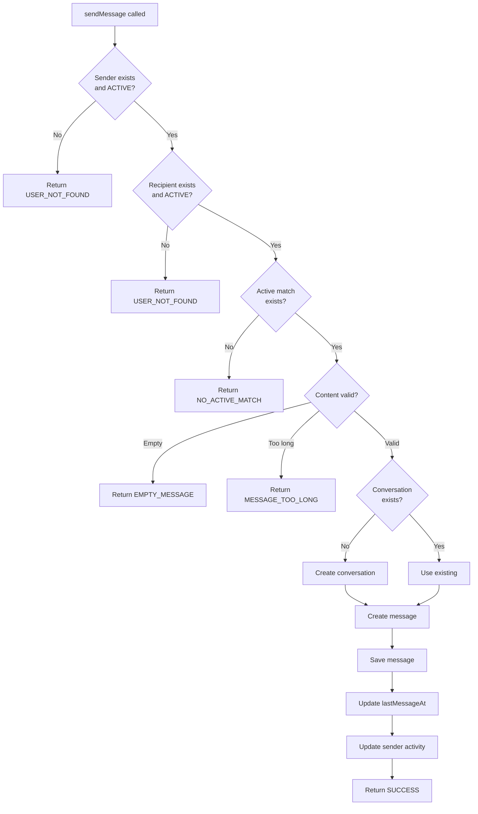

# Messaging System Design Document

**Version:** 1.0
**Date:** 2026-01-10
**Status:** Ready for Review
**Estimated Effort:** 17 hours (~2-3 focused days)

---

## 1. Executive Summary

The Messaging System enables matched users to communicate via text messages. This is a **high-complexity feature** that integrates with multiple existing systems (Match, Block, User, Achievement) and requires careful design to ensure correctness, security, and maintainability.

> [!IMPORTANT]
> Messaging is only available between users with an **ACTIVE match**. When a match ends (UNMATCHED/BLOCKED), messaging is disabled but conversation history remains visible as read-only.

---

## 2. Domain Models

### 2.1 Conversation Entity

The `Conversation` class represents a chat thread between two matched users. It follows the established pattern from `Match` with deterministic ID generation.

```java
// core/Conversation.java
public class Conversation {

    private final String id;              // Deterministic: userA_userB
    private final UUID userA;             // Lexicographically smaller
    private final UUID userB;             // Lexicographically larger
    private final Instant createdAt;
    private Instant lastMessageAt;        // Updated on each new message
    private Instant userALastReadAt;      // When userA last viewed
    private Instant userBLastReadAt;      // When userB last viewed

    // Factory method
    public static Conversation create(UUID a, UUID b);

    // Deterministic ID generation (order-independent)
    public static String generateId(UUID a, UUID b);

    // Query methods
    public boolean involves(UUID userId);
    public UUID getOtherUser(UUID userId);

    // Mutations
    public void updateLastMessageAt(Instant timestamp);
    public void updateReadTimestamp(UUID userId, Instant timestamp);
}
```

**Design Decisions:**
| Decision | Choice | Rationale |
|----------|--------|-----------|
| ID Format | `userA_userB` | Matches existing `Match.generateId()` pattern |
| Per-user read timestamps | Yes | Enables accurate unread counts per user |
| Mutable class | Yes | Read timestamps need updating |

---

### 2.2 Message Entitylly implemented

The `Message` record represents a single immutable message within a conversation.

```java
// core/Message.java
public record Message(
    UUID id,
    String conversationId,
    UUID senderId,
    String content,
    Instant createdAt
) {
    private static final int MAX_LENGTH = 1000;

    public Message {
        Objects.requireNonNull(id);
        Objects.requireNonNull(conversationId);
        Objects.requireNonNull(senderId);
        Objects.requireNonNull(createdAt);

        // Content validation
        if (content == null || content.isBlank()) {
            throw new IllegalArgumentException("Message cannot be empty");
        }
        content = content.trim();
        if (content.length() > MAX_LENGTH) {
            throw new IllegalArgumentException(
                "Message too long (max " + MAX_LENGTH + ")");
        }
    }

    public static Message create(String conversationId, UUID senderId, String content);
}
```

**Validation Rules:**
| Rule | Behavior |
|------|----------|
| Null content | Throws `IllegalArgumentException` |
| Empty/whitespace-only | Throws `IllegalArgumentException` |
| Content > 1000 chars | Throws `IllegalArgumentException` |
| Exactly 1000 chars | Allowed |
| Leading/trailing whitespace | Trimmed automatically |

---

## 3. Storage Layer

### 3.1 ConversationStorage Interface

```java
// core/ConversationStorage.java
public interface ConversationStorage {

    void save(Conversation conversation);

    Optional<Conversation> get(String conversationId);

    Optional<Conversation> getByUsers(UUID userA, UUID userB);

    List<Conversation> getConversationsFor(UUID userId);

    void updateLastMessageAt(String conversationId, Instant timestamp);

    void updateReadTimestamp(String conversationId, UUID userId, Instant timestamp);

    void delete(String conversationId);  // Cascade to messages
}
```

---

### 3.2 MessageStorage Interface

```java
// core/MessageStorage.java
public interface MessageStorage {

    void save(Message message);

    /**
     * Get messages for a conversation, ordered by createdAt ascending.
     * Uses offset pagination.
     */
    List<Message> getMessages(String conversationId, int limit, int offset);

    Optional<Message> getLatestMessage(String conversationId);

    int countMessages(String conversationId);

    /**
     * Count messages sent after the given timestamp.
     * Used for unread count calculation.
     */
    int countMessagesAfter(String conversationId, Instant after);

    void deleteByConversation(String conversationId);
}
```

---

### 3.3 Database Schema

```sql
-- Conversations table
CREATE TABLE IF NOT EXISTS conversations (
    id VARCHAR(100) PRIMARY KEY,
    user_a UUID NOT NULL,
    user_b UUID NOT NULL,
    created_at TIMESTAMP NOT NULL,
    last_message_at TIMESTAMP,
    user_a_last_read_at TIMESTAMP,
    user_b_last_read_at TIMESTAMP,
    CONSTRAINT unq_conversation_users UNIQUE (user_a, user_b)
);

CREATE INDEX IF NOT EXISTS idx_conversations_user_a
    ON conversations(user_a);
CREATE INDEX IF NOT EXISTS idx_conversations_user_b
    ON conversations(user_b);

-- Messages table
CREATE TABLE IF NOT EXISTS messages (
    id UUID PRIMARY KEY,
    conversation_id VARCHAR(100) NOT NULL
        REFERENCES conversations(id) ON DELETE CASCADE,
    sender_id UUID NOT NULL,
    content VARCHAR(1000) NOT NULL,
    created_at TIMESTAMP NOT NULL
);

CREATE INDEX IF NOT EXISTS idx_messages_conversation_created
    ON messages(conversation_id, created_at);
```

**Index Strategy:**
| Index | Purpose |
|-------|---------|
| `idx_conversations_user_a` | Fast lookup of user's conversations |
| `idx_conversations_user_b` | Fast lookup of user's conversations |
| `idx_messages_conversation_created` | Efficient pagination and ordering |

---

## 4. Service Layer

### 4.1 MessagingService

The core business logic handler with dependency on multiple storage and service components.

```java
// core/MessagingService.java
public class MessagingService {

    private final ConversationStorage conversationStorage;
    private final MessageStorage messageStorage;
    private final MatchStorage matchStorage;
    private final BlockStorage blockStorage;
    private final UserStorage userStorage;

    // === Core Operations ===

    public SendResult sendMessage(UUID senderId, UUID recipientId, String content);

    public List<Message> getMessages(
        UUID userId, UUID otherUserId, int limit, int offset);

    public List<ConversationPreview> getConversations(UUID userId);

    public void markAsRead(UUID userId, String conversationId);

    public int getUnreadCount(UUID userId, String conversationId);

    public int getTotalUnreadCount(UUID userId);
}
```

---

### 4.2 sendMessage Flow



---

### 4.3 Data Transfer Objects

```java
// ConversationPreview for list display
public record ConversationPreview(
    Conversation conversation,
    User otherUser,
    Optional<Message> lastMessage,
    int unreadCount
) {}

// SendResult with error handling
public record SendResult(
    boolean success,
    Optional<Message> message,
    Optional<String> errorMessage,
    Optional<ErrorCode> errorCode
) {
    public enum ErrorCode {
        NO_ACTIVE_MATCH,
        USER_NOT_FOUND,
        EMPTY_MESSAGE,
        MESSAGE_TOO_LONG
    }

    public static SendResult success(Message message);
    public static SendResult failure(String error, ErrorCode code);
}
```

---

## 5. System Integrations

### 5.1 Integration Matrix

| System | Integration Point | Behavior |
|--------|-------------------|----------|
| **Match** | Pre-condition | Messaging requires `Match.State.ACTIVE` |
| **Match** | On UNMATCHED | Messaging disabled, history remains |
| **Match** | On BLOCKED | Messaging disabled, history visible to blocker |
| **Block** | Defensive check | Verify not blocked (should match state) |
| **User** | Validation | Both users must be ACTIVE state |
| **User** | Activity | Update `lastActiveAt` on message send |
| **Achievement** | Trigger | Potential: First message, N messages sent |
| **Report** | Future | Messages could be reported |

### 5.2 Match State Handling

```java
// In MessagingService.sendMessage()
String matchId = Match.generateId(senderId, recipientId);
Optional<Match> match = matchStorage.get(matchId);

if (match.isEmpty() || !match.get().isActive()) {
    return SendResult.failure(
        "Cannot message: no active match",
        ErrorCode.NO_ACTIVE_MATCH);
}
```

### 5.3 Block Behavior

When User A blocks User B:
1. Match state becomes `BLOCKED`
2. `sendMessage()` fails with `NO_ACTIVE_MATCH`
3. User A can still view conversation history
4. User B sees match ended (no indication of block)

---

## 6. CLI Layer Design

### 6.1 MessagingHandler

```java
// cli/MessagingHandler.java
public class MessagingHandler {

    private final ServiceRegistry registry;
    private final InputReader input;

    public void showConversationList(User currentUser);
    public void showConversation(User currentUser, Conversation conversation);
    public void sendMessage(User currentUser, UUID recipientId);
}
```

### 6.2 Conversation List UI

```
═══════════════════════════════════════════════
       💬 YOUR CONVERSATIONS
═══════════════════════════════════════════════
1. Alice (3 new) · 5m ago
   "Hey! How was your hike yest..."

2. Bob · 2h ago
   "That sounds great! Let's pl..."

3. Carol (1 new) · 1d ago
   "Thanks for matching! 👋"
───────────────────────────────────────────────
Total unread: 4 messages

[#] Select conversation  [B] Back
>
```

**Display Features:**
| Feature | Implementation |
|---------|---------------|
| Unread count | `(N new)` indicator |
| Relative time | Smart: 5m, 2h, 1d, Jan 10 |
| Message preview | Truncated to ~25 chars with ellipsis |
| Sorting | Most recent first (`lastMessageAt DESC`) |

### 6.3 Single Conversation UI

```
═══════════════════════════════════════════════
       💬 Conversation with Alice
═══════════════════════════════════════════════
   [Jan 10, 8:30 AM] Alice:
   Hey! How was your hike yesterday?

   [Jan 10, 8:35 AM] You:
   It was amazing! Got great views from the peak.

   [Jan 10, 9:00 AM] Alice:
   That sounds awesome! We should go together 🏔️
───────────────────────────────────────────────
Commands: /back  /older  /block  /unmatch

Type your message:
>
```

**In-Conversation Commands:**
| Command | Action |
|---------|--------|
| `/back` | Return to conversation list |
| `/older` | Load 20 more older messages |
| `/block` | Block this user (with confirmation) |
| `/unmatch` | Unmatch (with confirmation) |
| Any text | Send as message |

### 6.4 Locked Conversation UI

When match is no longer active:

```
═══════════════════════════════════════════════
       💬 Conversation with Bob
       ⚠️  Match ended - read only
═══════════════════════════════════════════════
   [Jan 8, 2:00 PM] Bob:
   Hey!

   [Jan 8, 2:05 PM] You:
   Hi there!
───────────────────────────────────────────────
[B] Back
>
```

---

## 7. Edge Cases and Error Handling

### 7.1 Content Validation

| Input | Result |
|-------|--------|
| `""` (empty) | Error: EMPTY_MESSAGE |
| `"   "` (whitespace) | Error: EMPTY_MESSAGE |
| 1000 chars | Allowed |
| 1001 chars | Error: MESSAGE_TOO_LONG |
| `"Hello\nWorld"` | Allowed (newlines preserved) |
| Emoji only | Allowed |

### 7.2 State Transitions

| Scenario | Behavior |
|----------|----------|
| First message | Creates conversation atomically |
| Match ended mid-conversation | Next send fails gracefully |
| Recipient banned | Fails with USER_NOT_FOUND |
| Sender banned | Should not be logged in |
| Concurrent first messages | Both succeed (same conversation created) |

### 7.3 Pagination Edge Cases

| Scenario | Behavior |
|----------|----------|
| No messages | Return empty list |
| Fewer than limit | Return all available |
| Offset beyond end | Return empty list |
| Negative offset | Treat as 0 |

---

## 8. Testing Strategy

### 8.1 Unit Tests

| File | Test Coverage |
|------|---------------|
| `MessageTest.java` | Construction, validation, edge cases |
| `ConversationTest.java` | ID generation, user queries, timestamps |
| `MessagingServiceTest.java` | All public methods, error conditions |

**Key Test Cases for MessagingService:**
```java
// Test classes using mocks for storage
@Test void sendMessage_validMatch_success()
@Test void sendMessage_noMatch_returnsNoActiveMatch()
@Test void sendMessage_unmatchedState_fails()
@Test void sendMessage_blockedState_fails()
@Test void sendMessage_createsConversationOnFirst()
@Test void sendMessage_emptyContent_fails()
@Test void sendMessage_tooLongContent_fails()
@Test void getMessages_returnsInOrder()
@Test void getMessages_paginationWorks()
@Test void markAsRead_updatesTimestamp()
@Test void getUnreadCount_correctAfterRead()
```

### 8.2 Integration Tests

| File | Test Coverage |
|------|---------------|
| `H2ConversationStorageTest.java` | CRUD operations, cascade delete |
| `H2MessageStorageTest.java` | CRUD, pagination, counting |
| `MessagingIntegrationTest.java` | Full flow with real H2 |

### 8.3 Manual CLI Testing

1. **Create Match Flow:**
   - Create UserA and UserB
   - Both users like each other → Match created
   - Verify "Conversations" menu appears

2. **First Message:**
   - UserA opens Conversations → Empty list
   - UserA sends message to UserB
   - Verify conversation created
   - UserB sees (1 new) indicator

3. **Unread Tracking:**
   - UserB opens conversation → Unread cleared
   - UserA sends another message
   - UserB sees (1 new) again

4. **Match Ended:**
   - UserA unmatches UserB
   - Both users see conversation as read-only
   - Sending fails with graceful error

---

## 9. Performance Considerations

### 9.1 Query Optimization

| Operation | Optimization |
|-----------|-------------|
| Get user's conversations | Index on `user_a`, `user_b` |
| Get messages | Index on `(conversation_id, created_at)` |
| Unread count | Count query with `created_at > ?` |
| Latest message | `LIMIT 1 ORDER BY created_at DESC` |

### 9.2 Pagination Defaults

| Setting | Value | Rationale |
|---------|-------|-----------|
| Messages per page | 20 | Reasonable for CLI display |
| Conversations per page | 50 | Unlikely to exceed |
| Max message length | 1000 | Balances expressiveness and storage |

### 9.3 Future Scalability

> [!NOTE]
> These are not needed for Phase 1 CLI but documented for future reference.

- **Caching:** Recent conversations and messages in memory
- **Denormalization:** Store unread count in conversation table
- **Archiving:** Move old messages to archive table
- **Sharding:** By conversation_id for horizontal scaling

---

## 10. Security Considerations

### 10.1 Authorization Checks

| Operation | Verification |
|-----------|-------------|
| sendMessage | Sender is session user |
| getMessages | Requester is conversation participant |
| getConversations | Only returns user's own conversations |
| markAsRead | User is conversation participant |

### 10.2 Content Security

| Phase 1 (CLI) | Future (Web/Mobile) |
|---------------|---------------------|
| Length validation | + HTML sanitization |
| Trim whitespace | + XSS prevention |
| No moderation | + Spam detection |
| — | + Rate limiting |
| — | + Content filtering |

### 10.3 Privacy

- Messages are strictly private between two users
- No admin access in current model
- Block preserves history for blocker only
- Blocked user cannot determine if they were blocked

---

## 11. Implementation Plan

### Phase A: Core Domain Models (2 hours)

#### [NEW] [Conversation.java](file:///c:/Users/tom7s/Desktopp/Claude_Folder_2/Date_Program/src/main/java/datingapp/core/Conversation.java)
- Deterministic ID generation matching `Match` pattern
- User queries: `involves()`, `getOtherUser()`
- Timestamp management methods

#### [NEW] [Message.java](file:///c:/Users/tom7s/Desktopp/Claude_Folder_2/Date_Program/src/main/java/datingapp/core/Message.java)
- Immutable record with validation
- Factory method `create()`

#### [NEW] [ConversationStorage.java](file:///c:/Users/tom7s/Desktopp/Claude_Folder_2/Date_Program/src/main/java/datingapp/core/ConversationStorage.java)
- Storage interface for Conversation

#### [NEW] [MessageStorage.java](file:///c:/Users/tom7s/Desktopp/Claude_Folder_2/Date_Program/src/main/java/datingapp/core/MessageStorage.java)
- Storage interface for Message

---

### Phase B: H2 Storage Implementation (3 hours)

#### [NEW] [H2ConversationStorage.java](file:///c:/Users/tom7s/Desktopp/Claude_Folder_2/Date_Program/src/main/java/datingapp/storage/H2ConversationStorage.java)
- All ConversationStorage methods
- Proper timestamp handling

#### [NEW] [H2MessageStorage.java](file:///c:/Users/tom7s/Desktopp/Claude_Folder_2/Date_Program/src/main/java/datingapp/storage/H2MessageStorage.java)
- All MessageStorage methods
- Efficient pagination queries

#### [MODIFY] [DatabaseManager.java](file:///c:/Users/tom7s/Desktopp/Claude_Folder_2/Date_Program/src/main/java/datingapp/storage/DatabaseManager.java)
- Add `conversations` table creation
- Add `messages` table creation
- Add indexes

---

### Phase C: MessagingService (3 hours)

#### [NEW] [MessagingService.java](file:///c:/Users/tom7s/Desktopp/Claude_Folder_2/Date_Program/src/main/java/datingapp/core/MessagingService.java)
- Core business logic
- Authorization and validation
- All public methods documented above

---

### Phase D: ServiceRegistry Integration (1 hour)

#### [MODIFY] [ServiceRegistry.java](file:///c:/Users/tom7s/Desktopp/Claude_Folder_2/Date_Program/src/main/java/datingapp/core/ServiceRegistry.java)
- Add `ConversationStorage` field and getter
- Add `MessageStorage` field and getter
- Add `MessagingService` field and getter

#### [MODIFY] [ServiceRegistryBuilder.java](file:///c:/Users/tom7s/Desktopp/Claude_Folder_2/Date_Program/src/main/java/datingapp/core/ServiceRegistryBuilder.java)
- Wire H2ConversationStorage
- Wire H2MessageStorage
- Wire MessagingService with dependencies

---

### Phase E: CLI Handler (3 hours)

#### [NEW] [MessagingHandler.java](file:///c:/Users/tom7s/Desktopp/Claude_Folder_2/Date_Program/src/main/java/datingapp/cli/MessagingHandler.java)
- Conversation list view
- Single conversation view
- Message sending
- Command processing

#### [MODIFY] [Main.java](file:///c:/Users/tom7s/Desktopp/Claude_Folder_2/Date_Program/src/main/java/datingapp/Main.java)
- Add "Conversations" menu option
- Show total unread count in menu
- Wire to MessagingHandler

---

### Phase F: Unit Tests (3 hours)

#### [NEW] [MessageTest.java](file:///c:/Users/tom7s/Desktopp/Claude_Folder_2/Date_Program/src/test/java/datingapp/core/MessageTest.java)

#### [NEW] [ConversationTest.java](file:///c:/Users/tom7s/Desktopp/Claude_Folder_2/Date_Program/src/test/java/datingapp/core/ConversationTest.java)

#### [NEW] [MessagingServiceTest.java](file:///c:/Users/tom7s/Desktopp/Claude_Folder_2/Date_Program/src/test/java/datingapp/core/MessagingServiceTest.java)

---

### Phase G: Integration Tests (2 hours)

#### [NEW] [H2ConversationStorageTest.java](file:///c:/Users/tom7s/Desktopp/Claude_Folder_2/Date_Program/src/test/java/datingapp/storage/H2ConversationStorageTest.java)

#### [NEW] [H2MessageStorageTest.java](file:///c:/Users/tom7s/Desktopp/Claude_Folder_2/Date_Program/src/test/java/datingapp/storage/H2MessageStorageTest.java)

---

## 12. Verification Plan

### 12.1 Automated Tests

Run all tests with:
```bash
mvn clean test
```

Expected outcomes:
- All existing tests pass (no regressions)
- All new tests pass
- 10+ new test classes added

### 12.2 Manual Verification

**Test Scenario 1: Basic Messaging Flow**
1. Run app: `mvn exec:java`
2. Create UserA (complete profile)
3. Create UserB (complete profile)
4. As UserA, browse and like UserB
5. As UserB, browse and like UserA → Match!
6. As UserA, open Conversations → Empty
7. Send message "Hello!"
8. Switch to UserB, open Conversations → (1 new)
9. Open conversation, verify message visible
10. Reply "Hi there!"
11. Switch to UserA, verify (1 new)

**Test Scenario 2: Unmatch Disables Messaging**
1. Continue from Scenario 1
2. As UserA, unmatch UserB
3. As UserA, try to send message → Should fail gracefully
4. Verify history still visible with read-only indicator

**Test Scenario 3: Block Behavior**
1. Create fresh match between UserC and UserD
2. Exchange messages
3. UserC blocks UserD
4. UserC can see conversation history
5. UserD sees match ended, cannot send

---

## 13. Future Enhancements

> [!TIP]
> These are out of scope for Phase 1 but documented for future planning.

| Enhancement | Description | Complexity |
|-------------|-------------|------------|
| Message reactions | ❤️ 👍 😂 reactions | LOW |
| Read receipts | Show when recipient read | LOW |
| Typing indicator | "Alice is typing..." | MEDIUM |
| Image messages | Send photos in chat | MEDIUM |
| Voice messages | Audio recording | HIGH |
| Message delete | Delete own messages | LOW |
| Message edit | Edit within 15 min | MEDIUM |
| Search messages | Full-text search | MEDIUM |
| Message export | Download chat history | LOW |
| Scheduled messages | Send later | MEDIUM |
| Icebreaker prompts | Suggested first messages | LOW |

---

## 14. Open Questions

> [!CAUTION]
> These decisions may need user input before implementation.

1. **Conversation on re-match?** If we add ability to re-match after unmatch, should we:
   - Reuse existing conversation (show old messages)
   - Create fresh conversation

2. **Message notifications?** For CLI, we show unread count. For future web/mobile:
   - Push notification system
   - Email digest of unread messages

3. **First message requirement?** Should there be an "icebreaker" requirement?
   - Minimum 10 characters
   - No emoji-only first message

---

*Generated: 2026-01-10 using deep sequential thinking analysis*
