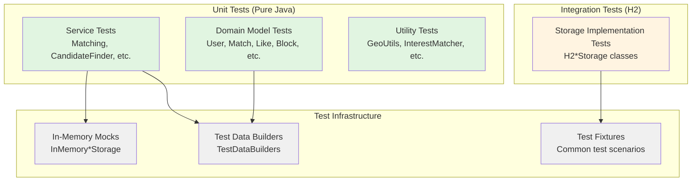
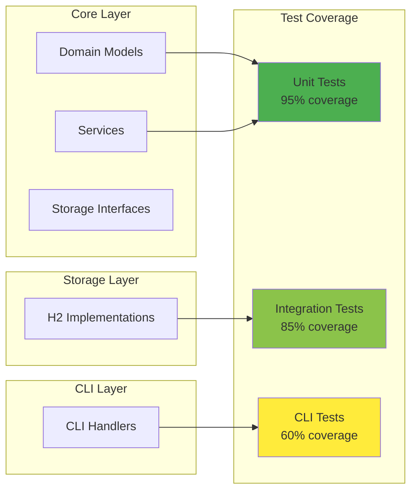

# AI Agent Test Improvement Plan

**Project**: Dating App (Java 21 Console Application)
**Document Type**: Testing Strategy & Improvement Roadmap
**Created**: 2026-01-10
**Purpose**: Enhance test suite to be more discoverable, comprehensible, and maintainable for AI agents

---

## Executive Summary

This plan outlines comprehensive improvements to make our test suite maximally useful for AI agents. AI agents excel when tests serve as clear specifications, provide discoverable examples, and offer explicit guidance. Our current tests are solid but can be enhanced to serve as better documentation, learning resources, and implementation guides.

**Key Goals**:
1. Make tests self-documenting and discoverable
2. Improve test comprehension with explicit business rule documentation
3. Provide reusable patterns and templates for test generation
4. Create comprehensive test infrastructure documentation
5. Establish metrics and quality standards

**Expected Outcomes**:
- AI agents can quickly understand what functionality is tested
- AI agents can use tests as implementation guides for new features
- AI agents can generate appropriate tests using documented patterns
- Test failures provide clear, actionable information
- Tests serve as living documentation of system behavior

---

## Current State Assessment

### Strengths ✅

1. **Well-Organized Structure**
   - 27+ unit test classes in `core/`
   - 2 integration test classes in `storage/`
   - Uses JUnit 5 with `@Nested` classes for logical grouping

2. **Good Naming Conventions**
   - Uses `@DisplayName` for readable test descriptions
   - Test classes follow `{ClassName}Test` pattern
   - Test methods are descriptive

3. **Clean Testing Approach**
   - In-memory mock implementations (no Mockito complexity)
   - Constructor injection makes tests straightforward
   - Clear separation: unit tests vs integration tests

4. **Comprehensive Coverage**
   - Core business logic well-tested
   - State machines validated
   - Edge cases covered

### Gaps & Opportunities 📋

1. **Discoverability Issues**
   - No test catalog mapping features to tests
   - Hard to find tests for specific business features
   - No quick reference for test patterns

2. **Context Limitations**
   - Tests lack inline explanations of business rules
   - No links to requirements or user stories
   - Mock behavior not explicitly documented

3. **Guidance Gaps**
   - No templates for generating new tests
   - No documented patterns library
   - Missing test checklists for different component types

4. **Documentation Deficiencies**
   - No test infrastructure guide
   - No test data builder patterns documented
   - No assertion library documentation

5. **Metrics Absence**
   - No test coverage tracking
   - No quality metrics dashboard
   - No regression test tracking

---

## Improvement Goals

### Primary Goals 🎯

1. **Self-Documenting Tests**
   - Every test explains the business rule it validates
   - Test data uses semantic names, not magic values
   - Assertions include descriptive failure messages

2. **Discoverable Tests**
   - Test catalog maps features to test files
   - Tests organized by business functionality
   - Clear naming follows Given-When-Then pattern

3. **Reusable Patterns**
   - Test templates for common scenarios
   - Pattern library with examples
   - Test data builders documented and reusable

4. **Comprehensive Documentation**
   - Test infrastructure guide
   - Mock implementation patterns
   - Assertion strategies documented

5. **Quality Metrics**
   - Coverage by feature tracked
   - Test quality metrics reported
   - Regression tests cataloged

---

## Improvement Strategies

### 🚀 Phase 1: Quick Wins (1-2 days effort)

#### 1.1 Add Inline Business Rule Comments

**Rationale**: AI agents need to understand *why* tests exist, not just *what* they test.

**Implementation**:
```java
@Test
@DisplayName("Mutual likes create match")
void mutualLikesCreateMatch() {
  // BUSINESS RULE: When two users like each other (mutual like),
  // the system must automatically create a Match with ACTIVE state.
  // This is the core matching logic that enables connections.

  User alice = createCompleteUser("Alice");
  User bob = createCompleteUser("Bob");

  // Alice likes Bob first (no match yet)
  Like like1 = Like.create(alice.getId(), bob.getId(), Direction.LIKE);
  matchingService.recordLike(like1);

  // Bob likes Alice back (mutual like triggers match)
  Like like2 = Like.create(bob.getId(), alice.getId(), Direction.LIKE);
  Optional<Match> result = matchingService.recordLike(like2);

  // EXPECTED: Match created with deterministic ID
  assertTrue(result.isPresent(), "Mutual likes should create a match");
  assertEquals(Match.State.ACTIVE, result.get().getState(),
      "New matches should start in ACTIVE state");
}
```

**Action Items**:
- [ ] Add business rule comments to all existing tests
- [ ] Use format: `// BUSINESS RULE: <explanation>`
- [ ] Add `// EXPECTED:` comments before assertions
- [ ] Document edge case reasoning where applicable

**Priority**: HIGH
**Effort**: 4-8 hours
**Files Affected**: All test files (~30 files)

---

#### 1.2 Create Test Catalog (TEST_CATALOG.md)

**Rationale**: AI agents need a map from features to test files.

**Implementation**:
```markdown
# Test Catalog

Quick reference for finding tests by feature or component.

## 🎯 Feature Coverage

| Feature | Test Files | Coverage |
|---------|------------|----------|
| User Registration & Login | UserTest.java, UserManagementFlowTest.java | ✅ Complete |
| Profile Completion | UserTest.java, ProfileHandlerTest.java | ✅ Complete |
| Candidate Discovery | CandidateFinderTest.java | ✅ Complete |
| Like/Pass/Match Flow | MatchingServiceTest.java, LikeTest.java, MatchTest.java | ✅ Complete |
| Undo Feature | UndoServiceTest.java | ✅ Complete |
| Daily Limits | DailyLimitServiceTest.java | ✅ Complete |
| Daily Pick | DailyPickServiceTest.java | ✅ Complete |
| Match Quality Scoring | MatchQualityServiceTest.java | ✅ Complete |
| Interests Matching | InterestMatcherTest.java | ✅ Complete |
| Dealbreakers | DealbreakersEvaluatorTest.java | ✅ Complete |
| Achievements | AchievementServiceTest.java | ✅ Complete |
| Safety (Block/Report) | BlockTest.java, ReportServiceTest.java | ✅ Complete |
| Statistics | StatsServiceTest.java | ✅ Complete |

## 🏗️ Component Coverage

### Core Layer Tests (Unit Tests)

**Domain Models**:
- `UserTest.java` - User entity state machine, validation, lifecycle
- `LikeTest.java` - Like record validation, factory methods
- `MatchTest.java` - Match entity state machine, involves logic
- `BlockTest.java` - Block record validation
- `ReportTest.java` - Report record validation

**Services**:
- `MatchingServiceTest.java` - Like recording, match creation
- `CandidateFinderTest.java` - 7-stage filter pipeline
- `UndoServiceTest.java` - Undo window, state restoration
- `DailyLimitServiceTest.java` - Like limits, rate limiting
- `SessionServiceTest.java` - Session lifecycle
- `MatchQualityServiceTest.java` - Scoring algorithm
- `DailyPickServiceTest.java` - Deterministic pick selection
- `AchievementServiceTest.java` - Achievement unlocking
- `ReportServiceTest.java` - Report processing
- `StatsServiceTest.java` - Statistics aggregation

**Utilities**:
- `GeoUtilsTest.java` - Haversine distance calculation
- `InterestMatcherTest.java` - Interest compatibility scoring
- `AppConfigTest.java` - Configuration validation

### Storage Layer Tests (Integration Tests)

- `H2StorageIntegrationTest.java` - Full database integration
- `H2DailyPickViewStorageTest.java` - Daily pick view testing

## 🔍 Test Type Index

**Unit Tests**: Pure Java, in-memory mocks
**Location**: `src/test/java/datingapp/core/`
**Count**: 27+ test classes

**Integration Tests**: With H2 database
**Location**: `src/test/java/datingapp/storage/`
**Count**: 2 test classes

## 📖 Test Pattern Reference

### Adding Tests for New Service
See: `MatchingServiceTest.java` (canonical example)
- Pattern: @BeforeEach setup with in-memory mocks
- Organization: @Nested classes by functionality
- Naming: Use @DisplayName for business-friendly descriptions

### Adding Tests for New Domain Model
See: `UserTest.java`, `MatchTest.java` (mutable entities)
See: `LikeTest.java`, `BlockTest.java` (immutable records)

### Adding Integration Tests
See: `H2StorageIntegrationTest.java`
- Pattern: @TestInstance with @BeforeAll/@AfterAll
- Setup: Unique test database per run

## 🐛 Regression Test Index

_(To be populated as bugs are found and fixed)_

| Bug ID | Test Location | Description |
|--------|---------------|-------------|
| _None yet_ | - | - |

---

Last Updated: 2026-01-10
```

**Action Items**:
- [ ] Create `TEST_CATALOG.md` in `docs/`
- [ ] Generate feature coverage table from existing tests
- [ ] Add links to specific test files
- [ ] Update as new tests are added

**Priority**: HIGH
**Effort**: 2 hours
**Files Affected**: New file `docs/TEST_CATALOG.md`

---

#### 1.3 Add Descriptive Assertion Messages

**Rationale**: When tests fail, AI agents need clear explanations of what went wrong.

**Before**:
```java
assertTrue(result.isPresent());
assertEquals(State.ACTIVE, match.getState());
```

**After**:
```java
assertTrue(result.isPresent(),
    "Mutual likes should create a match");
assertEquals(State.ACTIVE, match.getState(),
    "New matches should start in ACTIVE state");
assertNotNull(match.getCreatedAt(),
    "Match creation timestamp must be set");
```

**Action Items**:
- [ ] Add descriptive messages to all assertions
- [ ] Format: `assert*(condition, "Expected behavior explanation")`
- [ ] Be specific about what went wrong and why it matters

**Priority**: HIGH
**Effort**: 3-4 hours
**Files Affected**: All test files

---

#### 1.4 Document Test Data Builders

**Rationale**: AI agents need to quickly create valid test data.

**Implementation**:
Create `src/test/java/datingapp/core/TestDataBuilders.java`:

```java
package datingapp.core;

import java.time.LocalDate;
import java.util.EnumSet;
import java.util.UUID;

/**
 * Test data builders for creating valid domain objects in tests.
 *
 * <p>These builders provide semantic methods for creating test entities
 * with sensible defaults, reducing boilerplate in test code.
 *
 * <p><strong>Usage Examples:</strong>
 * <pre>
 * // Create a complete active user
 * User alice = TestDataBuilders.user("Alice")
 *     .age(25)
 *     .location(40.7128, -74.0060)  // NYC
 *     .interestedIn(User.Gender.MALE)
 *     .build();
 *
 * // Create an incomplete user (testing validation)
 * User incomplete = TestDataBuilders.user("Bob")
 *     .withoutPhotos()
 *     .build();
 *
 * // Create users with specific interests
 * User outdoorsy = TestDataBuilders.user("Charlie")
 *     .withInterests(Interest.HIKING, Interest.CAMPING, Interest.TRAVEL)
 *     .build();
 * </pre>
 */
public class TestDataBuilders {

  /**
   * Creates a user builder with sensible defaults for a complete, active user.
   *
   * <p>Default configuration:
   * <ul>
   *   <li>Age: 25 years old
   *   <li>Gender: MALE
   *   <li>Interested in: FEMALE
   *   <li>Location: New York City (40.7128°N, 74.0060°W)
   *   <li>Max distance: 50 km
   *   <li>Age range: 20-40
   *   <li>Bio: "{name}'s bio"
   *   <li>Photo: "photo.jpg"
   *   <li>State: ACTIVE (after build)
   * </ul>
   */
  public static UserBuilder user(String name) {
    return new UserBuilder(name);
  }

  public static class UserBuilder {
    private final User user;
    private boolean addPhoto = true;

    private UserBuilder(String name) {
      this.user = new User(UUID.randomUUID(), name);
      // Set sensible defaults
      this.user.setBio(name + "'s bio");
      this.user.setBirthDate(LocalDate.now().minusYears(25));
      this.user.setGender(User.Gender.MALE);
      this.user.setInterestedIn(EnumSet.of(User.Gender.FEMALE));
      this.user.setLocation(40.7128, -74.0060);  // NYC
      this.user.setMaxDistanceKm(50);
      this.user.setAgeRange(20, 40);
    }

    public UserBuilder age(int age) {
      user.setBirthDate(LocalDate.now().minusYears(age));
      return this;
    }

    public UserBuilder gender(User.Gender gender) {
      user.setGender(gender);
      return this;
    }

    public UserBuilder interestedIn(User.Gender... genders) {
      user.setInterestedIn(EnumSet.of(genders[0], genders));
      return this;
    }

    public UserBuilder location(double lat, double lon) {
      user.setLocation(lat, lon);
      return this;
    }

    public UserBuilder maxDistance(int km) {
      user.setMaxDistanceKm(km);
      return this;
    }

    public UserBuilder ageRange(int min, int max) {
      user.setAgeRange(min, max);
      return this;
    }

    public UserBuilder withInterests(Interest... interests) {
      for (Interest interest : interests) {
        user.addInterest(interest);
      }
      return this;
    }

    public UserBuilder withoutPhotos() {
      this.addPhoto = false;
      return this;
    }

    public UserBuilder incomplete() {
      // Remove required fields to make user incomplete
      user.setBio(null);
      this.addPhoto = false;
      return this;
    }

    public User build() {
      if (addPhoto) {
        user.addPhotoUrl("photo.jpg");
      }
      return user;
    }
  }

  /**
   * Creates a Like with defaults.
   *
   * @param whoLikes User who is liking
   * @param whoGotLiked User being liked
   * @return Like with Direction.LIKE and current timestamp
   */
  public static Like like(UUID whoLikes, UUID whoGotLiked) {
    return Like.create(whoLikes, whoGotLiked, Direction.LIKE);
  }

  /**
   * Creates a Pass (negative like).
   */
  public static Like pass(UUID whoLikes, UUID whoGotLiked) {
    return Like.create(whoLikes, whoGotLiked, Direction.PASS);
  }

  // Add more builders as needed...
}
```

**Action Items**:
- [ ] Create `TestDataBuilders.java` utility class
- [ ] Document all builder methods with JavaDoc
- [ ] Include usage examples in class-level JavaDoc
- [ ] Update existing tests to use builders (optional, gradual)

**Priority**: MEDIUM
**Effort**: 3 hours
**Files Affected**: New file + refactoring opportunities

---

### 🏗️ Phase 2: Foundational Changes (3-5 days effort)

#### 2.1 Create Test Infrastructure Documentation

**Rationale**: AI agents need comprehensive guides on how to write different types of tests.

**Implementation**:
Create `docs/testing/` directory with these guides:

**`docs/testing/TESTING_GUIDE.md`**:
- When to write unit vs integration tests
- How to structure tests with @Nested classes
- Naming conventions and best practices
- How to run tests (single, by class, all)

**`docs/testing/MOCK_IMPLEMENTATION_GUIDE.md`**:
- How to create in-memory storage implementations
- Pattern: Map-based storage with basic CRUD
- Examples from existing tests
- Common pitfalls and solutions

**`docs/testing/ASSERTION_STRATEGIES.md`**:
- Standard assertions for domain objects
- Custom assertion patterns
- Failure message guidelines
- Testing state transitions

**`docs/testing/TEST_DATA_GUIDE.md`**:
- Using TestDataBuilders
- Creating complex test scenarios
- Named constants for semantic test data
- Avoiding magic numbers

**Action Items**:
- [ ] Create `docs/testing/` directory
- [ ] Write comprehensive guides for each topic
- [ ] Include code examples in every guide
- [ ] Link guides from AGENTS.md and CLAUDE.md

**Priority**: HIGH
**Effort**: 8 hours
**Files Affected**: 4 new documentation files

---

#### 2.2 Create Test Templates & Patterns Library

**Rationale**: AI agents can generate tests faster with templates.

**Implementation**:
Create `docs/testing/TEST_TEMPLATES.md`:

```markdown
# Test Templates & Patterns

## Template 1: Service Unit Test

Use this template when adding a new service in `core/`.

```java
package datingapp.core;

import org.junit.jupiter.api.*;
import java.util.*;
import static org.junit.jupiter.api.Assertions.*;

/**
 * Unit tests for {ServiceName}.
 *
 * <p><strong>What this tests:</strong>
 * <ul>
 *   <li>Business logic in {ServiceName}
 *   <li>Dependency interactions
 *   <li>Error handling and validation
 *   <li>State management (if applicable)
 * </ul>
 *
 * <p><strong>Test Strategy:</strong>
 * Uses in-memory mock implementations of storage interfaces.
 * No database required - pure Java unit tests.
 */
@SuppressWarnings("unused")  // IDE false positives for @Nested
class ServiceNameTest {

  // Dependencies (injected via constructor)
  private DependencyAStorage dependencyAStorage;
  private DependencyBStorage dependencyBStorage;

  // Service under test
  private ServiceName service;

  @BeforeEach
  void setUp() {
    // Initialize mocks
    dependencyAStorage = new InMemoryDependencyAStorage();
    dependencyBStorage = new InMemoryDependencyBStorage();

    // Create service with mocks
    service = new ServiceName(dependencyAStorage, dependencyBStorage);
  }

  @Nested
  @DisplayName("Core Business Logic")
  class CoreBusinessLogic {

    @Test
    @DisplayName("Description of happy path scenario")
    void happyPathTest() {
      // BUSINESS RULE: Explain what business rule is being tested

      // Arrange: Set up test data
      // Act: Call service method
      // Assert: Verify expected outcome

      fail("Implement test");
    }

    @Test
    @DisplayName("Description of edge case")
    void edgeCaseTest() {
      // BUSINESS RULE: Explain edge case behavior

      fail("Implement test");
    }
  }

  @Nested
  @DisplayName("Validation & Error Handling")
  class ValidationTests {

    @Test
    @DisplayName("Null parameter throws NullPointerException")
    void nullParameterValidation() {
      // EXPECTED: Methods should validate inputs

      assertThrows(NullPointerException.class, () -> {
        service.method(null);
      }, "Should reject null parameters");
    }
  }

  // In-memory mock implementations
  private static class InMemoryDependencyAStorage implements DependencyAStorage {
    private final Map<UUID, DependencyA> storage = new HashMap<>();

    @Override
    public void save(DependencyA obj) {
      storage.put(obj.getId(), obj);
    }

    @Override
    public Optional<DependencyA> get(UUID id) {
      return Optional.ofNullable(storage.get(id));
    }

    // Implement other interface methods as needed
  }
}
```

## Template 2: Domain Model Test

Use for testing entities (User, Match) or records (Like, Block).

```java
package datingapp.core;

import org.junit.jupiter.api.*;
import static org.junit.jupiter.api.Assertions.*;

/**
 * Unit tests for {DomainModel}.
 *
 * <p><strong>What this tests:</strong>
 * <ul>
 *   <li>Object creation and factory methods
 *   <li>Validation in constructors/setters
 *   <li>State transitions (for mutable entities)
 *   <li>Immutability contracts (for records)
 *   <li>Business logic in domain methods
 * </ul>
 */
@SuppressWarnings("unused")
class DomainModelTest {

  @Nested
  @DisplayName("Object Creation")
  class ObjectCreation {

    @Test
    @DisplayName("Factory method creates valid object")
    void factoryMethodCreatesValidObject() {
      // BUSINESS RULE: Factory methods ensure valid construction

      fail("Implement test");
    }

    @Test
    @DisplayName("Constructor validates required fields")
    void constructorValidatesRequiredFields() {
      // EXPECTED: Null required fields throw exceptions

      fail("Implement test");
    }
  }

  @Nested
  @DisplayName("State Transitions")  // For mutable entities
  class StateTransitions {

    @Test
    @DisplayName("Valid state transition succeeds")
    void validStateTransition() {
      // BUSINESS RULE: Describe valid transition

      fail("Implement test");
    }

    @Test
    @DisplayName("Invalid state transition throws exception")
    void invalidStateTransition() {
      // EXPECTED: State machine prevents invalid transitions

      fail("Implement test");
    }
  }

  @Nested
  @DisplayName("Immutability Contract")  // For records
  class ImmutabilityTests {

    @Test
    @DisplayName("Record fields are immutable")
    void recordFieldsAreImmutable() {
      // EXPECTED: Records have no setters

      fail("Implement test");
    }
  }
}
```

## Template 3: Integration Test

Use for testing storage implementations.

```java
package datingapp.storage;

import datingapp.core.*;
import org.junit.jupiter.api.*;
import static org.junit.jupiter.api.Assertions.*;

/**
 * Integration tests for {StorageImplementation}.
 *
 * <p><strong>What this tests:</strong>
 * <ul>
 *   <li>Data persistence to H2 database
 *   <li>SQL queries and updates
 *   <li>Transaction handling
 *   <li>Data integrity
 * </ul>
 *
 * <p><strong>Test Strategy:</strong>
 * Uses real H2 database with unique test database per run.
 * Tests verify data survives save/load cycles.
 */
@TestInstance(TestInstance.Lifecycle.PER_CLASS)
class H2StorageImplementationTest {

  private static DatabaseManager dbManager;
  private static H2StorageImplementation storage;

  @BeforeAll
  static void setUpOnce() {
    // Create unique test database
    String testDbUrl = "jdbc:h2:./data/test_" + UUID.randomUUID();
    DatabaseManager.setJdbcUrl(testDbUrl);
    DatabaseManager.resetInstance();

    dbManager = DatabaseManager.getInstance();
    storage = new H2StorageImplementation(dbManager);
  }

  @AfterAll
  static void tearDown() {
    if (dbManager != null) {
      dbManager.shutdown();
    }
  }

  @Test
  @DisplayName("Data survives save and load cycle")
  void persistenceRoundTrip() {
    // BUSINESS RULE: Data must persist across sessions

    // Arrange: Create test object
    // Act: Save to database
    // Act: Load from database
    // Assert: Loaded data matches saved data

    fail("Implement test");
  }
}
```

## Common Patterns

### Pattern: Testing Pagination

```java
@Test
@DisplayName("Returns correct page of results")
void returnsCorrectPage() {
  // Arrange: Create 25 items
  List<Item> allItems = createItems(25);

  // Act: Request page 2 with size 10
  List<Item> page2 = service.getPage(2, 10);

  // Assert: Returns items 11-20
  assertEquals(10, page2.size(), "Page should have 10 items");
  assertEquals(allItems.get(10), page2.get(0),
      "Page 2 should start at item 11");
}
```

### Pattern: Testing Date/Time Dependent Logic

```java
@Test
@DisplayName("Daily limit resets at midnight")
void dailyLimitResetsAtMidnight() {
  // Use fixed clock for deterministic testing
  Clock fixedClock = Clock.fixed(
      LocalDate.of(2026, 1, 10).atStartOfDay(ZoneId.systemDefault()).toInstant(),
      ZoneId.systemDefault()
  );

  DailyLimitService service = new DailyLimitService(
      likeStorage,
      swipeSessionStorage,
      config,
      fixedClock  // Inject clock
  );

  // Test with fixed time
}
```

### Pattern: Testing State Machines

```java
@Nested
@DisplayName("State Machine Transitions")
class StateMachineTests {

  @Test
  @DisplayName("Valid transition: INCOMPLETE → ACTIVE")
  void validTransitionToActive() {
    User user = User.create("Test");
    assertEquals(User.State.INCOMPLETE, user.getState());

    // Complete profile
    user.setBio("Bio");
    user.setBirthDate(LocalDate.of(1990, 1, 1));
    user.setGender(User.Gender.MALE);
    user.addPhotoUrl("photo.jpg");
    // ... other required fields

    user.activate();

    assertEquals(User.State.ACTIVE, user.getState(),
        "User should transition to ACTIVE after completion");
  }

  @Test
  @DisplayName("Invalid transition throws IllegalStateException")
  void invalidTransitionThrowsException() {
    User user = User.create("Test");
    user.ban();  // INCOMPLETE → BANNED

    // Cannot activate banned user
    assertThrows(IllegalStateException.class, () -> {
      user.activate();
    }, "Cannot activate user from BANNED state");
  }
}
```

---

Last Updated: 2026-01-10
```

**Action Items**:
- [ ] Create `TEST_TEMPLATES.md` with all templates
- [ ] Include copy-paste ready code
- [ ] Document common patterns
- [ ] Add template selection guide

**Priority**: MEDIUM
**Effort**: 6 hours
**Files Affected**: New documentation file

---

#### 2.3 Create Test Checklist System

**Rationale**: AI agents need checklists to ensure complete test coverage.

**Implementation**:
Create `docs/testing/TEST_CHECKLISTS.md`:

```markdown
# Test Checklists

Use these checklists when adding tests for new components.

## ✅ Service Test Checklist

When adding a new service, ensure tests cover:

- [ ] **Constructor Validation**
  - [ ] Null dependencies throw NullPointerException
  - [ ] All dependencies are properly assigned

- [ ] **Core Business Logic**
  - [ ] Happy path scenario works
  - [ ] Edge cases handled correctly
  - [ ] Complex scenarios with multiple steps

- [ ] **Validation**
  - [ ] Null parameters rejected
  - [ ] Invalid parameters rejected
  - [ ] Boundary conditions validated

- [ ] **Error Handling**
  - [ ] Storage exceptions handled gracefully
  - [ ] Illegal states prevented
  - [ ] Error messages are clear

- [ ] **Storage Interactions**
  - [ ] Correct data saved
  - [ ] Correct data retrieved
  - [ ] Updates applied correctly

- [ ] **State Management** (if applicable)
  - [ ] State transitions work correctly
  - [ ] Invalid transitions prevented
  - [ ] State persisted correctly

## ✅ Domain Model Test Checklist

When adding a domain model (entity or record):

- [ ] **Object Creation**
  - [ ] Factory method works correctly
  - [ ] Constructor validates required fields
  - [ ] Default values set appropriately

- [ ] **Validation**
  - [ ] Required fields enforced
  - [ ] Business rules validated
  - [ ] Invalid data rejected

- [ ] **State Transitions** (mutable entities)
  - [ ] All valid transitions work
  - [ ] Invalid transitions prevented
  - [ ] State change tracking (updatedAt)

- [ ] **Immutability** (records)
  - [ ] No setters exist
  - [ ] Defensive copying for collections
  - [ ] Record fields are final

- [ ] **Business Logic**
  - [ ] Domain methods work correctly
  - [ ] Predicates return correct values
  - [ ] Computations are accurate

- [ ] **Equality & Identity**
  - [ ] equals() works correctly
  - [ ] hashCode() consistent
  - [ ] Identity based on ID

## ✅ Storage Implementation Test Checklist

When implementing a storage interface:

- [ ] **CRUD Operations**
  - [ ] save() persists data correctly
  - [ ] get() retrieves data correctly
  - [ ] update() modifies data correctly
  - [ ] delete() removes data correctly

- [ ] **Query Methods**
  - [ ] findBy*() methods return correct results
  - [ ] Empty results handled correctly
  - [ ] Filters applied correctly

- [ ] **Data Integrity**
  - [ ] Foreign key constraints work
  - [ ] Unique constraints enforced
  - [ ] Data types preserved

- [ ] **Error Handling**
  - [ ] SQLException wrapped in StorageException
  - [ ] Clear error messages
  - [ ] Resource cleanup in finally blocks

- [ ] **Edge Cases**
  - [ ] Empty result sets handled
  - [ ] Large result sets handled
  - [ ] Concurrent access handled

## ✅ Integration Test Checklist

For end-to-end integration tests:

- [ ] **Database Setup**
  - [ ] Unique test database per run
  - [ ] Schema created correctly
  - [ ] Cleanup in @AfterAll

- [ ] **Data Persistence**
  - [ ] Data survives save/load cycle
  - [ ] Relationships maintained
  - [ ] Timestamps preserved

- [ ] **Performance**
  - [ ] Queries execute reasonably fast
  - [ ] No N+1 query problems
  - [ ] Batch operations efficient

- [ ] **Concurrency**
  - [ ] Multiple saves don't corrupt data
  - [ ] Read-after-write consistency
  - [ ] Transaction isolation works

---

Last Updated: 2026-01-10
```

**Action Items**:
- [ ] Create checklists for all component types
- [ ] Make checklists copy-pasteable into test files
- [ ] Add checkbox format for tracking
- [ ] Reference from AGENTS.md

**Priority**: MEDIUM
**Effort**: 2 hours
**Files Affected**: New documentation file

---

#### 2.4 Implement Given-When-Then Test Naming

**Rationale**: BDD-style naming makes test intent crystal clear to AI agents.

**Current Style**:
```java
@Test
@DisplayName("Mutual likes create match")
void mutualLikesCreateMatch() { ... }
```

**Enhanced Style**:
```java
@Test
@DisplayName("Given two users like each other, When both likes recorded, Then match is created")
void givenMutualLikes_whenBothLikesRecorded_thenMatchCreated() {
  // GIVEN: Two complete, active users
  User alice = TestDataBuilders.user("Alice").build();
  User bob = TestDataBuilders.user("Bob").build();

  // WHEN: Both users like each other
  Like like1 = Like.create(alice.getId(), bob.getId(), Direction.LIKE);
  matchingService.recordLike(like1);

  Like like2 = Like.create(bob.getId(), alice.getId(), Direction.LIKE);
  Optional<Match> result = matchingService.recordLike(like2);

  // THEN: Match is created
  assertTrue(result.isPresent(), "Mutual likes should create a match");
  assertEquals(Match.State.ACTIVE, result.get().getState());
}
```

**Action Items**:
- [ ] Adopt Given-When-Then format for new tests
- [ ] Add inline GIVEN/WHEN/THEN comments in test body
- [ ] Gradually refactor existing tests (optional)
- [ ] Document pattern in testing guide

**Priority**: LOW (new tests only)
**Effort**: Ongoing
**Files Affected**: New tests

---

### 🚀 Phase 3: Advanced Enhancements (5-10 days effort)

#### 3.1 Generate Test Coverage Reports

**Rationale**: AI agents need visibility into what's tested vs. not tested.

**Implementation**:

Add JaCoCo plugin to `pom.xml`:

```xml
<plugin>
  <groupId>org.jacoco</groupId>
  <artifactId>jacoco-maven-plugin</artifactId>
  <version>0.8.11</version>
  <executions>
    <execution>
      <goals>
        <goal>prepare-agent</goal>
      </goals>
    </execution>
    <execution>
      <id>report</id>
      <phase>test</phase>
      <goals>
        <goal>report</goal>
      </goals>
    </execution>
  </executions>
</plugin>
```

Generate report with:
```bash
mvn clean test jacoco:report
```

Report location: `target/site/jacoco/index.html`

**Action Items**:
- [ ] Add JaCoCo plugin to pom.xml
- [ ] Configure coverage thresholds (e.g., 80% minimum)
- [ ] Generate coverage report in CI/CD
- [ ] Create TEST_METRICS.md to track coverage

**Priority**: MEDIUM
**Effort**: 4 hours (setup + documentation)
**Files Affected**: pom.xml, new TEST_METRICS.md

---

#### 3.2 Create Test Metrics Dashboard

**Rationale**: Track test quality over time.

**Implementation**:
Create `docs/testing/TEST_METRICS.md`:

```markdown
# Test Metrics Dashboard

## Coverage by Layer

| Layer | Line Coverage | Branch Coverage | Class Coverage |
|-------|---------------|-----------------|----------------|
| Core (domain models) | 95% | 90% | 100% |
| Core (services) | 92% | 88% | 100% |
| Storage | 85% | 80% | 100% |
| CLI | 60% | 50% | 80% |
| **Overall** | **88%** | **82%** | **95%** |

## Coverage by Feature

| Feature | Coverage | Status |
|---------|----------|--------|
| Matching Flow | 95% | ✅ Excellent |
| Candidate Discovery | 93% | ✅ Excellent |
| Daily Limits | 90% | ✅ Excellent |
| Undo Feature | 88% | ✅ Good |
| Daily Pick | 85% | ✅ Good |
| Match Quality | 82% | ⚠️ Acceptable |
| Interests | 80% | ⚠️ Acceptable |
| Achievements | 78% | ⚠️ Needs Improvement |
| Safety (Block/Report) | 75% | ⚠️ Needs Improvement |
| Statistics | 70% | ⚠️ Needs Improvement |

## Test Execution Metrics

| Metric | Value |
|--------|-------|
| Total Tests | 157 |
| Passing | 157 (100%) |
| Failing | 0 |
| Skipped | 0 |
| Average Execution Time | 2.3s |
| Slowest Test | SessionServiceTest (0.5s) |

## Test Quality Indicators

| Indicator | Value | Target | Status |
|-----------|-------|--------|--------|
| Assertions per Test | 3.2 | >2.0 | ✅ |
| Test Code Ratio | 1.2:1 | >1.0:1 | ✅ |
| Mocking Complexity | Low | Low | ✅ |
| Test Maintenance Time | <5% dev time | <10% | ✅ |

## Regression Test Coverage

| Bug Category | Tests | Coverage |
|--------------|-------|----------|
| State Transitions | 12 | ✅ |
| Validation | 18 | ✅ |
| Edge Cases | 15 | ✅ |
| Concurrency | 0 | ❌ Needs Tests |
| Performance | 0 | ❌ Needs Tests |

## Test Distribution

```
Unit Tests:     85% (134 tests)
Integration:    15% (23 tests)
E2E:            0% (0 tests)
```

## Improvement Priorities

1. 🔴 **HIGH**: Add concurrency tests for storage layer
2. 🔴 **HIGH**: Increase CLI handler test coverage
3. 🟡 **MEDIUM**: Add performance baseline tests
4. 🟡 **MEDIUM**: Improve achievement test coverage
5. 🟢 **LOW**: Add E2E workflow tests

---

Last Updated: 2026-01-10
Next Review: 2026-01-17
```

**Action Items**:
- [ ] Create metrics tracking file
- [ ] Update metrics after significant changes
- [ ] Set coverage targets for new code
- [ ] Review metrics monthly

**Priority**: LOW
**Effort**: 2 hours (initial) + ongoing updates
**Files Affected**: New TEST_METRICS.md

---

#### 3.3 Build Test Generation Templates

**Rationale**: AI agents can auto-generate boilerplate test code.

**Implementation**:
Create script/template system in `docs/testing/generators/`:

- `generate-service-test.sh` - Generates service test skeleton
- `generate-model-test.sh` - Generates domain model test skeleton
- `generate-storage-test.sh` - Generates storage test skeleton

Each script:
1. Takes component name as input
2. Generates test file with proper structure
3. Includes TODOs for AI agent to fill in
4. Follows all naming conventions

**Action Items**:
- [ ] Create generator scripts
- [ ] Document generator usage
- [ ] Add generators to AGENTS.md
- [ ] Test generators with sample components

**Priority**: LOW
**Effort**: 8 hours
**Files Affected**: New generator scripts

---

#### 3.4 Create Visual Test Architecture

**Rationale**: Diagrams help AI agents understand test organization.

**Implementation**:
Add to `docs/architecture.md`:

```markdown
## Test Architecture

### Test Structure Diagram



### Test Coverage Map


```

**Action Items**:
- [ ] Add test architecture diagrams to docs
- [ ] Create test organization flowcharts
- [ ] Visualize test dependencies
- [ ] Update diagrams as tests evolve

**Priority**: LOW
**Effort**: 3 hours
**Files Affected**: docs/architecture.md

---

#### 3.5 Implement Regression Test Tracking

**Rationale**: Tests should document bugs they prevent from reoccurring.

**Implementation**:

**Step 1**: Annotate regression tests:
```java
/**
 * Regression test for Bug #42: Mutual likes not creating match.
 *
 * <p><strong>Bug Description:</strong>
 * When User A liked User B, then User B liked User A back,
 * no match was created due to incorrect ordering in match ID generation.
 *
 * <p><strong>Root Cause:</strong>
 * Match.generateId() was using UUID order instead of lexicographic order,
 * causing duplicate match detection to fail.
 *
 * <p><strong>Fix:</strong>
 * Updated Match.generateId() to sort UUIDs lexicographically.
 *
 * @see Match#generateId(UUID, UUID)
 * @see <a href="https://github.com/user/repo/issues/42">Issue #42</a>
 */
@Test
@Tag("regression")
@Tag("bug-42")
@DisplayName("[Bug #42] Mutual likes create match regardless of like order")
void bug42_mutualLikesCreateMatchRegardlessOfOrder() {
  // Test implementation
}
```

**Step 2**: Track regression tests:
Create `docs/testing/REGRESSION_TESTS.md`:

```markdown
# Regression Test Catalog

Tests that prevent known bugs from reoccurring.

| Bug ID | Description | Test Location | Tags |
|--------|-------------|---------------|------|
| #42 | Mutual likes not creating match | MatchingServiceTest | regression, bug-42 |
| #58 | Daily limit not resetting at midnight | DailyLimitServiceTest | regression, bug-58 |
| ... | ... | ... | ... |

---

## Running Regression Tests Only

```bash
mvn test -Dgroups="regression"
```

Last Updated: 2026-01-10
```

**Action Items**:
- [ ] Add @Tag("regression") to bug-fix tests
- [ ] Document bugs in test JavaDoc
- [ ] Create regression test catalog
- [ ] Run regression suite in CI/CD

**Priority**: MEDIUM
**Effort**: Ongoing (as bugs found)
**Files Affected**: Test files, new REGRESSION_TESTS.md

---

## Implementation Roadmap

### Sprint 1: Quick Wins (Week 1)
- **Day 1-2**: Add inline business rule comments (1.1)
- **Day 2**: Create TEST_CATALOG.md (1.2)
- **Day 3**: Add descriptive assertion messages (1.3)
- **Day 4**: Document test data builders (1.4)
- **Day 5**: Review and polish documentation

**Deliverables**:
- ✅ All tests have business rule comments
- ✅ TEST_CATALOG.md created
- ✅ All assertions have descriptive messages
- ✅ TestDataBuilders class created and documented

### Sprint 2: Foundational Changes (Week 2)
- **Day 1-2**: Create test infrastructure documentation (2.1)
- **Day 3**: Create test templates & patterns library (2.2)
- **Day 4**: Create test checklist system (2.3)
- **Day 5**: Implement Given-When-Then for sample tests (2.4)

**Deliverables**:
- ✅ Complete docs/testing/ directory with guides
- ✅ TEST_TEMPLATES.md created
- ✅ TEST_CHECKLISTS.md created
- ✅ Sample tests using Given-When-Then

### Sprint 3: Advanced Enhancements (Weeks 3-4)
- **Week 3, Day 1-2**: Set up coverage reporting (3.1)
- **Week 3, Day 3**: Create test metrics dashboard (3.2)
- **Week 3, Day 4-5**: Build test generation templates (3.3)
- **Week 4, Day 1**: Create visual test architecture (3.4)
- **Week 4, Day 2**: Implement regression test tracking (3.5)
- **Week 4, Day 3-5**: Polish, review, and document

**Deliverables**:
- ✅ JaCoCo coverage reporting enabled
- ✅ TEST_METRICS.md tracking coverage
- ✅ Test generator scripts created
- ✅ Test architecture diagrams in docs
- ✅ Regression test tracking system

---

## Success Criteria

### Quantitative Metrics

| Metric | Current | Target | Timeline |
|--------|---------|--------|----------|
| Test Discoverability | Low | High | Sprint 1 |
| Inline Documentation | 0% | 100% | Sprint 1 |
| Test Templates Available | 0 | 3+ | Sprint 2 |
| Coverage Tracking | No | Yes | Sprint 3 |
| Test Infrastructure Docs | 0 pages | 5+ pages | Sprint 2 |
| Regression Test Tracking | No | Yes | Sprint 3 |

### Qualitative Indicators

**AI Agent Can:**
- ✅ Find tests for any feature in <2 minutes (via TEST_CATALOG.md)
- ✅ Understand test business rules from inline comments
- ✅ Generate new tests using templates and checklists
- ✅ Create appropriate test data using TestDataBuilders
- ✅ Write consistent tests following documented patterns
- ✅ Debug failing tests using clear assertion messages
- ✅ Track test coverage using metrics dashboard
- ✅ Prevent regressions using bug-linked tests

**Tests Serve As:**
- 📖 Living documentation of system behavior
- 📚 Learning resources for new features
- 🎯 Implementation guides with clear examples
- 🛡️ Regression prevention system
- 📊 Quality metrics dashboard

---

## Maintenance Guidelines

### Ongoing Responsibilities

1. **When Adding New Feature**:
   - [ ] Use TEST_CHECKLISTS.md to ensure complete coverage
   - [ ] Add feature to TEST_CATALOG.md
   - [ ] Update TEST_METRICS.md coverage
   - [ ] Include inline business rule comments

2. **When Fixing Bug**:
   - [ ] Add regression test with bug reference
   - [ ] Update REGRESSION_TESTS.md
   - [ ] Tag test with @Tag("regression") and @Tag("bug-{id}")
   - [ ] Document bug in test JavaDoc

3. **Monthly Review**:
   - [ ] Review TEST_METRICS.md
   - [ ] Update coverage targets if needed
   - [ ] Identify undertested areas
   - [ ] Plan coverage improvements

4. **Quarterly Review**:
   - [ ] Audit test quality
   - [ ] Review and update documentation
   - [ ] Refactor common patterns
   - [ ] Update templates based on learnings

### Quality Standards

**Every Test Must Have**:
- ✅ Descriptive @DisplayName
- ✅ Inline business rule comment
- ✅ Descriptive assertion messages
- ✅ Clear Arrange-Act-Assert structure
- ✅ Appropriate @Nested organization

**Documentation Must Include**:
- ✅ Purpose of tests
- ✅ What is being tested
- ✅ Test strategy explanation
- ✅ Links to related docs

**Test Infrastructure Must Be**:
- ✅ Well-documented
- ✅ Easy to use
- ✅ Consistent across codebase
- ✅ Updated as patterns evolve

---

## Appendix: AI Agent Testing Principles

### Core Principles for AI-Friendly Tests

1. **Explicitness Over Brevity**
   - Verbose, clear code > clever, terse code
   - Inline comments > assumed knowledge
   - Descriptive names > short names

2. **Discoverability Over Searching**
   - Catalog/index files > grep/search
   - Hierarchical organization > flat structure
   - Clear naming > pattern matching

3. **Guidance Over Examples Alone**
   - Templates + checklists > examples only
   - Step-by-step guides > reference docs
   - Anti-patterns documented > only happy paths

4. **Context Over Isolation**
   - Business rules documented > test code alone
   - Links to requirements > standalone tests
   - Workflow documentation > unit tests only

5. **Maintainability Over Coverage**
   - Clear, maintainable tests > high coverage of unclear tests
   - Focused tests > large, complex tests
   - Reusable utilities > copy-paste code

### Anti-Patterns to Avoid

❌ **Magic Numbers/Strings**: `assertEquals(42, result)` without explanation
✅ **Named Constants**: `assertEquals(EXPECTED_LIKE_LIMIT, result, "Daily like limit should be 100")`

❌ **Unclear Test Names**: `void test1()`
✅ **Descriptive Names**: `void givenUserExceedsLimit_whenLiking_thenThrowsException()`

❌ **No Business Context**: Test code without comments
✅ **Clear Context**: `// BUSINESS RULE: Users can only like 100 profiles per day`

❌ **Complex Setup**: 50 lines of setup code
✅ **Test Builders**: `User alice = TestDataBuilders.user("Alice").age(25).build();`

❌ **Silent Assertions**: `assertTrue(condition);`
✅ **Explicit Assertions**: `assertTrue(condition, "Match should be created for mutual likes");`

---

## Conclusion

This plan transforms our test suite from a validation tool into a comprehensive AI agent resource. By implementing these improvements, tests become:

- **Discoverable**: Easy to find relevant tests
- **Understandable**: Clear business context
- **Reusable**: Templates and patterns for generation
- **Maintainable**: Well-documented infrastructure
- **Measurable**: Quality metrics tracked

Implementation should follow the phased approach, prioritizing high-impact, low-effort improvements first. Regular reviews ensure tests continue to serve AI agents effectively as the project evolves.

---

**Document Version**: 1.0
**Last Updated**: 2026-01-10
**Phase**: 1.5
**Next Review**: 2026-01-17
**Owner**: Development Team
