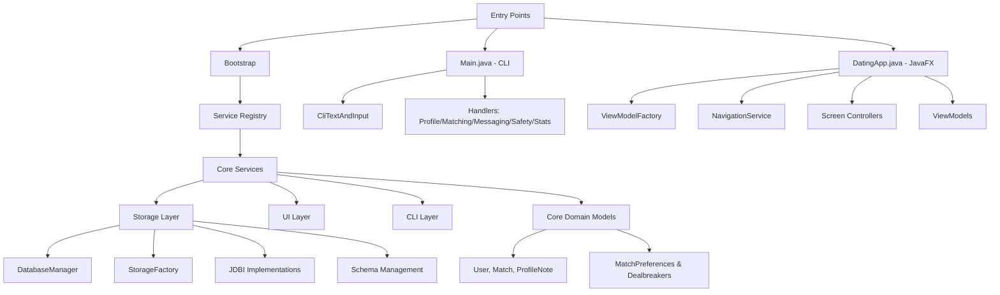

# Comprehensive Codebase Analysis Report
## Dating App - March 17, 2026

### Executive Summary
This report provides a comprehensive analysis of the dating app codebase, covering 247 Java files with 66,698 total lines (52,170 code lines). The application is a modern JavaFX-based dating platform with CLI fallback, using clean architecture principles with H2 database, JDBI for data access, and comprehensive testing.

### 1. Architecture Overview

#### High-Level Architecture

#### Key Architectural Patterns
- **Clean Architecture**: Core domain models free from framework dependencies
- **Dependency Injection**: ServiceRegistry provides centralized service access
- **Event-Driven**: InProcessAppEventBus for component communication
- **Async Abstractions**: Custom async framework for UI operations
- **Result Records**: Business logic returns typed results instead of exceptions
- **Builder Pattern**: Complex object construction (User.StorageBuilder, Dealbreakers.Builder)

### 2. Entry Points and Bootstrap

#### Main Entry Points
- **CLI Entry**: `Main.java` - Interactive console application with UTF-8 console setup via FFM API
- **GUI Entry**: `DatingApp.java` - JavaFX application with navigation and view model factory

#### Bootstrap Process (`ApplicationStartup.java`)
- **Configuration Loading**: JSON-based config with Jackson databinding and Jackson mix-ins
- **Environment Overrides**: Environment variables override JSON defaults
- **Database Initialization**: H2 database with JDBI connection pooling
- **Service Wiring**: Deterministic service registry initialization
- **Dev Data Seeding**: Optional development data population

#### Configuration System
- **JSON Configuration**: Flat JSON structure mapped to AppConfig.Builder
- **Environment Variables**: DATING_APP_* prefixed overrides
- **Validation**: Comprehensive config validation with descriptive errors
- **Timezone Handling**: Custom ZoneId deserializer for user timezone config

### 3. Data Models and Relationships

#### Core Domain Models

##### User Model (`User.java`)
- **Identity**: UUID-based with deterministic timestamps
- **Profile Data**: Name, bio, birth date, gender, location, photos
- **Preferences**: Gender interests, age range, distance limits
- **Lifestyle**: Smoking, drinking, kids stance, education, height
- **Verification**: Email/phone verification workflow
- **Pace Preferences**: Communication style and dating timeline preferences
- **Dealbreakers**: Hard filters for matching compatibility
- **Interests**: Categorized activity preferences (max 10 per user)
- **State Management**: INCOMPLETE → ACTIVE ↔ PAUSED → BANNED transitions
- **Soft Delete**: Deleted timestamp for data retention

**Relationships:**
- User ↔ Match (many-to-many via Match entity)
- User ↔ ProfileNote (admin notes on user profiles)
- User → MatchPreferences (nested preferences and dealbreakers)
- User → Interests (enum set with categories)

##### Match Model (`Match.java`)
- **Identity**: Deterministic string ID from sorted UUID pair
- **Participants**: userA and userB (lexicographically ordered)
- **State Machine**: ACTIVE → FRIENDS/UNMATCHED/GRACEFUL_EXIT/BLOCKED
- **Lifecycle**: Created timestamp, ended timestamp, ended by user
- **Archive Reasons**: Categorization for analytics (FRIEND_ZONE, UNMATCH, BLOCK)
- **Soft Delete**: Deleted timestamp support
- **Messaging Permissions**: State-based messaging eligibility

**Relationships:**
- Match → User (two-way association)
- Match lifecycle managed by TrustSafetyService and MatchingService

##### ProfileNote Model (`ProfileNote.java`)
- **Identity**: Author-subject UUID pair
- **Content**: 500-character limit admin notes
- **Audit Trail**: Created/updated timestamps
- **Constraints**: Cannot note yourself, content required

#### Preferences and Compatibility System

##### MatchPreferences (`MatchPreferences.java`)
**Interest Categories:**
- Outdoors: Hiking, camping, fishing, cycling, running, climbing
- Arts: Movies, music, concerts, art galleries, theater, photography, reading, writing
- Food: Cooking, baking, wine, craft beer, coffee, foodie
- Sports: Gym, yoga, basketball, soccer, tennis, swimming, golf
- Tech: Video games, board games, coding, tech, podcasts
- Social: Travel, dancing, volunteering, pets, dogs, cats, nightlife

**Lifestyle Enums:**
- Smoking: Never, Sometimes, Regularly
- Drinking: Never, Socially, Regularly
- WantsKids: Don't want, Open to it, Want someday, Have kids
- LookingFor: Casual, Short-term, Long-term, Marriage, Not sure
- Education: High school, Some college, Bachelor's, Master's, PhD, Trade school, Other

**PacePreferences Record:**
- MessagingFrequency: Rarely, Often, Constantly, No preference
- TimeToFirstDate: Quickly, Few days, Weeks, Months, No preference
- CommunicationStyle: Text only, Voice notes, Video calls, In person only, Mix
- DepthPreference: Small talk, Deep chat, Existential, Depends on vibe

##### Dealbreakers System
- **One-way Filtering**: Seeker filters candidates, not vice versa
- **Lifestyle Filters**: Acceptable enum sets for smoking, drinking, kids, relationship goals, education
- **Physical Filters**: Height range constraints
- **Age Filters**: Maximum age difference override
- **Evaluation Engine**: Data-driven compatibility checking with failure diagnostics

### 4. Service Layer Architecture

#### Core Services Registry
**ServiceRegistry** provides centralized access to:
- UserStorage, InteractionStorage, CommunicationStorage
- MatchingService, ProfileService, ValidationService
- ActivityMetricsService, RecommendationService
- TrustSafetyService, UndoService, CleanupService
- AchievementService, DailyLimitService, DailyPickService

#### Key Service Responsibilities

##### MatchingService
- Candidate finding and filtering
- Compatibility scoring algorithms
- Recommendation engine
- Swipe session management
- Undo functionality

##### ProfileService
- Profile completeness validation
- Interest management
- Dealbreaker configuration
- Profile activation workflow

##### TrustSafetyService
- Match lifecycle management (unmatch, block, friend-zone)
- Safety reporting and blocking
- User verification workflows

##### ActivityMetricsService
- Swipe statistics tracking
- Session management
- Performance monitoring
- Cleanup operations

### 5. Storage Layer Implementation

#### Database Architecture
- **H2 Database**: Embedded Java database for development/production
- **JDBI 3**: Declarative SQL with SqlObject pattern
- **Connection Pooling**: HikariCP for performance
- **Schema Management**: Migration-based schema evolution

#### Storage Interfaces
- **UserStorage**: CRUD operations for user profiles and preferences
- **InteractionStorage**: Match and swipe data management
- **CommunicationStorage**: Messaging and conversation persistence
- **AnalyticsStorage**: Metrics and activity data
- **TrustSafetyStorage**: Safety reports and blocks

#### Schema Design Patterns
- **Normalized Preferences**: Separate tables for interests and dealbreakers
- **Soft Deletes**: Deleted timestamp columns for data retention
- **Audit Trails**: Created/updated timestamps on all entities
- **Deterministic IDs**: Generated keys for consistent referencing

### 6. UI Architecture

#### JavaFX Application Structure
- **NavigationService**: Singleton navigation coordinator
- **ViewModelFactory**: Service-to-UI adapter factory
- **Screen Controllers**: FXML-backed UI controllers
- **ViewModels**: Business logic containers with async abstractions

#### Async Framework (`ui/async/`)
- **ViewModelAsyncScope**: Structured async operation management
- **AsyncErrorRouter**: Centralized error handling for UI operations
- **UiThreadDispatcher**: Platform-specific threading abstractions
- **TaskHandle**: Cancellable operation management

#### UI Components
- **Controllers**: 12 screen controllers for different app sections
- **Popups**: Match notifications and milestone celebrations
- **Animations**: Smooth transitions and feedback
- **Image Management**: Caching and local photo storage

### 7. CLI Implementation

#### Handler Architecture
- **ProfileHandler**: User creation, selection, profile completion
- **MatchingHandler**: Candidate browsing, matches viewing, notifications
- **MessagingHandler**: Conversation management
- **SafetyHandler**: Blocking, reporting, safety features
- **StatsHandler**: Statistics and achievements display

#### Input/Output Abstraction
- **CliTextAndInput**: UTF-8 aware console I/O with input validation
- **MainMenuRegistry**: Dynamic menu construction with login requirements

### 8. Use Case Layer

#### Business Logic Organization (`app/usecase/`)
- **MatchingUseCases**: High-level matching workflows
- **MessagingUseCases**: Communication business rules
- **ProfileUseCases**: Profile management operations
- **SocialUseCases**: Social features and interactions

#### Error Handling
- **UseCaseError**: Typed error results instead of exceptions
- **UseCaseResult**: Success/failure result containers
- **UserContext**: Request-scoped user information

### 9. Test Coverage Analysis

#### Test Structure
- **Unit Tests**: Core service and utility testing
- **Integration Tests**: Database and service integration
- **Architecture Tests**: Dependency rule enforcement
- **UI Tests**: ViewModel and controller testing

#### Coverage Requirements
- **JaCoCo Minimum**: 60% line coverage
- **Exclusion Rules**: CLI and UI packages excluded from coverage requirements
- **Quality Gates**: Tests run as part of verify phase

### 10. Quality Gates and Standards

#### Code Quality Tools
- **Spotless**: Palantir Java Format enforcement
- **Checkstyle**: Code style validation
- **PMD**: Static analysis for bugs and maintainability
- **JaCoCo**: Test coverage measurement

#### Build Configuration
- **Java 25 Preview**: Latest Java features enabled
- **Maven Profiles**: Verbose test output profile
- **Plugin Management**: Consistent plugin versions

### 11. Identified Gaps and Incomplete Features

#### Placeholder Implementations
- **REST API**: `RestApiServer.java` exists but implementation details unclear
- **Event System**: `AppEventBus` and `InProcessAppEventBus` may need expansion
- **Verification System**: Email/phone verification simulated, not integrated

#### Configuration Limitations
- **Hardcoded Limits**: Some business rules embedded in code rather than config
- **Feature Flags**: Limited runtime feature toggling

#### UI/UX Gaps
- **Accessibility**: Limited screen reader support
- **Internationalization**: Basic i18n but limited locale support
- **Offline Mode**: No offline capability for critical features

### 12. Code Quality Patterns

#### Positive Patterns
- **Immutable Records**: Extensive use of Java records for data transfer
- **Builder Pattern**: Complex object construction with validation
- **Enum Safety**: EnumSetUtil for safe enum set operations
- **Result Types**: Business logic returns typed results
- **Dependency Injection**: Clean service boundaries

#### Areas for Improvement
- **Exception Handling**: Some areas still use runtime exceptions instead of result types
- **Documentation**: API documentation could be more comprehensive
- **Concurrency**: Limited use of modern Java concurrency features
- **Performance**: Some N+1 query patterns in storage layer

### 13. Security Considerations

#### Implemented Security
- **Input Sanitization**: OWASP HTML sanitizer for rich text
- **SQL Injection Prevention**: JDBI parameterized queries
- **XSS Protection**: Input validation and sanitization
- **Soft Deletes**: Data retention without exposure

#### Security Gaps
- **Authentication**: No real authentication system (simulated sessions)
- **Authorization**: Limited role-based access control
- **Audit Logging**: Basic audit trails but limited security event logging
- **Rate Limiting**: No API rate limiting implemented [INVALID] ❌ (Triple-verification confirms `LocalRateLimiter` exists in `RestApiServer.java`)

### 14. Performance Characteristics

#### Database Performance
- **Connection Pooling**: HikariCP for efficient connection management
- **Indexing Strategy**: Proper indexing on frequently queried columns
- **Query Optimization**: JDBI SqlObject for optimized queries

#### Application Performance
- **Lazy Loading**: On-demand service initialization
- **Caching**: Image caching in UI layer
- **Async Operations**: Non-blocking UI operations
- **Memory Management**: Efficient enum and collection usage

### 15. Deployment and Operations

#### Build Process
- **Maven Build**: Standard Java build with quality gates
- **Native Image Ready**: GraalVM-compatible (preview features disabled for native)
- **Cross-Platform**: JavaFX supports Windows, macOS, Linux

#### Configuration Management
- **Environment-Based**: Environment variables for deployment config
- **JSON Defaults**: Sensible defaults with override capability
- **Validation**: Startup-time configuration validation

### Recommendations

#### Immediate Priorities
1. Complete REST API implementation
2. Enhance verification system integration
3. Add comprehensive API documentation
4. Implement rate limiting and security headers

#### Medium-term Improvements
1. Add authentication and real session management
2. Implement offline mode capabilities
3. Enhance internationalization support
4. Add performance monitoring and metrics

#### Long-term Vision
1. Microservices architecture preparation
2. Advanced matching algorithms
3. Mobile application development
4. Machine learning integration for recommendations

---

**Analysis Date**: March 17, 2026
**Codebase Version**: Dating App 1.0.0
**Java Version**: 25 (Preview)
**Total Files**: 247
**Lines of Code**: 52,170
**Test Coverage**: 60% minimum required