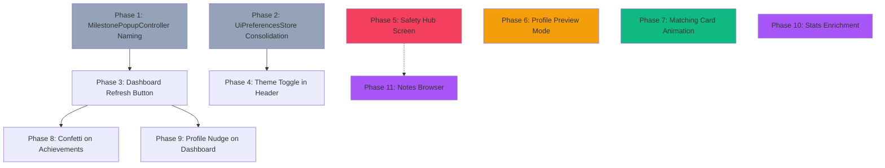

# Implementation Plan: JavaFX GUI Completion

Date: 2026-03-08
Source: [javafx_gui_audit.md](file:///C:/Users/tom7s/.gemini/antigravity/brain/bade743d-171f-4cf2-a278-cbba314cb8e8/javafx_gui_audit.md)
Status: ✅ Implemented (2026-03-08)
Owner: UI layer maintainers

---

## 1. Goal

Close the remaining feature and quality gaps between the CLI and GUI surfaces, and polish the JavaFX GUI into a complete, cohesive product.

Primary outcomes:
1. Implement 5 missing features (Safety Hub, Profile Preview, Notes Browser, Profile Score, Dashboard Refresh).
2. Add 3 UX enhancements (theme toggle in header, matching card entrance animation, confetti on achievement).
3. Fix 2 code quality issues (MilestonePopupController naming, UiPreferencesStore consolidation).
4. Add a profile completeness nudge on the dashboard.

## 1.1 Progress Tracking

- ✅ Phase 1 complete — verified the naming-collision issue is already resolved in current source: `achievement_popup.fxml` points at `datingapp.ui.screen.MilestonePopupController`, and no `ui/popup/MilestonePopupController` stub remains to rename/delete.
- ✅ Phase 2 complete — `UiPreferencesStore` is now shared through `ViewModelFactory`/`NavigationService` instead of being independently instantiated in runtime wiring.
- ✅ Phase 3 complete — dashboard refresh button added with icon-button styling and spin feedback.
- ✅ Phase 4 complete — global dark/light toggle added as a persistent overlay in `NavigationService` and backed by the shared preferences store.
- ✅ Phase 5 complete — new Safety Hub screen, controller, viewmodel, navigation route, dashboard card, and unblock flow implemented.
- ✅ Phase 6 complete — profile preview dialog implemented, plus the missing profile score breakdown dialog was added as part of the profile work to satisfy the stated plan scope.
- ✅ Phase 7 complete — like/pass button actions now use card exit animation and the next card fades/scales in.
- ✅ Phase 8 complete — dashboard confetti now celebrates newly seen achievements and persists seen-achievement state in `UiPreferencesStore`.
- ✅ Phase 9 complete — dashboard completeness nudge banner implemented with direct navigation to edit profile.
- ✅ Phase 10 complete — stats screen expanded to a 2×3 grid using currently available telemetry (`likes given`, `likes received`, `matches`, `match rate`, `messages`, `login streak`).
- ✅ Phase 11 complete — notes browser screen, controller, viewmodel, route, and dashboard entry point implemented.
- ✅ UX polish pass complete (2026-03-08) — refined microcopy for Safety/Notes empty states, improved dialog theme consistency in Profile preview/score, added selection feedback in Notes, and fixed dashboard nudge banner visibility wiring.

---

## 2. User Review Required

> [!IMPORTANT]
> **New screen: Safety Hub** — This adds a brand-new `SAFETY` ViewType, FXML, Controller, and ViewModel. It will appear as a card on the Dashboard and from the profile screen. Scope includes: view/unblock blocked users. Verification flow is **excluded** since the CLI `SafetyHandler` does not have one either (grep returned no results for `verifyProfile` or `requestVerification` in [SafetyHandler.java](file:///c:/Users/tom7s/Desktopp/Claude_Folder_2/Date_Program/src/main/java/datingapp/app/cli/SafetyHandler.java)).

> [!IMPORTANT]
> **Ordering** — The plan is phased so each phase produces a working build. Phases 1–3 are structural/preparedness work. Phases 4–9 are each an independent feature. They can be reordered or skipped individually without breaking other phases.

---

## 3. Current State (Verified from Source)

### Existing Files

| Layer         | Count | Key Files                                                                                                                                                                                                                                                                                                                                                                                                                                                                                                                                                                                                                                                                                                                                                                                                                                                                                                                                                                                                                                                                                                                                                                                                                                                                                                                                                                                                                                                                                                                                                                                                                                                                                                                                                                   |
|---------------|-------|-----------------------------------------------------------------------------------------------------------------------------------------------------------------------------------------------------------------------------------------------------------------------------------------------------------------------------------------------------------------------------------------------------------------------------------------------------------------------------------------------------------------------------------------------------------------------------------------------------------------------------------------------------------------------------------------------------------------------------------------------------------------------------------------------------------------------------------------------------------------------------------------------------------------------------------------------------------------------------------------------------------------------------------------------------------------------------------------------------------------------------------------------------------------------------------------------------------------------------------------------------------------------------------------------------------------------------------------------------------------------------------------------------------------------------------------------------------------------------------------------------------------------------------------------------------------------------------------------------------------------------------------------------------------------------------------------------------------------------------------------------------------------------|
| Controllers   | 12    | [LoginController](file:///c:/Users/tom7s/Desktopp/Claude_Folder_2/Date_Program/src/main/java/datingapp/ui/screen/LoginController.java#56-658) (658 LOC), [ProfileController](file:///c:/Users/tom7s/Desktopp/Claude_Folder_2/Date_Program/src/main/java/datingapp/ui/screen/ProfileController.java#46-923) (923), [MatchesController](file:///c:/Users/tom7s/Desktopp/Claude_Folder_2/Date_Program/src/main/java/datingapp/ui/screen/MatchesController.java#65-944) (944), [MatchingController](file:///c:/Users/tom7s/Desktopp/Claude_Folder_2/Date_Program/src/main/java/datingapp/ui/screen/MatchingController.java#48-696) (696), [ChatController](file:///c:/Users/tom7s/Desktopp/Claude_Folder_2/Date_Program/src/main/java/datingapp/ui/screen/ChatController.java#42-479) (479), [DashboardController](file:///c:/Users/tom7s/Desktopp/Claude_Folder_2/Date_Program/src/main/java/datingapp/ui/screen/DashboardController.java#22-294) (294), [PreferencesController](file:///c:/Users/tom7s/Desktopp/Claude_Folder_2/Date_Program/src/main/java/datingapp/ui/screen/PreferencesController.java#25-249) (249), [SocialController](file:///c:/Users/tom7s/Desktopp/Claude_Folder_2/Date_Program/src/main/java/datingapp/ui/screen/SocialController.java#31-199) (199), [StandoutsController](file:///c:/Users/tom7s/Desktopp/Claude_Folder_2/Date_Program/src/main/java/datingapp/ui/screen/StandoutsController.java#29-149) (149), [StatsController](file:///c:/Users/tom7s/Desktopp/Claude_Folder_2/Date_Program/src/main/java/datingapp/ui/screen/StatsController.java#24-139) (139), [MilestonePopupController](file:///c:/Users/tom7s/Desktopp/Claude_Folder_2/Date_Program/src/main/java/datingapp/ui/screen/MilestonePopupController.java#32-336) ×2 (61+336) |
| ViewModels    | 13    | All present, including `UiDataAdapters`, `ViewModelErrorSink`, [ViewModelFactory](file:///c:/Users/tom7s/Desktopp/Claude_Folder_2/Date_Program/src/main/java/datingapp/ui/viewmodel/ViewModelFactory.java#43-333)                                                                                                                                                                                                                                                                                                                                                                                                                                                                                                                                                                                                                                                                                                                                                                                                                                                                                                                                                                                                                                                                                                                                                                                                                                                                                                                                                                                                                                                                                                                                                           |
| FXML          | 12    | `login`, `dashboard`, [profile](file:///c:/Users/tom7s/Desktopp/Claude_Folder_2/Date_Program/src/main/java/datingapp/ui/viewmodel/DashboardViewModel.java#415-418), `matching`, `matches`, `chat`, `stats`, `preferences`, `standouts`, `social`, `achievement_popup`, `match_popup`                                                                                                                                                                                                                                                                                                                                                                                                                                                                                                                                                                                                                                                                                                                                                                                                                                                                                                                                                                                                                                                                                                                                                                                                                                                                                                                                                                                                                                                                                        |
| Tests         | 20    | 5 controller tests, 8 viewmodel tests, 2 async tests, 2 nav tests, 1 CSS validation, 1 image cache, 1 test support                                                                                                                                                                                                                                                                                                                                                                                                                                                                                                                                                                                                                                                                                                                                                                                                                                                                                                                                                                                                                                                                                                                                                                                                                                                                                                                                                                                                                                                                                                                                                                                                                                                          |
| ViewType enum | 10    | `LOGIN`, `DASHBOARD`, `PROFILE`, `MATCHING`, `MATCHES`, `CHAT`, `STATS`, `PREFERENCES`, `STANDOUTS`, `SOCIAL`                                                                                                                                                                                                                                                                                                                                                                                                                                                                                                                                                                                                                                                                                                                                                                                                                                                                                                                                                                                                                                                                                                                                                                                                                                                                                                                                                                                                                                                                                                                                                                                                                                                               |
| Use-Cases     | 4     | `MatchingUseCases`, `MessagingUseCases`, `ProfileUseCases`, `SocialUseCases`                                                                                                                                                                                                                                                                                                                                                                                                                                                                                                                                                                                                                                                                                                                                                                                                                                                                                                                                                                                                                                                                                                                                                                                                                                                                                                                                                                                                                                                                                                                                                                                                                                                                                                |

### True Gaps (CLI Features Not in GUI)

| # | CLI Entry Point                               | Missing From GUI                        |
|---|-----------------------------------------------|-----------------------------------------|
| 1 | `SafetyHandler.manageBlockedUsers()` (menu 8) | No way to view or unblock blocked users |
| 2 | `ProfileHandler.previewProfile()`             | No profile-as-others-see-it preview     |
| 3 | `ProfileHandler.viewAllNotes()` (menu 13)     | No unified notes browser                |
| 4 | `ProfileHandler.viewProfileScore()` (menu 14) | No detailed profile quality breakdown   |
| 5 | Dashboard has no refresh mechanism            | Dashboard data is loaded once on entry  |

---

## 4. Proposed Changes

---

### ✅ Phase 1: Code Quality — MilestonePopupController Naming Fix

**Problem:** Two classes named [MilestonePopupController](file:///c:/Users/tom7s/Desktopp/Claude_Folder_2/Date_Program/src/main/java/datingapp/ui/screen/MilestonePopupController.java#32-336) in packages `popup/` (61 lines, stub) and `screen/` (336 lines, real implementation). Naming collision causes confusion.

#### [MODIFY] [MilestonePopupController.java](file:///c:/Users/tom7s/Desktopp/Claude_Folder_2/Date_Program/src/main/java/datingapp/ui/popup/MilestonePopupController.java)
- Rename class to `PopupStubController` (or determine if this stub is referenced by any FXML file — if [achievement_popup.fxml](file:///c:/Users/tom7s/Desktopp/Claude_Folder_2/Date_Program/src/main/resources/fxml/achievement_popup.fxml) or [match_popup.fxml](file:///c:/Users/tom7s/Desktopp/Claude_Folder_2/Date_Program/src/main/resources/fxml/match_popup.fxml) reference it, update those `fx:controller` attributes too).

#### [MODIFY] [achievement_popup.fxml](file:///c:/Users/tom7s/Desktopp/Claude_Folder_2/Date_Program/src/main/resources/fxml/achievement_popup.fxml)
- Update `fx:controller` to `datingapp.ui.popup.PopupStubController` if applicable.

#### [MODIFY] [match_popup.fxml](file:///c:/Users/tom7s/Desktopp/Claude_Folder_2/Date_Program/src/main/resources/fxml/match_popup.fxml)
- Update `fx:controller` to `datingapp.ui.popup.PopupStubController` if applicable.

**Verification:** Check whether either FXML references the `popup.MilestonePopupController`. If NEITHER references it, the stub file can be deleted entirely instead of renamed.

**Pre-implementation command:**
```bash
rg "popup.MilestonePopupController" src/main/resources/fxml/
```

---

### ✅ Phase 2: Code Quality — UiPreferencesStore Consolidation

**Problem:** `UiPreferencesStore` instantiated independently in 3 places: [NavigationService](file:///c:/Users/tom7s/Desktopp/Claude_Folder_2/Date_Program/src/main/java/datingapp/ui/NavigationService.java#31-432) (line 42), [ViewModelFactory](file:///c:/Users/tom7s/Desktopp/Claude_Folder_2/Date_Program/src/main/java/datingapp/ui/viewmodel/ViewModelFactory.java#43-333) (line 82), [PreferencesViewModel](file:///c:/Users/tom7s/Desktopp/Claude_Folder_2/Date_Program/src/main/java/datingapp/ui/viewmodel/ViewModelFactory.java#245-257) (lines 65, 70). All wrap the same `java.util.prefs.Preferences` node. Functional but wasteful.

#### [MODIFY] [ViewModelFactory.java](file:///c:/Users/tom7s/Desktopp/Claude_Folder_2/Date_Program/src/main/java/datingapp/ui/viewmodel/ViewModelFactory.java)
- Create the single shared `UiPreferencesStore` instance here in the constructor.
- Pass it to `NavigationService.getInstance().setPreferencesStore(store)` during initialization.
- Pass it to [PreferencesViewModel](file:///c:/Users/tom7s/Desktopp/Claude_Folder_2/Date_Program/src/main/java/datingapp/ui/viewmodel/ViewModelFactory.java#245-257) via constructor injection.

#### [MODIFY] [NavigationService.java](file:///c:/Users/tom7s/Desktopp/Claude_Folder_2/Date_Program/src/main/java/datingapp/ui/NavigationService.java)
- Replace line 42 `private final UiPreferencesStore uiPreferencesStore = new UiPreferencesStore();` with a mutable field and add `setPreferencesStore(UiPreferencesStore store)` method.
- Add a guard: if no store is set, fall back to creating one (backward compatibility for tests).

#### [MODIFY] [PreferencesViewModel.java](file:///c:/Users/tom7s/Desktopp/Claude_Folder_2/Date_Program/src/main/java/datingapp/ui/viewmodel/PreferencesViewModel.java)
- Remove `new UiPreferencesStore()` from lines 65 and 70.
- Accept `UiPreferencesStore` via the constructor that [ViewModelFactory](file:///c:/Users/tom7s/Desktopp/Claude_Folder_2/Date_Program/src/main/java/datingapp/ui/viewmodel/ViewModelFactory.java#43-333) calls.
- Keep the existing 3-arg internal constructor unchanged (for test injection).

#### [MODIFY] [DatingApp.java](file:///c:/Users/tom7s/Desktopp/Claude_Folder_2/Date_Program/src/main/java/datingapp/ui/DatingApp.java)
- After creating [ViewModelFactory](file:///c:/Users/tom7s/Desktopp/Claude_Folder_2/Date_Program/src/main/java/datingapp/ui/viewmodel/ViewModelFactory.java#43-333), call `nav.setPreferencesStore(vmFactory.getPreferencesStore())` before `nav.initialize(primaryStage)`.

---

### ✅ Phase 3: Dashboard Refresh Button

**Problem:** Dashboard data loads once when the screen is navigated to. No way to refresh without navigating away and back.

#### [MODIFY] [dashboard.fxml](file:///c:/Users/tom7s/Desktopp/Claude_Folder_2/Date_Program/src/main/resources/fxml/dashboard.fxml)
- Add a small icon button in the header bar (next to the likes counter, before logout) with `fx:id="refreshButton"`, using icon `mdi2r-refresh`, and styleClass `button-icon`.

#### [MODIFY] [DashboardController.java](file:///c:/Users/tom7s/Desktopp/Claude_Folder_2/Date_Program/src/main/java/datingapp/ui/screen/DashboardController.java)
- Add `@FXML private Button refreshButton;` field.
- In [initialize()](file:///c:/Users/tom7s/Desktopp/Claude_Folder_2/Date_Program/src/main/java/datingapp/ui/screen/MatchingController.java#137-161), wire: `refreshButton.setOnAction(e -> { e.consume(); viewModel.performRefresh(); });`
- Add a brief spin animation on the button icon during refresh (use `RotateTransition` on the icon, 360°, 600ms).

#### [MODIFY] [theme.css](file:///c:/Users/tom7s/Desktopp/Claude_Folder_2/Date_Program/src/main/resources/css/theme.css)
- Add `.button-icon` style: small circular background, transparent default, subtle hover, no padding bloat.

```css
/* Compact icon-only button (e.g., dashboard refresh) */
.button-icon {
    -fx-background-color: transparent;
    -fx-background-radius: 16;
    -fx-padding: 6;
    -fx-cursor: hand;
}
.button-icon:hover {
    -fx-background-color: rgba(255, 255, 255, 0.08);
}
.button-icon .ikonli-font-icon {
    -fx-icon-color: -fx-text-secondary;
}
```

#### [MODIFY] [light-theme.css](file:///c:/Users/tom7s/Desktopp/Claude_Folder_2/Date_Program/src/main/resources/css/light-theme.css)
- Add light-theme override for `.button-icon:hover`.

---

### ✅ Phase 4: Dark/Light Theme Toggle in Header Bar

**Problem:** Theme toggle is only available in the Preferences screen. User wants a small, cute toggle accessible from all screens.

#### [MODIFY] [NavigationService.java](file:///c:/Users/tom7s/Desktopp/Claude_Folder_2/Date_Program/src/main/java/datingapp/ui/NavigationService.java)
- In the root layout construction (the method that builds the scene), add a persistent header overlay with a small sun/moon `ToggleButton` at the top-right corner.
- The toggle calls [setThemeMode()](file:///c:/Users/tom7s/Desktopp/Claude_Folder_2/Date_Program/src/main/java/datingapp/ui/NavigationService.java#136-144) on click.
- Use a `FontIcon` — `mdi2w-weather-sunny` (light) / `mdi2w-weather-night` (dark), size 16.
- Position: absolute top-right of the scene, floating above screen content via a `StackPane` wrapper.
- The toggle state binds to `currentThemeMode` property.

**Alternative approach (if persistent overlay is complex):** Add the toggle to every screen's header bar via [BaseController](file:///c:/Users/tom7s/Desktopp/Claude_Folder_2/Date_Program/src/main/java/datingapp/ui/screen/BaseController.java#34-131):
- Add a method `BaseController.addThemeToggle(HBox headerBar)` that creates and wires the toggle.
- Call from each controller's [initialize()](file:///c:/Users/tom7s/Desktopp/Claude_Folder_2/Date_Program/src/main/java/datingapp/ui/screen/MatchingController.java#137-161) where a header bar is present.
- This approach requires changes to every controller but is simpler and more maintainable.

> [!NOTE]
> The recommended approach is the persistent overlay in [NavigationService](file:///c:/Users/tom7s/Desktopp/Claude_Folder_2/Date_Program/src/main/java/datingapp/ui/NavigationService.java#31-432) since it's implemented once and appears on every screen automatically. However, the user should confirm their preference.

#### [MODIFY] [theme.css](file:///c:/Users/tom7s/Desktopp/Claude_Folder_2/Date_Program/src/main/resources/css/theme.css)
- Add `.theme-toggle` style: small pill shape, translucent background, icon-only.

#### [MODIFY] [light-theme.css](file:///c:/Users/tom7s/Desktopp/Claude_Folder_2/Date_Program/src/main/resources/css/light-theme.css)
- Add `.theme-toggle` light theme overrides.

---

### ✅ Phase 5: Safety Hub Screen (New Screen)

**Problem:** Users can block/report from 3 screens but cannot view or unblock blocked users. CLI has `SafetyHandler.manageBlockedUsers()` using `TrustSafetyService.getBlockedUsers()` and `TrustSafetyService.unblockUser()`.

#### [NEW] [safety.fxml](file:///c:/Users/tom7s/Desktopp/Claude_Folder_2/Date_Program/src/main/resources/fxml/safety.fxml)
- `BorderPane` with header (back button + title "Safety & Privacy") and center content.
- `ListView` for blocked users with unblock button per row.
- Empty state when no users are blocked.

#### [NEW] [SafetyController.java](file:///c:/Users/tom7s/Desktopp/Claude_Folder_2/Date_Program/src/main/java/datingapp/ui/screen/SafetyController.java)
- Extends `BaseController implements Initializable`.
- Constructor takes `SafetyViewModel`.
- Binds blocked-users list from ViewModel.
- Handles unblock action with confirmation dialog (pattern: same as `MatchesController.handleUnmatch()` — `UiFeedbackService.showConfirmation()` → call ViewModel method → `UiFeedbackService.showSuccess()`).
- Handles back navigation via [handleBack()](file:///c:/Users/tom7s/Desktopp/Claude_Folder_2/Date_Program/src/main/java/datingapp/ui/screen/BaseController.java#106-120).
- Wires [fadeIn(rootPane, 800)](file:///c:/Users/tom7s/Desktopp/Claude_Folder_2/Date_Program/src/main/java/datingapp/ui/UiAnimations.java#51-60) like every other controller.

#### [NEW] [SafetyViewModel.java](file:///c:/Users/tom7s/Desktopp/Claude_Folder_2/Date_Program/src/main/java/datingapp/ui/viewmodel/SafetyViewModel.java)
- Follows existing ViewModel patterns with `ViewModelAsyncScope`.
- Depends on: `SocialUseCases` (or directly `TrustSafetyService` + `UserStorage`), `AppSession`, `UiThreadDispatcher`.
- Exposes:
  - `ObservableList<BlockedUserEntry>` (record with userId, name, blockedAt).
  - `loadBlockedUsers()` — async load using `TrustSafetyService.getBlockedUsers()`.
  - `unblockUser(UUID userId)` — async unblock using `TrustSafetyService.unblockUser()`, then refresh list.
- Error handling via `ViewModelErrorSink`.

#### [MODIFY] [NavigationService.java](file:///c:/Users/tom7s/Desktopp/Claude_Folder_2/Date_Program/src/main/java/datingapp/ui/NavigationService.java)
- Add `SAFETY("/fxml/safety.fxml")` to `ViewType` enum.

#### [MODIFY] [ViewModelFactory.java](file:///c:/Users/tom7s/Desktopp/Claude_Folder_2/Date_Program/src/main/java/datingapp/ui/viewmodel/ViewModelFactory.java)
- Add `SafetyViewModel` field, lazy accessor `getSafetyViewModel()`.
- Add `SafetyController.class` entry to [buildControllerFactories()](file:///c:/Users/tom7s/Desktopp/Claude_Folder_2/Date_Program/src/main/java/datingapp/ui/viewmodel/ViewModelFactory.java#107-125).
- Add disposal call in [reset()](file:///c:/Users/tom7s/Desktopp/Claude_Folder_2/Date_Program/src/main/java/datingapp/ui/viewmodel/ViewModelFactory.java#289-308).

#### [MODIFY] [dashboard.fxml](file:///c:/Users/tom7s/Desktopp/Claude_Folder_2/Date_Program/src/main/resources/fxml/dashboard.fxml)
- Add a new navigation card "Safety & Privacy" with icon `mdi2s-shield-check`, linking to `#handleSafety`.

#### [MODIFY] [DashboardController.java](file:///c:/Users/tom7s/Desktopp/Claude_Folder_2/Date_Program/src/main/java/datingapp/ui/screen/DashboardController.java)
- Add `handleSafety()` method: `NavigationService.getInstance().navigateTo(NavigationService.ViewType.SAFETY);`.

---

### ✅ Phase 6: Profile Preview Mode

**Problem:** Users can edit their profile but can't see how it appears to others. CLI has `ProfileHandler.previewProfile()`.

#### [MODIFY] [profile.fxml](file:///c:/Users/tom7s/Desktopp/Claude_Folder_2/Date_Program/src/main/resources/fxml/profile.fxml)
- Add a "Preview" button in the top action bar next to Save/Cancel, with icon `mdi2e-eye`.

#### [MODIFY] [ProfileController.java](file:///c:/Users/tom7s/Desktopp/Claude_Folder_2/Date_Program/src/main/java/datingapp/ui/screen/ProfileController.java)
- Add `@FXML private Button previewButton;` field.
- Add `handlePreview()` method that opens a modal [Dialog](file:///c:/Users/tom7s/Desktopp/Claude_Folder_2/Date_Program/src/main/java/datingapp/ui/screen/MatchesController.java#695-719):
  - The dialog shows a read-only view of the profile as a "matching card" — same layout as `MatchingController.updateCandidateUI()` but with the current user's data.
  - Includes: name + age, bio, distance display (from search location), interests chips, lifestyle info, photos.
  - Styled with the match-card CSS classes.
  - "Close" button to dismiss.
- Data source: directly from the current ViewModel properties (no additional service calls needed, everything is already bound in [ProfileViewModel](file:///c:/Users/tom7s/Desktopp/Claude_Folder_2/Date_Program/src/main/java/datingapp/ui/viewmodel/ViewModelFactory.java#171-184)).

---

### ✅ Phase 7: Matching Card Entrance Animation

**Problem:** When Like/Pass button is clicked (not swiped), the next card just appears instantly. Swipe gesture already has exit animation, but button-click action doesn't animate the card transition.

#### [MODIFY] [MatchingController.java](file:///c:/Users/tom7s/Desktopp/Claude_Folder_2/Date_Program/src/main/java/datingapp/ui/screen/MatchingController.java)
- In [handleLike()](file:///c:/Users/tom7s/Desktopp/Claude_Folder_2/Date_Program/src/main/java/datingapp/ui/screen/MatchingController.java#548-554) and [handlePass()](file:///c:/Users/tom7s/Desktopp/Claude_Folder_2/Date_Program/src/main/java/datingapp/ui/screen/MatchingController.java#555-561): instead of directly calling `viewModel.like()`/`viewModel.pass()`, use the existing [animateCardExit()](file:///c:/Users/tom7s/Desktopp/Claude_Folder_2/Date_Program/src/main/java/datingapp/ui/screen/MatchingController.java#345-368) method to first play the exit animation, THEN call the viewmodel method on completion.
- Change [handleLike()](file:///c:/Users/tom7s/Desktopp/Claude_Folder_2/Date_Program/src/main/java/datingapp/ui/screen/MatchingController.java#548-554) to: [animateCardExit(true, this::performLike);](file:///c:/Users/tom7s/Desktopp/Claude_Folder_2/Date_Program/src/main/java/datingapp/ui/screen/MatchingController.java#345-368)
- Change [handlePass()](file:///c:/Users/tom7s/Desktopp/Claude_Folder_2/Date_Program/src/main/java/datingapp/ui/screen/MatchingController.java#555-561) to: [animateCardExit(false, this::performPass);](file:///c:/Users/tom7s/Desktopp/Claude_Folder_2/Date_Program/src/main/java/datingapp/ui/screen/MatchingController.java#345-368)
- After the viewmodel updates and `currentCandidateProperty` fires, add an entrance animation for the new card:
  - `candidateCard.setOpacity(0); candidateCard.setScaleX(0.85); candidateCard.setScaleY(0.85);`
  - Use a `ParallelTransition`: [FadeTransition(0→1, 400ms)](file:///c:/Users/tom7s/Desktopp/Claude_Folder_2/Date_Program/src/main/java/datingapp/ui/NavigationService.java#263-281) + `ScaleTransition(0.85→1.0, 400ms, EASE_OUT)`.
- Wrap in [updateCandidateUI()](file:///c:/Users/tom7s/Desktopp/Claude_Folder_2/Date_Program/src/main/java/datingapp/ui/screen/MatchingController.java#471-483) or as a post-listener on `currentCandidateProperty`.

---

### ✅ Phase 8: Confetti on Achievement Unlock (Dashboard)

**Problem:** [ConfettiAnimation](file:///c:/Users/tom7s/Desktopp/Claude_Folder_2/Date_Program/src/main/java/datingapp/ui/UiAnimations.java#332-450) exists in [UiAnimations.java](file:///c:/Users/tom7s/Desktopp/Claude_Folder_2/Date_Program/src/main/java/datingapp/ui/UiAnimations.java) but only fires in the milestone popup. Dashboard shows achievements in sidebar but no visual celebration when new ones are earned.

#### [MODIFY] [DashboardViewModel.java](file:///c:/Users/tom7s/Desktopp/Claude_Folder_2/Date_Program/src/main/java/datingapp/ui/viewmodel/DashboardViewModel.java)
- Add `BooleanProperty newAchievementsAvailable` that becomes `true` when achievements are loaded and there are achievements earned since the last dashboard visit (compare with a locally cached set of seen achievement IDs).
- Expose the property for the controller.

#### [MODIFY] [DashboardController.java](file:///c:/Users/tom7s/Desktopp/Claude_Folder_2/Date_Program/src/main/java/datingapp/ui/screen/DashboardController.java)
- Subscribe to `viewModel.newAchievementsAvailableProperty()`. When `true`:
  - Create a temporary `Canvas` overlay on `rootPane`.
  - Fire `new ConfettiAnimation().play(canvas)`.
  - Auto-remove canvas after 3 seconds.
  - Mark as seen via ViewModel to prevent re-triggering.

---

### ✅ Phase 9: Profile Completeness Nudge (Dashboard)

**Problem:** Dashboard shows "Profile X% complete" text but no visual prompt. User wants a nudge that highlights what's missing.

#### [MODIFY] [DashboardViewModel.java](file:///c:/Users/tom7s/Desktopp/Claude_Folder_2/Date_Program/src/main/java/datingapp/ui/viewmodel/DashboardViewModel.java)
- Add `StringProperty profileNudgeMessage` — a human-friendly hint like "Add a bio to boost your profile!" or "Upload a photo to get more matches!".
- Compute from existing `profileService.calculateCompletionPercentage()` — identify the first missing field (bio → photo → location → interests → lifestyle) and set the nudge message accordingly.
- If 100%, set to empty string (no nudge shown).

#### [MODIFY] [dashboard.fxml](file:///c:/Users/tom7s/Desktopp/Claude_Folder_2/Date_Program/src/main/resources/fxml/dashboard.fxml)
- Add a small nudge bar below the header (or above the navigation grid) with `fx:id="profileNudgeLabel"`, styled as a soft info banner. Include a small "Edit Profile" link/button.

#### [MODIFY] [DashboardController.java](file:///c:/Users/tom7s/Desktopp/Claude_Folder_2/Date_Program/src/main/java/datingapp/ui/screen/DashboardController.java)
- Bind `profileNudgeLabel.textProperty()` to `viewModel.profileNudgeMessageProperty()`.
- Toggle visibility/managed based on whether the message is non-empty.
- The "Edit Profile" action button navigates to `ViewType.PROFILE`.

---

### ✅ Phase 10: Stats Screen Enrichment (Nice-to-Have)

**Problem:** Stats screen is thin (139 lines) — only an achievement list + 3 counters. No charts, graphs, or trends.

#### [MODIFY] [StatsViewModel.java](file:///c:/Users/tom7s/Desktopp/Claude_Folder_2/Date_Program/src/main/java/datingapp/ui/viewmodel/StatsViewModel.java)
- Add properties for: `messagesExchanged`, `profileViews`, `superLikesUsed`, `loginStreak`.
- Source from `AnalyticsStorage` and `ActivityMetricsService` (already in `ServiceRegistry`).

#### [MODIFY] [stats.fxml](file:///c:/Users/tom7s/Desktopp/Claude_Folder_2/Date_Program/src/main/resources/fxml/stats.fxml)
- Expand from 3 stat counters to a 2×3 grid of stat cards, each with an icon, value, and label.
- Keep the achievements ListView below the stats grid.

#### [MODIFY] [StatsController.java](file:///c:/Users/tom7s/Desktopp/Claude_Folder_2/Date_Program/src/main/java/datingapp/ui/screen/StatsController.java)
- Bind new stat labels to ViewModel properties.
- Add card entrance animation stagger (same pattern as `MatchesController.animateCardEntrance()`).

---

### ✅ Phase 11: Notes Browser (Nice-to-Have)

**Problem:** Private notes exist per-candidate (Matching) and per-conversation (Chat), but no unified view. CLI has `ProfileHandler.viewAllNotes()`.

#### [NEW] [notes.fxml](file:///c:/Users/tom7s/Desktopp/Claude_Folder_2/Date_Program/src/main/resources/fxml/notes.fxml)
- `BorderPane` with header + back button, and a center `ListView<NoteEntry>`.
- Each note cell shows: user name, note content (truncated), last modified date.
- Clicking a note navigates to the matching screen with that user's context ([setNavigationContext](file:///c:/Users/tom7s/Desktopp/Claude_Folder_2/Date_Program/src/main/java/datingapp/ui/NavigationService.java#362-365)).

#### [NEW] [NotesController.java](file:///c:/Users/tom7s/Desktopp/Claude_Folder_2/Date_Program/src/main/java/datingapp/ui/screen/NotesController.java)
- Extends `BaseController implements Initializable`.
- Constructor takes `NotesViewModel`.
- Binds notes list, handles note selection for navigation.
- Pattern: same as [StandoutsController](file:///c:/Users/tom7s/Desktopp/Claude_Folder_2/Date_Program/src/main/java/datingapp/ui/screen/StandoutsController.java#29-149) — simple list with cell factory.

#### [NEW] [NotesViewModel.java](file:///c:/Users/tom7s/Desktopp/Claude_Folder_2/Date_Program/src/main/java/datingapp/ui/viewmodel/NotesViewModel.java)
- Depends on: `InteractionStorage` (has `getAllNotesForUser()`), `UserStorage`, `AppSession`.
- Loads all notes for the current user, enriches with user names.
- Exposes `ObservableList<NoteEntry>` (record: userId, userName, content, lastModified).

#### [MODIFY] [NavigationService.java](file:///c:/Users/tom7s/Desktopp/Claude_Folder_2/Date_Program/src/main/java/datingapp/ui/NavigationService.java)
- Add `NOTES("/fxml/notes.fxml")` to `ViewType` enum.

#### [MODIFY] [ViewModelFactory.java](file:///c:/Users/tom7s/Desktopp/Claude_Folder_2/Date_Program/src/main/java/datingapp/ui/viewmodel/ViewModelFactory.java)
- Add `NotesViewModel`, lazy accessor, controller factory entry, disposal.

#### [MODIFY] [dashboard.fxml](file:///c:/Users/tom7s/Desktopp/Claude_Folder_2/Date_Program/src/main/resources/fxml/dashboard.fxml)
- Add "My Notes" navigation card or link.

#### [MODIFY] [DashboardController.java](file:///c:/Users/tom7s/Desktopp/Claude_Folder_2/Date_Program/src/main/java/datingapp/ui/screen/DashboardController.java)
- Add `handleNotes()` method.

---

## 5. Files Changed Summary

### New Files (6)

| File                                                        | Type       | Phase |
|-------------------------------------------------------------|------------|-------|
| `src/main/resources/fxml/safety.fxml`                       | FXML       | 5     |
| `src/main/java/datingapp/ui/screen/SafetyController.java`   | Controller | 5     |
| `src/main/java/datingapp/ui/viewmodel/SafetyViewModel.java` | ViewModel  | 5     |
| `src/main/resources/fxml/notes.fxml`                        | FXML       | 11    |
| `src/main/java/datingapp/ui/screen/NotesController.java`    | Controller | 11    |
| `src/main/java/datingapp/ui/viewmodel/NotesViewModel.java`  | ViewModel  | 11    |

### Modified Files (16)

| File                                                                                                                                                                                                                                                                                       | Phases            |
|--------------------------------------------------------------------------------------------------------------------------------------------------------------------------------------------------------------------------------------------------------------------------------------------|-------------------|
| [popup/MilestonePopupController.java](file:///c:/Users/tom7s/Desktopp/Claude_Folder_2/Date_Program/src/main/java/datingapp/ui/popup/MilestonePopupController.java)                                                                                                                         | 1                 |
| [achievement_popup.fxml](file:///c:/Users/tom7s/Desktopp/Claude_Folder_2/Date_Program/src/main/resources/fxml/achievement_popup.fxml) or [match_popup.fxml](file:///c:/Users/tom7s/Desktopp/Claude_Folder_2/Date_Program/src/main/resources/fxml/match_popup.fxml)                         | 1 (if referenced) |
| [ViewModelFactory.java](file:///c:/Users/tom7s/Desktopp/Claude_Folder_2/Date_Program/src/main/java/datingapp/ui/viewmodel/ViewModelFactory.java)                                                                                                                                           | 2, 5, 11          |
| [NavigationService.java](file:///c:/Users/tom7s/Desktopp/Claude_Folder_2/Date_Program/src/main/java/datingapp/ui/NavigationService.java)                                                                                                                                                   | 2, 4, 5, 11       |
| [PreferencesViewModel.java](file:///c:/Users/tom7s/Desktopp/Claude_Folder_2/Date_Program/src/main/java/datingapp/ui/viewmodel/PreferencesViewModel.java)                                                                                                                                   | 2                 |
| [DatingApp.java](file:///c:/Users/tom7s/Desktopp/Claude_Folder_2/Date_Program/src/main/java/datingapp/ui/DatingApp.java)                                                                                                                                                                   | 2                 |
| [dashboard.fxml](file:///c:/Users/tom7s/Desktopp/Claude_Folder_2/Date_Program/src/main/resources/fxml/dashboard.fxml)                                                                                                                                                                      | 3, 5, 9, 11       |
| [DashboardController.java](file:///c:/Users/tom7s/Desktopp/Claude_Folder_2/Date_Program/src/main/java/datingapp/ui/screen/DashboardController.java)                                                                                                                                        | 3, 5, 8, 9, 11    |
| [DashboardViewModel.java](file:///c:/Users/tom7s/Desktopp/Claude_Folder_2/Date_Program/src/main/java/datingapp/ui/viewmodel/DashboardViewModel.java)                                                                                                                                       | 8, 9              |
| [theme.css](file:///c:/Users/tom7s/Desktopp/Claude_Folder_2/Date_Program/src/main/resources/css/theme.css)                                                                                                                                                                                 | 3, 4              |
| [light-theme.css](file:///c:/Users/tom7s/Desktopp/Claude_Folder_2/Date_Program/src/main/resources/css/light-theme.css)                                                                                                                                                                     | 3, 4              |
| [profile.fxml](file:///c:/Users/tom7s/Desktopp/Claude_Folder_2/Date_Program/src/main/resources/fxml/profile.fxml)                                                                                                                                                                          | 6                 |
| [ProfileController.java](file:///c:/Users/tom7s/Desktopp/Claude_Folder_2/Date_Program/src/main/java/datingapp/ui/screen/ProfileController.java)                                                                                                                                            | 6                 |
| [MatchingController.java](file:///c:/Users/tom7s/Desktopp/Claude_Folder_2/Date_Program/src/main/java/datingapp/ui/screen/MatchingController.java)                                                                                                                                          | 7                 |
| [stats.fxml](file:///c:/Users/tom7s/Desktopp/Claude_Folder_2/Date_Program/src/main/resources/fxml/stats.fxml)                                                                                                                                                                              | 10                |
| [StatsController.java](file:///c:/Users/tom7s/Desktopp/Claude_Folder_2/Date_Program/src/main/java/datingapp/ui/screen/StatsController.java) + [StatsViewModel.java](file:///c:/Users/tom7s/Desktopp/Claude_Folder_2/Date_Program/src/main/java/datingapp/ui/viewmodel/StatsViewModel.java) | 10                |

### Potentially Deleted (1)

| File                                                                                                                                                               | Condition                       | Phase |
|--------------------------------------------------------------------------------------------------------------------------------------------------------------------|---------------------------------|-------|
| [popup/MilestonePopupController.java](file:///c:/Users/tom7s/Desktopp/Claude_Folder_2/Date_Program/src/main/java/datingapp/ui/popup/MilestonePopupController.java) | Delete if no FXML references it | 1     |

---

## 6. Dependency Order



**Legend:** Gray = code quality. Red = critical gap. Amber = important. Green = UX polish. Purple = nice-to-have.

---

## 7. Implementation Patterns & References

For each phase, the implementing agent must follow these established patterns:

### New Controller Pattern (Phases 5, 11)
Reference: [StandoutsController.java](file:///c:/Users/tom7s/Desktopp/Claude_Folder_2/Date_Program/src/main/java/datingapp/ui/screen/StandoutsController.java) (149 lines — simplest existing controller)
```java
public class SafetyController extends BaseController implements Initializable {
    private final SafetyViewModel viewModel;

    public SafetyController(SafetyViewModel viewModel) {
        this.viewModel = viewModel;
    }

    @Override
    public void initialize(URL location, ResourceBundle resources) {
        viewModel.setErrorHandler(UiFeedbackService::showError);
        // Bind UI elements to ViewModel properties
        // Wire action handlers
        viewModel.initialize();
        UiAnimations.fadeIn(rootPane, 800);
    }
}
```

### New ViewModel Pattern (Phases 5, 11)
Reference: [StandoutsViewModel.java](file:///c:/Users/tom7s/Desktopp/Claude_Folder_2/Date_Program/src/main/java/datingapp/ui/viewmodel/StandoutsViewModel.java)
- Constructor injection of services + `AppSession` + `UiThreadDispatcher`.
- Use `ViewModelAsyncScope` for background work.
- `ObservableList<T>` for list data.
- `errorHandler` via [setErrorHandler()](file:///c:/Users/tom7s/Desktopp/Claude_Folder_2/Date_Program/src/main/java/datingapp/ui/viewmodel/DashboardViewModel.java#137-140).
- Expose [dispose()](file:///c:/Users/tom7s/Desktopp/Claude_Folder_2/Date_Program/src/main/java/datingapp/ui/viewmodel/DashboardViewModel.java#124-132) for lifecycle cleanup.

### ViewModelFactory Wiring Pattern (Phases 5, 11)
Reference: [ViewModelFactory.java lines 111–123](file:///c:/Users/tom7s/Desktopp/Claude_Folder_2/Date_Program/src/main/java/datingapp/ui/viewmodel/ViewModelFactory.java#L111-L123)
```java
// 1. Add lazy accessor
public synchronized SafetyViewModel getSafetyViewModel() { ... }
// 2. Add to buildControllerFactories()
map.put(SafetyController.class, () -> new SafetyController(getSafetyViewModel()));
// 3. Add to reset()
if (safetyViewModel != null) { safetyViewModel.dispose(); safetyViewModel = null; }
```

### New FXML Pattern (Phases 5, 11)
Reference: [standouts.fxml](file:///c:/Users/tom7s/Desktopp/Claude_Folder_2/Date_Program/src/main/resources/fxml/standouts.fxml)
- `BorderPane` with `fx:controller`.
- Use `styleClass` not inline styles for reusable classes.
- Include namespace `xmlns="http://javafx.com/javafx/21" xmlns:fx="http://javafx.com/fxml/1"`.

### Confirmation Dialog Pattern (Phases 5, 6)
Reference: [MatchesController.handleUnmatch()](file:///c:/Users/tom7s/Desktopp/Claude_Folder_2/Date_Program/src/main/java/datingapp/ui/screen/MatchesController.java#L675-L683)
```java
boolean confirmed = UiFeedbackService.showConfirmation("Title", "Header", "Body");
if (confirmed) { viewModel.doAction(...); UiFeedbackService.showSuccess("Done."); }
```

### Card Animation Pattern (Phase 7)
Reference: [MatchesController.animateCardEntrance()](file:///c:/Users/tom7s/Desktopp/Claude_Folder_2/Date_Program/src/main/java/datingapp/ui/screen/MatchesController.java#L499-L527)
```java
card.setOpacity(0); card.setTranslateY(40); card.setScaleX(0.9); card.setScaleY(0.9);
ParallelTransition entrance = new ParallelTransition(fade, slide, scale);
entrance.play();
```

### Dashboard Navigation Handler Pattern (Phases 5, 11)
Reference: existing handlers in [DashboardController.java](file:///c:/Users/tom7s/Desktopp/Claude_Folder_2/Date_Program/src/main/java/datingapp/ui/screen/DashboardController.java)
```java
@FXML private void handleSafety() {
    NavigationService.getInstance().navigateTo(NavigationService.ViewType.SAFETY);
}
```

### Services Available via ServiceRegistry
The implementing agent can use any of these services (already in `ServiceRegistry`):
- `TrustSafetyService` — `getBlockedUsers(UUID)`, `unblockUser(UUID, UUID)`
- `ProfileService` — `calculateCompletionPercentage()`, `getProfileScore()`
- `ActivityMetricsService` — engagement stats
- `InteractionStorage` — `getAllNotesForUser()` (notes browser)
- `UserStorage` — user name lookups
- `ConnectionService` — conversation/message data
- All 4 use-case classes

---

## 8. Verification Plan

### Automated Tests

**Existing tests that must continue passing after each phase:**
```bash
# Run ALL existing UI tests (20 tests)
mvn -Ptest-output-verbose -Dtest="datingapp.ui.**" test

# Run full suite (899+ tests)
mvn test

# Run quality gate
mvn spotless:apply verify
```

**New tests required:**

| Phase | Test File                                                                                                                                                                                                   | Scope                                                         |
|-------|-------------------------------------------------------------------------------------------------------------------------------------------------------------------------------------------------------------|---------------------------------------------------------------|
| 5     | `src/test/java/datingapp/ui/viewmodel/SafetyViewModelTest.java`                                                                                                                                             | Load blocked users, unblock user, empty state, error handling |
| 11    | `src/test/java/datingapp/ui/viewmodel/NotesViewModelTest.java`                                                                                                                                              | Load notes, empty state, note entry data integrity            |
| 7     | Update existing [src/test/java/datingapp/ui/screen/MatchingControllerTest.java](file:///c:/Users/tom7s/Desktopp/Claude_Folder_2/Date_Program/src/test/java/datingapp/ui/screen/MatchingControllerTest.java) | Verify animation wiring doesn't break like/pass               |
| 3     | Update existing `DashboardViewModelTest` or add inline assertions                                                                                                                                           | Verify `performRefresh()` is re-callable                      |

**Test run commands for new tests:**
```bash
# Phase 5 safety tests
mvn -Ptest-output-verbose -Dtest="SafetyViewModelTest" test

# Phase 11 notes tests
mvn -Ptest-output-verbose -Dtest="NotesViewModelTest" test

# Regression check after any phase
mvn -Ptest-output-verbose -Dtest="datingapp.ui.**" test
```

### Manual Verification (Per Phase)

After each phase, run the GUI and verify:

```bash
mvn compile && mvn javafx:run
```

| Phase | What to Verify In the GUI                                                                                                                                                                                                             |
|-------|---------------------------------------------------------------------------------------------------------------------------------------------------------------------------------------------------------------------------------------|
| 1     | App launches without FXML errors. Achievement/match popups still display correctly.                                                                                                                                                   |
| 2     | Theme persists after changing in Preferences. Theme loads correctly on app restart. No regressions.                                                                                                                                   |
| 3     | Dashboard header shows a small refresh icon. Clicking it refreshes dashboard data (daily pick, stats). Button icon spins during refresh.                                                                                              |
| 4     | A small sun/moon toggle appears on every screen. Clicking it toggles dark/light instantly. State persists across screen navigation.                                                                                                   |
| 5     | "Safety & Privacy" card appears on Dashboard. Click it → shows Safety screen with blocked users list. Unblock a user → confirmation dialog → user disappears from list. Empty state when no blocks. Back button returns to Dashboard. |
| 6     | Profile screen has "Preview" button. Click it → modal shows profile as a matching card. Verify name, age, bio, interests, photo are all present and readable. Close dismisses modal.                                                  |
| 7     | In Matching screen, click Like button → card slides out RIGHT with rotation. Click Pass → card slides out LEFT. Next card fades/scales in smoothly. Swipe gesture still works as before.                                              |
| 8     | On Dashboard, if there are newly unlocked achievements → brief confetti animation plays over the dashboard. Only plays once per new achievement.                                                                                      |
| 9     | If profile is incomplete, a nudge bar appears under the header saying what's missing (e.g., "Add a bio to get more matches!"). Clicking "Edit Profile" navigates to Profile screen. Bar disappears when profile is 100%.              |
| 10    | Stats screen shows a grid of 6 stat cards instead of 3 counters. Cards animate in with staggered entrance.                                                                                                                            |
| 11    | "My Notes" card on Dashboard → Notes screen with all private notes. Each note shows user name, content, date. Clicking a note navigates to Matching screen for that user.                                                             |

---

## 9. Risks and Mitigations

| # | Risk                                                                                                                                                                                                                                 | Mitigation                                                                                                                                                                                                                                                                                      |
|---|--------------------------------------------------------------------------------------------------------------------------------------------------------------------------------------------------------------------------------------|-------------------------------------------------------------------------------------------------------------------------------------------------------------------------------------------------------------------------------------------------------------------------------------------------|
| 1 | **Phase 4 (theme toggle) could break layout** if the persistent overlay interferes with existing screen layouts                                                                                                                      | Implement as a `StackPane` wrapper with `setPickOnBounds(false)` and `setMouseTransparent(true)` on the overlay layer except the toggle itself. Test on every screen.                                                                                                                           |
| 2 | **Phase 5 (Safety Hub) adds a new ViewType** which affects NavigationService history stack                                                                                                                                           | The existing `ConcurrentLinkedDeque` history stack with `MAX_HISTORY_SIZE = 20` already handles arbitrary view types. No new risk.                                                                                                                                                              |
| 3 | **Phase 7 (card animation) could cause double-action** if user clicks fast during exit animation                                                                                                                                     | Add a `animating` boolean guard; disable Like/Pass buttons while exit animation plays (`candidateCard.setDisable(true)` during animation, re-enable on new card entrance).                                                                                                                      |
| 4 | **Phase 8 (confetti) could fire repeatedly** if dashboard is navigated to multiple times before achievements are "seen"                                                                                                              | Track seen achievements by storing the last-seen set in a `UiPreferencesStore` preference node. Compare on load.                                                                                                                                                                                |
| 5 | **Phase 2 (UiPreferencesStore) could break tests** that create [PreferencesViewModel](file:///c:/Users/tom7s/Desktopp/Claude_Folder_2/Date_Program/src/main/java/datingapp/ui/viewmodel/ViewModelFactory.java#245-257) independently | Keep the existing 3-arg internal constructor that accepts a `UiPreferencesStore` for test injection. Only change the constructors called by [ViewModelFactory](file:///c:/Users/tom7s/Desktopp/Claude_Folder_2/Date_Program/src/main/java/datingapp/ui/viewmodel/ViewModelFactory.java#43-333). |
| 6 | **Large dashboard.fxml changes** from phases 3, 5, 9, 11 could conflict                                                                                                                                                              | Apply changes to [dashboard.fxml](file:///c:/Users/tom7s/Desktopp/Claude_Folder_2/Date_Program/src/main/resources/fxml/dashboard.fxml) incrementally within each phase, not all at once. Each addition is a new element, not a replacement.                                                     |

---

## 10. Execution Order (Recommended)

1. **Phase 1** — MilestonePopupController naming (5 min, verify FXML references first)
2. **Phase 2** — UiPreferencesStore consolidation (removes waste before adding more features)
3. **Phase 3** — Dashboard refresh button (small, self-contained, proves FXML edit pattern)
4. **Phase 4** — Theme toggle in header (depends on Phase 2 for shared store)
5. **Phase 5** — Safety Hub (largest phase, new screen, critical gap)
6. **Phase 7** — Matching card animation (pure UX, self-contained)
7. **Phase 9** — Profile completeness nudge (depends on Phase 3 for dashboard patterns)
8. **Phase 8** — Confetti on achievements (depends on Phase 3 for dashboard patterns)
9. **Phase 6** — Profile preview (self-contained, important usability)
10. **Phase 10** — Stats enrichment (nice-to-have)
11. **Phase 11** — Notes browser (nice-to-have, new screen)

Run `mvn spotless:apply verify` after each phase before proceeding to the next.

---

## 11. Definition of Done

This plan is complete only when all are true:

1. All 5 CLI-only features are surfaced in the GUI (Safety Hub, Profile Preview, Notes Browser, Profile Score, Dashboard Refresh).
2. Theme toggle is accessible from all screens.
3. Matching card transitions use animation for both button-click and swipe actions.
4. Dashboard shows profile completeness nudge and fires confetti on new achievements.
5. MilestonePopupController naming collision is resolved.
6. UiPreferencesStore is a single shared instance.
7. All new tests pass.
8. `mvn spotless:apply verify` passes.
9. All 20+ existing UI tests continue to pass.
