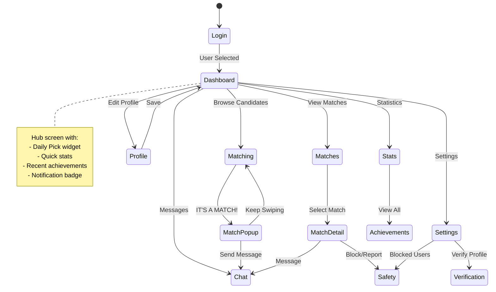

# JavaFX UI Implementation Plan for Dating App

> **Plan Created**: 2026-01-12
> **Target**: Replace CLI with modern JavaFX desktop GUI
> **Status**: Awaiting approval

---

## Executive Summary

This plan outlines the integration of a modern JavaFX graphical user interface into the existing Java 21 dating app. The UI will replace the current console-based CLI while **preserving all existing core business logic** untouched.

---

## 1. Version Selection

### Recommended: **OpenJFX 21.0.2** (LTS)

| Criteria | OpenJFX 21 | OpenJFX 17 | OpenJFX 22+ |
|----------|------------|------------|-------------|
| **Java 21 Compatibility** | ✅ Native | ⚠️ Works | ✅ Native |
| **LTS Support** | ✅ Yes | ✅ Yes | ❌ No |
| **AI Training Data** | ⭐⭐⭐⭐⭐ | ⭐⭐⭐⭐⭐ | ⭐⭐⭐ |
| **Virtual Threads** | ✅ Yes | ❌ No | ✅ Yes |

**Decision**: OpenJFX 21.0.2 — matches Java 21, LTS support, identical API to heavily-trained JavaFX 17.

---

## 2. UI Architecture

### Pattern: **MVVM (Model-View-ViewModel)** with FXML

```
┌─────────────────────────────────────────────────────────────────┐
│                       EXISTING (UNTOUCHED)                      │
│  ┌─────────────┐    ┌─────────────┐    ┌─────────────┐         │
│  │   Storage   │────│    Core     │────│   Service   │         │
│  │   Layer     │    │   Models    │    │   Layer     │         │
│  └─────────────┘    └─────────────┘    └─────────────┘         │
│                            │                                    │
│                            ▼                                    │
│  ┌──────────────────────────────────────────────────────────┐  │
│  │                   ServiceRegistry                         │  │
│  └──────────────────────────────────────────────────────────┘  │
└────────────────────────────┼────────────────────────────────────┘
                             │
┌────────────────────────────┼────────────────────────────────────┐
│                       NEW UI LAYER                              │
│                            ▼                                    │
│  ┌──────────────────────────────────────────────────────────┐  │
│  │                   ViewModelFactory                        │  │
│  │        (Creates ViewModels with ServiceRegistry)          │  │
│  └──────────────────────────────────────────────────────────┘  │
│       │              │              │              │            │
│       ▼              ▼              ▼              ▼            │
│  ┌─────────┐   ┌─────────┐   ┌─────────┐   ┌─────────┐        │
│  │  Login  │   │Dashboard│   │Matching │   │  Chat   │        │
│  │ViewModel│   │ViewModel│   │ViewModel│   │ViewModel│        │
│  └────┬────┘   └────┬────┘   └────┬────┘   └────┬────┘        │
│       │              │              │              │            │
│       ▼              ▼              ▼              ▼            │
│  ┌─────────┐   ┌─────────┐   ┌─────────┐   ┌─────────┐        │
│  │ login   │   │dashboard│   │matching │   │  chat   │        │
│  │  .fxml  │   │  .fxml  │   │  .fxml  │   │  .fxml  │        │
│  └─────────┘   └─────────┘   └─────────┘   └─────────┘        │
│                         CSS Theme                               │
└─────────────────────────────────────────────────────────────────┘
```

### Key Design Decisions

1. **ServiceRegistry Injection** — ViewModels receive existing services (no core changes)
2. **CLI Coexistence** — Both interfaces can run simultaneously, sharing the H2 database
3. **FXML-First** — Declarative XML layouts maximize AI generation accuracy
4. **Controller-per-Screen** — Each screen gets its own Controller + ViewModel pair

---

## 3. CLI Handler → JavaFX Screen Mapping

| CLI Handler | JavaFX Screen | Notes |
|-------------|---------------|-------|
| `UserManagementHandler` | Login Screen | User selection/creation |
| `ProfileHandler` | Profile Editor | Edit bio, photos, interests, dealbreakers |
| `MatchingHandler` | Matching Screen | Swipe cards, daily pick, undo |
| `MessagingHandler` | Chat Screen | Conversations + message thread |
| `LikerBrowserHandler` | "Who Liked Me" Tab | Integrated into Matches screen |
| `StatsHandler` | Stats Screen | Statistics and achievements |
| `SafetyHandler` | Safety Screen | Block + report dialogs |
| `RelationshipHandler` | Notifications Panel | Friend requests, match transitions |
| `ProfileNotesHandler` | Notes Tab | Integrated into Match Detail |
| `ProfileVerificationHandler` | Verification Dialog | Modal in Settings |
| **N/A** | Dashboard | **NEW** — Hub screen with widgets |
| **N/A** | Settings | **NEW** — App preferences |

---

## 4. Screen Flow



---

## 5. Wireframes

### 5.1 Login Screen
```
┌─────────────────────────────────────────────────────────────┐
│                                                             │
│                     🌹 DATING APP 🌹                        │
│                                                             │
│  ┌───────────────────────────────────────────────────────┐ │
│  │  ○ Alice (Active, 87% complete) ✓                     │ │
│  │  ○ Bob (Incomplete)                                   │ │
│  │  ○ Charlie (Active, Verified ✓)                       │ │
│  └───────────────────────────────────────────────────────┘ │
│                                                             │
│  ┌──────────────────────┐  ┌──────────────────────┐       │
│  │   + Create New User  │  │     Select User →    │       │
│  └──────────────────────┘  └──────────────────────┘       │
└─────────────────────────────────────────────────────────────┘
```

### 5.2 Dashboard
```
┌─────────────────────────────────────────────────────────────┐
│  👤 Alice (Active)     Daily Likes: 47/50      🔔 3        │
├─────────────────────────────────────────────────────────────┤
│                                                             │
│   ┌─────────┐  ┌─────────┐  ┌─────────┐  ┌─────────┐      │
│   │   🔥    │  │   ❤️    │  │  💬 12  │  │   👤    │      │
│   │ Browse  │  │ Matches │  │  Chat   │  │ Profile │      │
│   │  (5)    │  │  (3)    │  │         │  │  87%    │      │
│   └─────────┘  └─────────┘  └─────────┘  └─────────┘      │
│                                                             │
│  ┌───────────────────────────────────────────────────────┐ │
│  │  🌟 DAILY PICK                                        │ │
│  │  ┌──────────┐  Sarah, 28 • Software Engineer          │ │
│  │  │  Avatar  │  📍 3km away • ⭐ 92% Match             │ │
│  │  └──────────┘  [View Profile]                         │ │
│  └───────────────────────────────────────────────────────┘ │
│                                                             │
│  ┌───────────────────────────────────────────────────────┐ │
│  │  🏆 [First Match] [Profile Pro] [+2]                  │ │
│  └───────────────────────────────────────────────────────┘ │
│                                                             │
│  ⚙️ Settings   📊 Stats   🚫 Safety                        │
└─────────────────────────────────────────────────────────────┘
```

### 5.3 Matching Screen (Swipe Cards)
```
┌─────────────────────────────────────────────────────────────┐
│   ← Back              DISCOVER              🎚️ Filter      │
├─────────────────────────────────────────────────────────────┤
│                                                             │
│         ┌─────────────────────────────────────┐            │
│         │                                     │            │
│         │          [PROFILE PHOTO]            │            │
│         │                                     │            │
│         │─────────────────────────────────────│            │
│         │  Sarah, 28        ✓ Verified        │            │
│         │  Software Engineer                  │            │
│         │  📍 3km • ⭐ 92% Match              │            │
│         │                                     │            │
│         │  "Love hiking and coding..."       │            │
│         │                                     │            │
│         │  🎸 Music  💻 Tech  🏔️ Outdoors     │            │
│         └─────────────────────────────────────┘            │
│                                                             │
│         ↩️         ❌          ❤️          ⭐              │
│        Undo      Pass       Like      Super Like           │
│                                                             │
└─────────────────────────────────────────────────────────────┘
```

### 5.4 Chat List
```
┌─────────────────────────────────────────────────────────────┐
│   ← Back              MESSAGES                   🔍         │
├─────────────────────────────────────────────────────────────┤
│  ┌───────────────────────────────────────────────────────┐ │
│  │ 🔵 Sarah           "Hey! How are you?"        2m ago  │ │
│  ├───────────────────────────────────────────────────────┤ │
│  │    Mike            "Sounds great!"            1h ago  │ │
│  ├───────────────────────────────────────────────────────┤ │
│  │    Emma            "See you Saturday"      Yesterday  │ │
│  └───────────────────────────────────────────────────────┘ │
└─────────────────────────────────────────────────────────────┘
```

### 5.5 Conversation View
```
┌─────────────────────────────────────────────────────────────┐
│   ← Back           Sarah           ⋮ (Block/Report/Exit)   │
├─────────────────────────────────────────────────────────────┤
│              Matched on Jan 10, 2026                        │
│                                                             │
│                              ┌────────────────────────┐    │
│                              │ Hey! Nice to meet you! │    │
│                              └────────────────────────┘    │
│                                            Sarah • 2:30pm  │
│                                                             │
│  ┌──────────────────────────┐                              │
│  │ Hi Sarah! Love your bio! │                              │
│  └──────────────────────────┘                              │
│  You • 2:32pm                                               │
│                                                             │
├─────────────────────────────────────────────────────────────┤
│  ┌─────────────────────────────────────────────┐  [Send]   │
│  │ Type a message...                           │           │
│  └─────────────────────────────────────────────┘           │
└─────────────────────────────────────────────────────────────┘
```

---

## 6. File Structure

### New Package: `datingapp.ui`

```
src/main/java/datingapp/
├── ui/
│   ├── DatingApp.java              # Main Application (extends Application)
│   ├── NavigationService.java      # Screen transition manager
│   ├── ViewModelFactory.java       # ViewModel creation with DI
│   ├── controller/
│   │   ├── LoginController.java
│   │   ├── DashboardController.java
│   │   ├── ProfileController.java
│   │   ├── MatchingController.java
│   │   ├── MatchesController.java
│   │   ├── ChatController.java
│   │   ├── StatsController.java
│   │   └── SettingsController.java
│   └── viewmodel/
│       ├── LoginViewModel.java
│       ├── DashboardViewModel.java
│       ├── ProfileViewModel.java
│       ├── MatchingViewModel.java
│       ├── ChatViewModel.java
│       └── StatsViewModel.java

src/main/resources/
├── fxml/
│   ├── login.fxml
│   ├── dashboard.fxml
│   ├── profile.fxml
│   ├── matching.fxml
│   ├── matches.fxml
│   ├── chat.fxml
│   ├── conversation.fxml
│   ├── stats.fxml
│   └── settings.fxml
├── css/
│   ├── theme.css              # Main theme (colors, fonts)
│   ├── components.css         # Reusable component styles
│   └── animations.css         # Transitions and effects
└── images/
    ├── placeholder-avatar.png
    └── app-logo.png
```

---

## 7. Maven Configuration Changes

### Add to `pom.xml`

```xml
<!-- JavaFX Dependencies -->
<dependency>
    <groupId>org.openjfx</groupId>
    <artifactId>javafx-controls</artifactId>
    <version>21.0.2</version>
</dependency>
<dependency>
    <groupId>org.openjfx</groupId>
    <artifactId>javafx-fxml</artifactId>
    <version>21.0.2</version>
</dependency>
<dependency>
    <groupId>org.openjfx</groupId>
    <artifactId>javafx-graphics</artifactId>
    <version>21.0.2</version>
</dependency>

<!-- In plugins section -->
<plugin>
    <groupId>org.openjfx</groupId>
    <artifactId>javafx-maven-plugin</artifactId>
    <version>0.0.8</version>
    <configuration>
        <mainClass>datingapp.ui.DatingApp</mainClass>
    </configuration>
</plugin>
```

> [!NOTE]
> JavaFX is modular. We do **NOT** need a `module-info.java` if we run via Maven with the `javafx-maven-plugin`. The plugin automatically configures the module path.

---

## 8. CSS Theme Strategy

Using a **dark theme with gradient accents** (modern dating app aesthetic):

```css
/* theme.css - JavaFX CSS variables use .root, not :root */
.root {
    -fx-primary-gradient: linear-gradient(to bottom right, #667eea, #764ba2);
    -fx-background-dark: #1a1a2e;
    -fx-surface-dark: #16213e;
    -fx-card-background: #0f3460;
    -fx-text-primary: #ffffff;
    -fx-text-secondary: #a0a0a0;
    -fx-accent-like: #ff6b6b;
    -fx-accent-pass: #4ecdc4;
    -fx-accent-super: #ffd93d;
    -fx-font-family: "Segoe UI", "Roboto", sans-serif;
}

.button {
    -fx-background-color: -fx-card-background;
    -fx-text-fill: -fx-text-primary;
    -fx-background-radius: 8;
    -fx-padding: 10 20;
    -fx-cursor: hand;
}

.button:hover {
    -fx-background-color: derive(-fx-card-background, 20%);
}

.card {
    -fx-background-color: -fx-card-background;
    -fx-background-radius: 16;
    -fx-effect: dropshadow(gaussian, rgba(0,0,0,0.3), 10, 0, 0, 4);
}
```

---

## 9. Implementation Phases

### Phase 1: Foundation (~8 files)
- Modify `pom.xml` with JavaFX dependencies
- Create `DatingApp.java` (main entry point)
- Create `NavigationService.java` (screen switching)
- Create `ViewModelFactory.java` (DI container)
- Create `theme.css` (base styling)
- Create `login.fxml` + `LoginController.java` + `LoginViewModel.java`

### Phase 2: Dashboard & Profile (~8 files)
- Create `dashboard.fxml` + `DashboardController.java` + `DashboardViewModel.java`
- Create `profile.fxml` + `ProfileController.java` + `ProfileViewModel.java`
- Wire up daily pick, achievements widget, notification badge

### Phase 3: Matching (~6 files)
- Create `matching.fxml` + `MatchingController.java` + `MatchingViewModel.java`
- Create swipe card component
- Create "IT'S A MATCH!" popup modal
- Implement undo functionality

### Phase 4: Messaging (~6 files)
- Create `chat.fxml` (conversation list) + controller
- Create `conversation.fxml` (message thread) + controller
- Create `ChatViewModel.java`
- Implement unread count badges

### Phase 5: Polish (~6 files)
- Create `stats.fxml` + controller (statistics & achievements)
- Create `settings.fxml` + controller (app settings, verification)
- Add `animations.css` (transitions, hover effects)
- Add safety dialogs (block/report modals)

**Total Files**: ~34 new files

---

## 10. Verification Plan

### Automated Tests

```shell
# Existing tests (must still pass)
mvn test

# Compile with JavaFX dependencies
mvn clean compile

# Run the JavaFX application
mvn javafx:run
```

### Manual Verification Checklist

#### Phase 1
- [ ] `mvn javafx:run` launches without errors
- [ ] Login screen displays existing users from database
- [ ] Can select user and proceed to dashboard
- [ ] Can create new user via dialog

#### Phase 2
- [ ] Dashboard displays user stats correctly
- [ ] Daily Like counter matches CLI output
- [ ] Profile completion % matches CLI output
- [ ] Can edit profile and save changes

#### Phase 3
- [ ] Swipe cards display candidate info
- [ ] Like/Pass work and persist to database
- [ ] "IT'S A MATCH!" popup appears on mutual like
- [ ] Undo button works

#### Phase 4
- [ ] Conversation list shows all matches
- [ ] Unread badges display correct counts
- [ ] Can send messages
- [ ] Messages persist to database

### Cross-Validation with CLI

```shell
# Terminal 1: JavaFX UI
mvn javafx:run

# Terminal 2: CLI (shared database)
mvn exec:java -Dexec.mainClass="datingapp.Main"
```

**Expected**: Both interfaces show identical data (same H2 database file).

---

## 11. Risks & Mitigations

| Risk | Mitigation |
|------|------------|
| JavaFX learning curve | FXML + CSS separation makes iteration fast |
| Photo handling | Use placeholder initially, add real image loading later |
| Thread safety | Use `Platform.runLater()` for UI updates from services |
| Database locking | H2 supports multiple connections in same JVM |

---

## 12. Decision Points for User

> [!IMPORTANT]
> Please confirm before I proceed:

1. **Theme**: Dark theme with gradients — OK, or prefer light theme?
2. **Approach**: Phase 1 first (foundation), or single-screen prototype (e.g., just Matching)?
3. **Scope**: Full replacement eventually, or CLI stays for debugging?

---

## Next Steps After Approval

1. Implement **Phase 1 (Foundation)** — ~8 files
2. Test with you using `mvn javafx:run`
3. Iterate based on your feedback
4. Proceed to Phase 2
